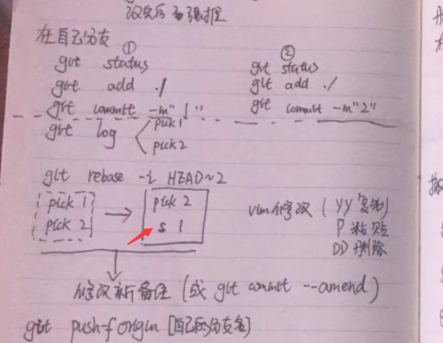
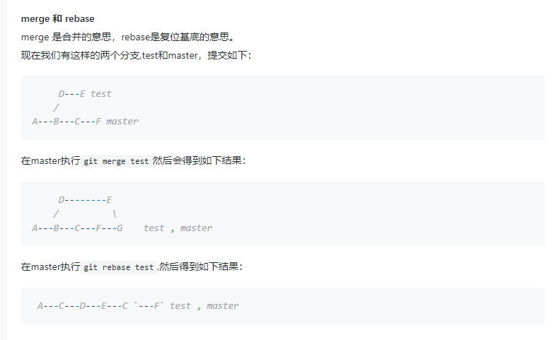

# Git踩坑记录

## 1. 删除了已经commit的代码

**原因：** 没搞明白`git rebase`的含义

**解析：** `rebase` 即 `re base` ，意思是重新定义基点，所以`git rebase -i HEAD~2`的意思是，编辑最近两次提交（commit），也就是说，你可以删除其中的提交，也可以修改提交的注释。

所以当时的操作是`git rebase -i HEAD~2`, 并删除了两个commit节点，因此代码被冲点消失。

**补救：** `git reflog`中可以查看所有的操作记录，其中也包括了被删除节点的commitid，因此，使用`git reset --hard commitid`恢复到了指定版本，找回了代码。

## 2. git合并多个commit节点



注意这个箭头指的地方是`s`, 代表`squash`, 意思是压碎、压扁、压缩

描述比较清楚的一篇文章如下：[Git合并多个commit](https://segmentfault.com/a/1190000007748862)

## 3. git丢弃对一个文件的修改

```shell
git checkout filepath 
```

## 4. merge中的fast-forward

**描述：** `Git` 合并两个分支时，如果顺着一个分支走下去可以到达另一个分支的话，那么 **Git 在合并两者时，只会简单地把指针右移** ，叫做“快进”（fast-forward）不过这种情况如果删除分支，则会丢失merge分支信息。

平时`git merge` 的时候，**默认使用`--ff`**， 即`fast-forward`（快进）

## 5. 删除分支

（1）删除本地分支

```shell
git branch -d xxx
```

（2）删除远程分支

```shell
git push origin --delete xxx
```

### 6. commit之后想要撤销（soft hard mixed）

```shell
git reset --soft HEAD^ // 这样撤回commit的同时，可以保留所修改的代码，不撤销git add ./
git reset --hard HEAD^ // 撤销commit，同时撤销git add ./ ，删除改动的代码，所以使用hard这个词，比较硬
git reset --mixed HEAD^ // 撤销cmmit， 同时撤销 git add ./ 但是并不删除改动的代码
```

### 7. git merge 与 git rebase的区别



**区别：**

- git merge 是在master后边新建一个节点

- git rebase 是将test的各个节点融合到master分支上去
