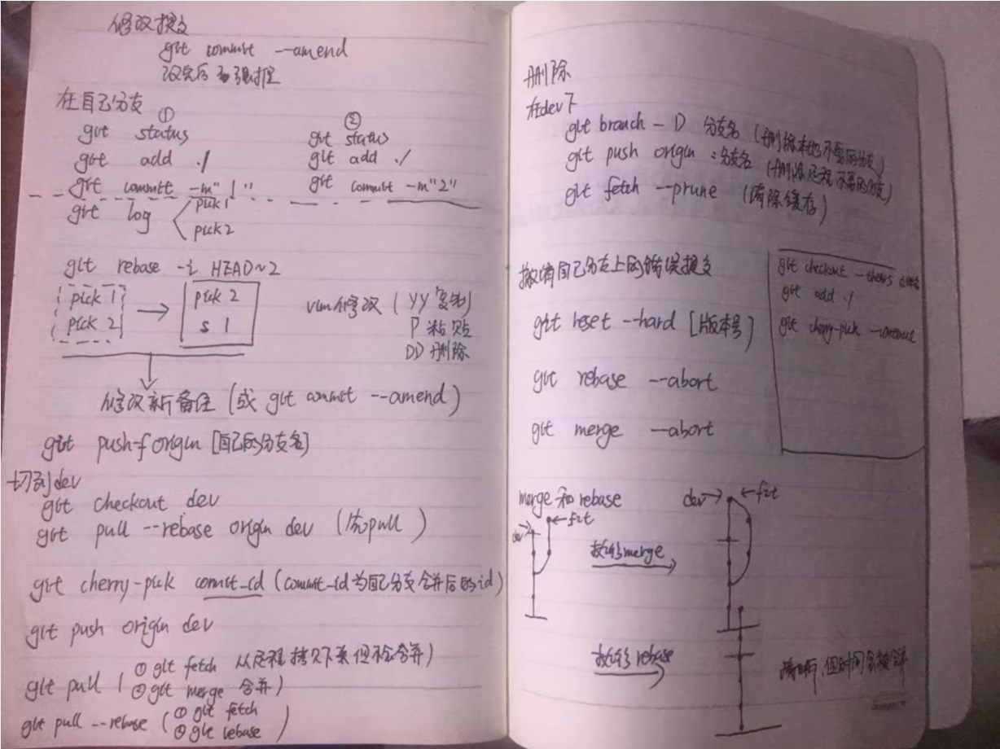
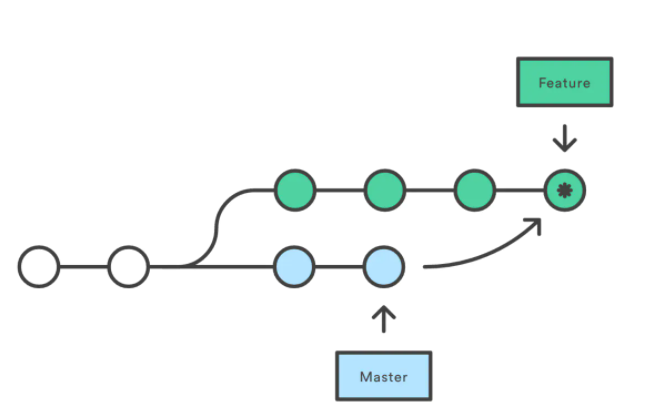
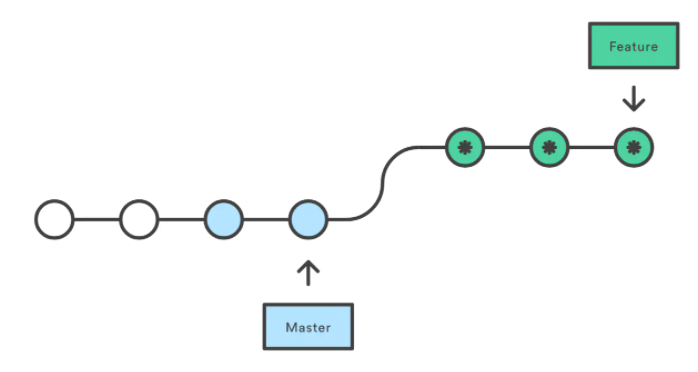

# Git面试问题

## 01 工作中常用到的几个git命令

**在自己分支：**

`git add ./`

`git status`

`git commit -m''`

`git push origin mydev`

`git log`

`git rebase -i HEAD~2 `合并后两个节点

`git checkout otherdev ` 切换分支

`git pull --rebase origin dev` 从dev分支下拉节点并合并到当前分支

相当于

​	`git fetch`  下拉节点，但是不合并

​	`git rebase` 合并

`git cherry-pick commitid `将自己的commitid的提交到dev上

撤销自己在分支上的提交：

`git reset --hard[版本号]`

`git rebase --abort`

`git merge --abort`

拉取合并远程分支：

`git fetch/ git merge`或者`git pull`

修改提交时候的历史信息  `git commit –amend`

## 02 git fetch + git merge = git pull

git fetch 将远程节点拉到本地，但是不合并

git merge 合并到当前分支

git pull  = git fetch + git merge 远程拉下来后合并到本地分支

## 03 git merge 和 git rebase 的区别

git merge 和 git rebase都是合并分支的命令

git merge dev 会先把dev分支的**差异内容pull 到本地**， 然后再与本地分支的内容**形成一个commit对象**提交到主分支上，合并后的支与主分支一致

git rebase 会**先把dev分支合并到主分支上**，然后把**本地分支的commit**放到**主分支后面**，合并后的分支好像从合并后的分支又拉了一个分支一样，本地分支本身不会保留提交历史。

## 03 git cherry-pick

git cherry-pick 可以把分支A的提交复制到分支B上

**在分支B上进行**

- 复制单个提交： git cherry-pick commitid
- 复制多个提交: git cherry-pick commitid1 .... commitid3

