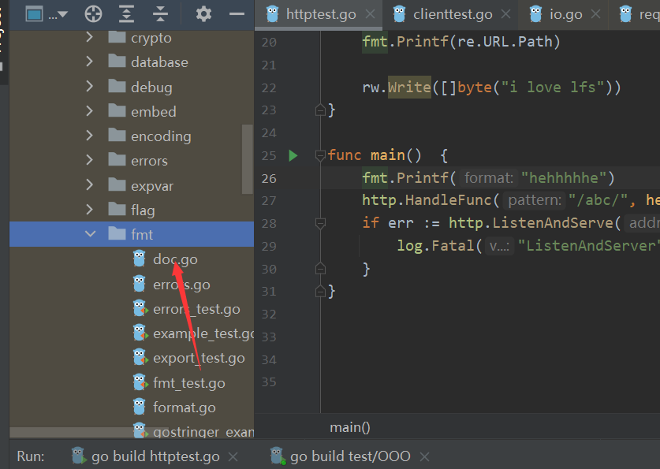

# `GoLang`基础


## 1. 变量声明

- 首字符是否大写控制了访问性： 大写包外可访问
- 驼峰命名
- `GoLang`支持类型推断，所以大部分情况下可以省略类型
- `var`
   - 局部变量
   - 包变量
   - 块声明

- `const `常量， 和`var`用法一样
  - 字符串和基本类型（不包含数组）
  - 必须显式初始化
  - 不能修改
  - 常量有些人用驼峰，有些人全大写，没有统一


## 2. `if-else`

```go
if true {

}eles if true {

}else if true {

}else{

}
```


下边这种写法很常见，用于控制局部变量得作用域，使得局部变量得作用域落在`if else `块内部

```go
func main(){
	if age:=getAge(); age>18{
		println(age)
	}else{
		println(age);
	}
}
```


## 3. `switch`  省略`break`

```Go

func Switch(a int){
	switch (a){
	case 1:
		println("1")
		//break  // 这里可以省略break
	case 2:
		println("2")
		//break
	default:
		//break

	}
}
```

`switch `是支持复杂类型得：

- 基本类型

- 字符串

- 数组（不建议使用）

- `struct`结构体（不建议使用）

- ...

  （严格来说，只**要表达式和case是可比较得**，就可以使用）

##  4.  异常处理之`error`

- `error`： 总体而言，`error`是一个普通得类，一种约定俗成得东西
- 典型用法是把error作为返回值得最后一个
- 调用方如果发现方法返回了`error`，一定要先检查`error`


```go
if err != nil{
	//XXXX
}
```


- `error`： `Error()`方法返回错误信息

- 格式化打印(`fmt`中`%v`和`%+v`得区别)
- (`GoLang`中打印堆栈是比较麻烦得事情，但是有些`error`并没有堆栈得，比如自己定义得`error`， 只需要打印错误信息即可)

```go
package main

import "errors"

func Switch(a int) error{
	switch (a){
	case 1:
		println("1")
		return nil
		//break  // 这里可以省略break
	case 2:
		println("2")
		return nil
		//break
	default:
		// println("default")
		return errors.New("input error")
		//break
	}
}

func main(){
	if age:=getAge(); age>18{
		println(age)
	}else{
		println(age);
	}
	if err:=Switch(3); err != nil {
		println(err.Error())
	}
}


```


## 5. `fmt `格式化占位符

源码中得`doc.go`有详细得说明




## 6. 数组与切片

- `[]byte` 是切片, 是一种引用类型，`slice`总是指向一个底层`array`
- `[10]byte`是数组，即数组是有初始长度得


**共性：**

- 都使用`data[i]`来索引数据
- 使用`len(data)`来获得长度（已有元素个数）
- 使用`cap（data）`来获得容量


**注意：** 数组的长度和容量是一致的

```go
func Array(){
	arr1 := [3]int{1, 2}
	var arr2 [10]int64
	fmt.Printf("%d   %d\n", len(arr1), cap(arr1))
	fmt.Printf("%d   %d\n", len(arr2), cap(arr2))
}
```

**创建有两种方式**

- 直接创建或者声明
- 使用`make`关键字


**`make`关键字**

- 可以传入初始长度，初始容量
- 当容量不够的时候，会发生扩容


**`append（）`的用法：**

```go
package main

import "fmt"

func main() {
    // x y 是切片， 边长数组，所以可以append
	x := []int {1,2,3}
	y := []int {4,5,6}
	//注意下面这两个区别
	fmt.Println(append(x,4,5,6))
	fmt.Println(append(x,y...))
}
```


**切片和数组的区别：**

- 切片是变长数组

- 数组是定长数组


## 7. `for` 的用法

三种写法：

- `for i `的形式
- `for range`的形式
- `for true`的形式


```go
package main

import "fmt"

func main() {
	x := []int {1,2,3}
	y := []int {4,5,6}
	//注意下面这两个区别
	//fmt.Println(append(x,4,5,6))
	z := append(x,y...)
	fmt.Println(z)
	// for i
	for i := 0; i < len(z); i++ {
		println(z[i])
	}
	// for range
	for i, iz := range z {
		println("i:%d  iz:%d", i, iz)
	}
	// for true
	i := 0
	for true{
		if i>5{
			break
		}
		println(i)
		i++
	}
}
```


## 8. Go 写服务端和客户端

**服务端：**

```go
package main

import (
	"fmt"
	"log"
	"net/http"
)


func  helloworld(rw http.ResponseWriter ,re *http.Request){
	fmt.Printf("Success!\n")
	fmt.Printf(re.URL.Path)

	rw.Write([]byte("i love lfs"))
}
//
func main()  {
	fmt.Printf("hehhhhhe")
	http.HandleFunc("/abc/", helloworld)
	if err := http.ListenAndServe("0.0.0.0:8888", nil); err!=nil{
		log.Fatal("ListenAndServer", err)
	}

}

```


**客户端**

```go
package main

import (
	"io/ioutil"
	"net/http"
)

func main(){
	client := http.Client{}
	resp, err := client.Get("http://www.baidu.com")
	if err != nil{
		println(err.Error())
		return
	}
	println(resp.Status)
	data, err := ioutil.ReadAll(resp.Body)
	if err != nil{
		println(err.Error())
		return
	}
	println(data)

}

```


