## 01 七层负载均衡和四层负载均衡

对应的是OSI网络模型：

- 七层负载均衡-应用层做负载均衡

- 四层负载均衡-传输层做负载均衡

### 七层负载均衡

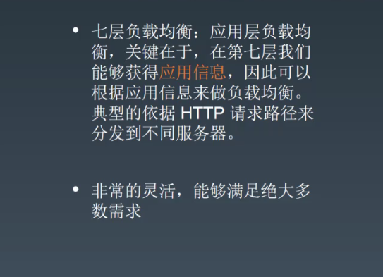

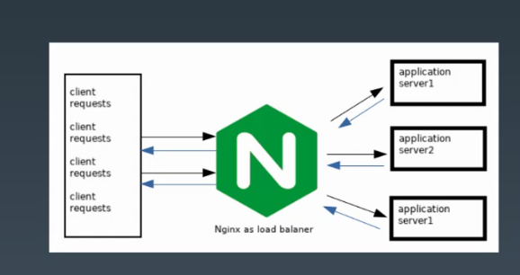

七层负载均衡要比四层负载均衡要差一些

### 四层负载均衡

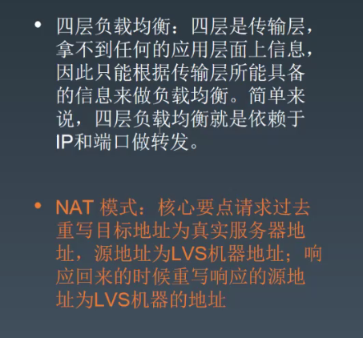

能拿到的只有IP和端口，没有针对业务特征做的灵活

#### 001 NAT 模式

Linux virtual server

会把请求的目标地址改为真实的机器IP地址。响应回来的时候，会重新改一下响应的源地址改到响应的目的地址。

#### 002 隧道模式

隧道直接转发请求

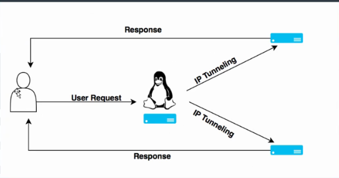

#### 003 Direct Route模式

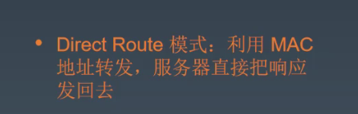

不再根据IP地址来修改，而是根据MAC修改转发

## 02 grpc 实现流量染色是怎么做的？？ 

本质： **链路构建和上下文传递**

流量染色服务：用于线上测试， 灰度发布

**染色的作用：** 是用来区分正常请求和染色请求， 可以做环境隔离 全链路压测

**上下文传递分为：**

- 进程内的上下文传递
- 跨进程传递

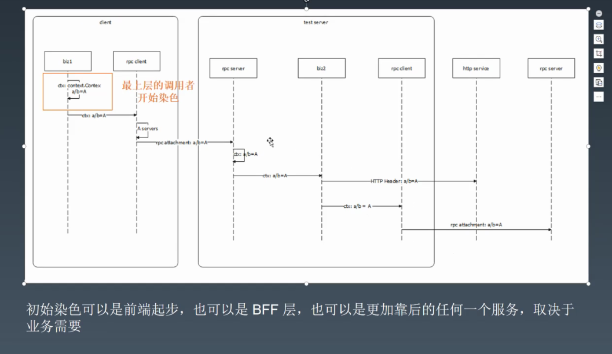

参考： https://www.cnblogs.com/rsapaper/p/10916770.html

## 03 错误处理知识点整理

### 001 使用错误

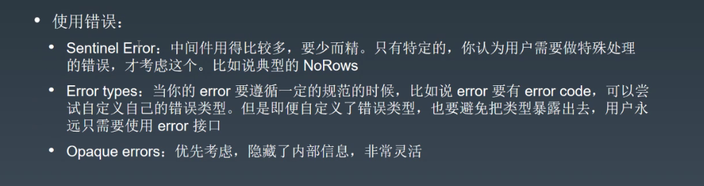

### 002 错误处理知识点

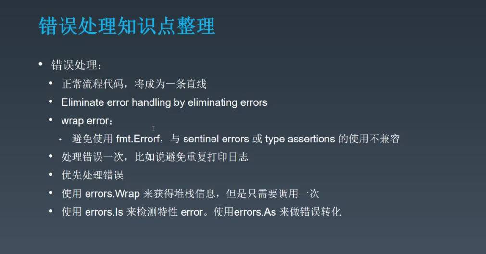

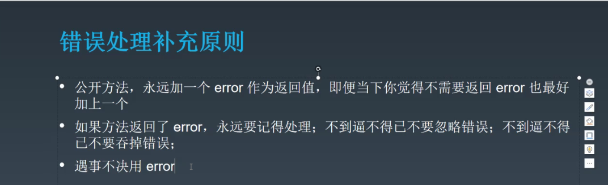

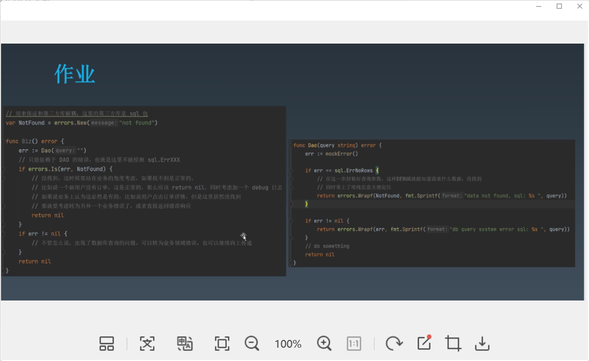

## 04 设计一个错误系统

首先从错误码规范开始

全局错误码唯一

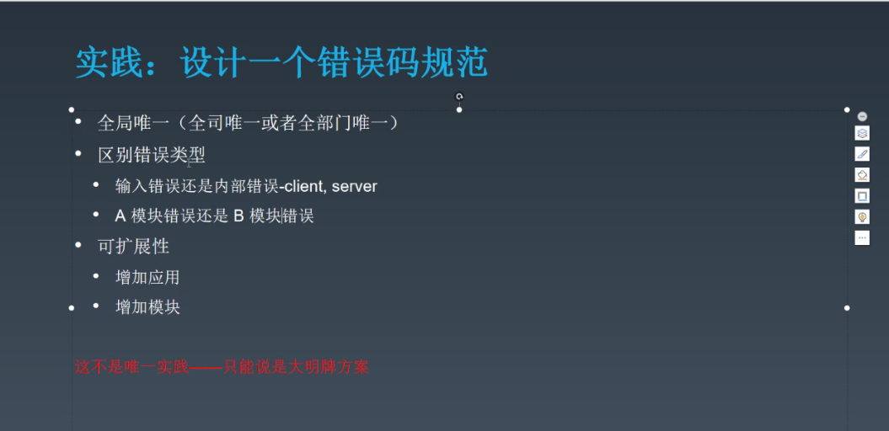

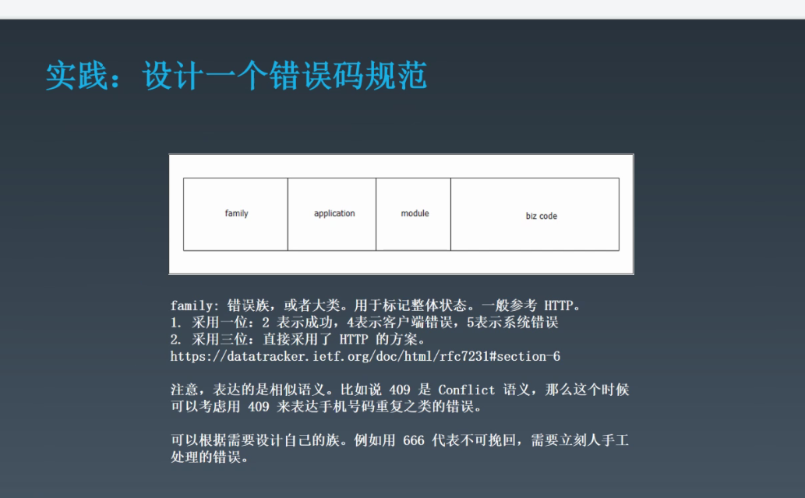

参考HTTP错误码

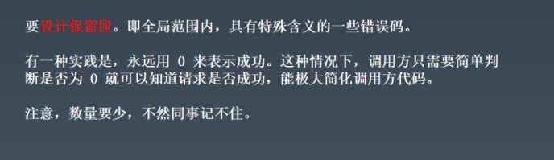

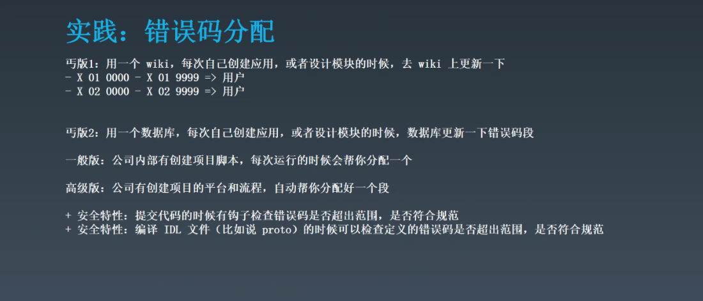

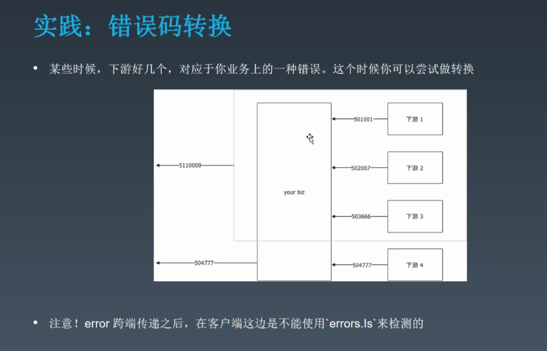

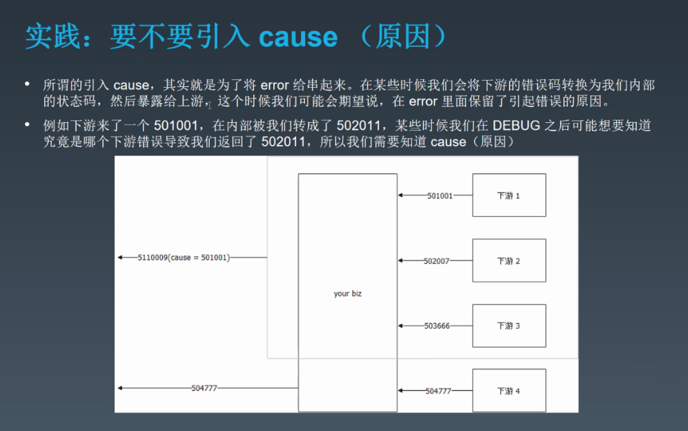

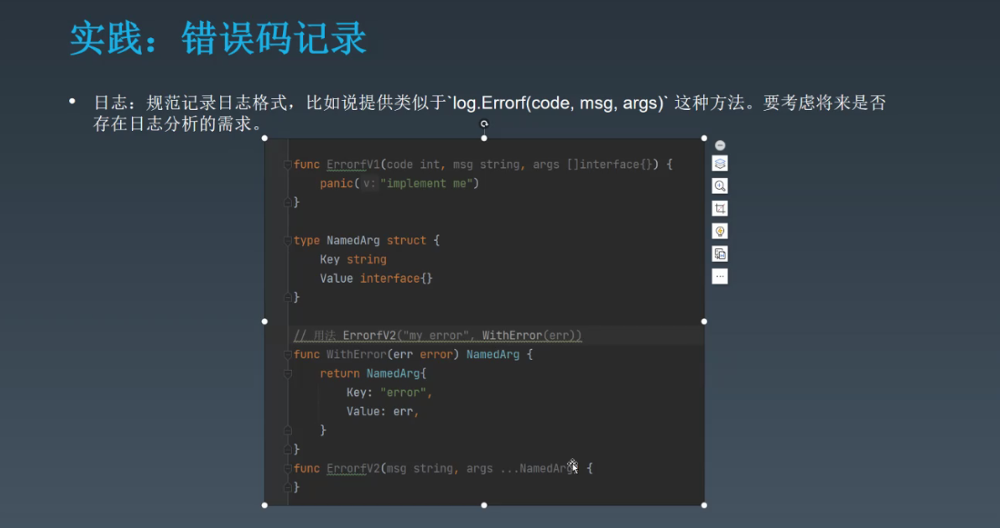

`zipkin`工具使用` tracing `

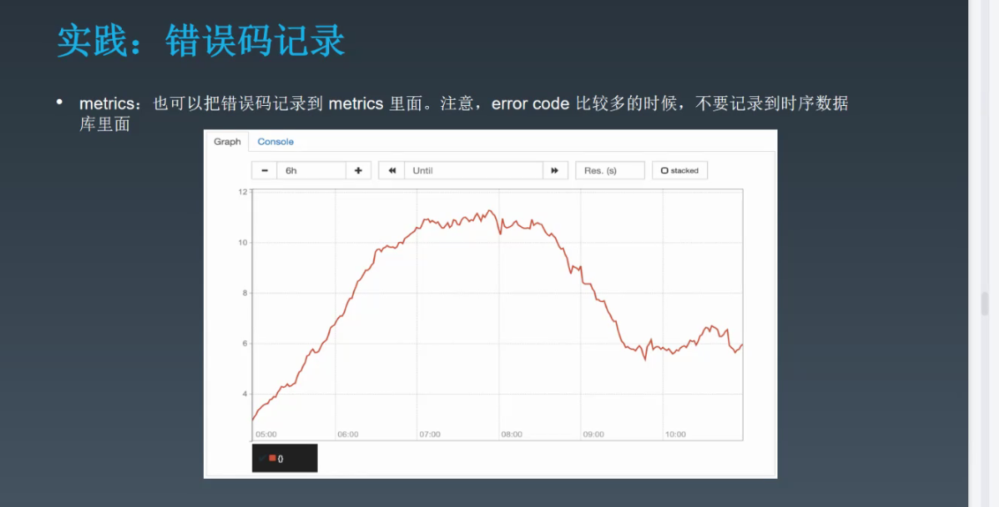

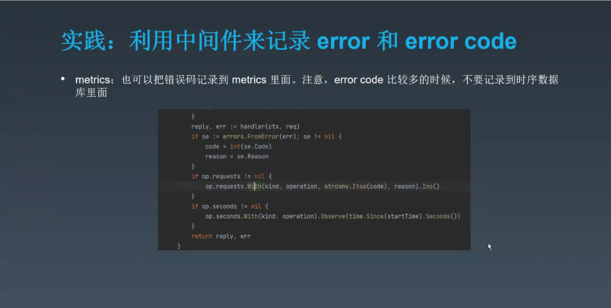

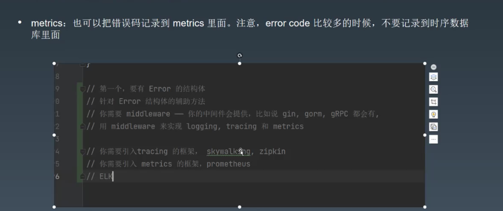

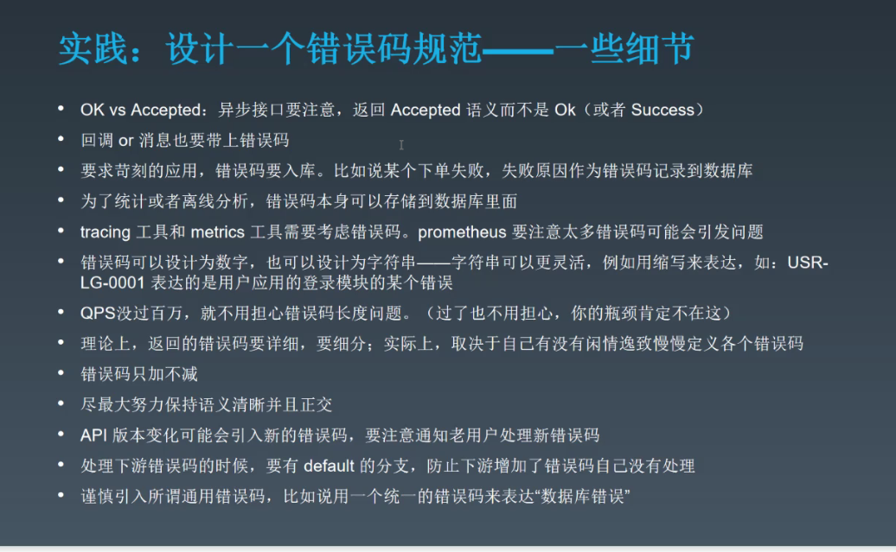

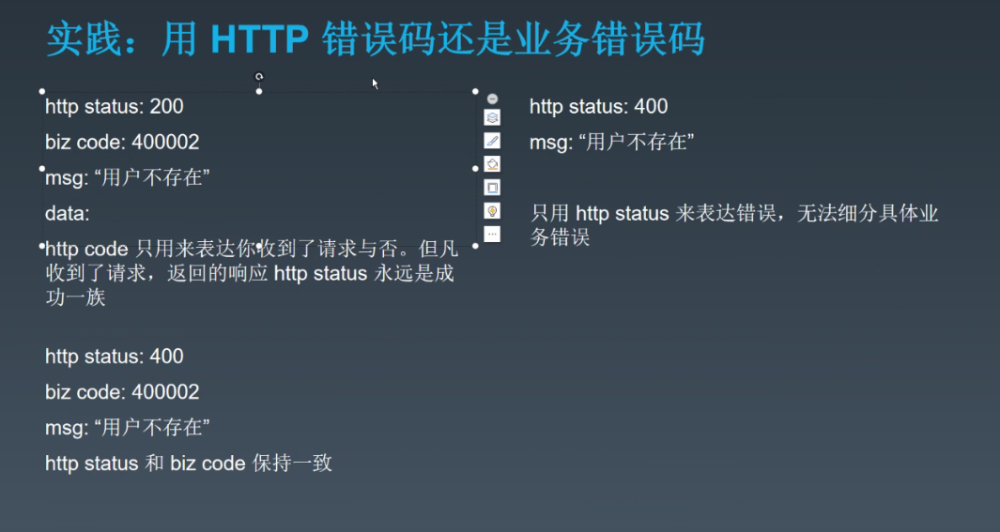

curd 的框架https://github.com/gotomicro/ego

