# 1. 微服务概览

## 1. 传统单体架构：

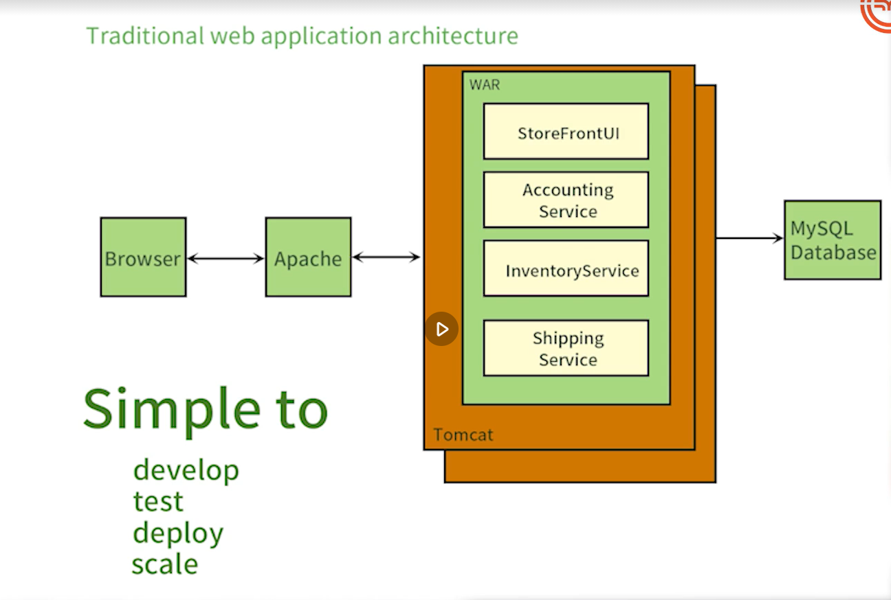

中间一坨称为全家桶，但是有个缺点就是： 如果改了A， 有可能B， C模块也有问题

## 2. 微服务起源

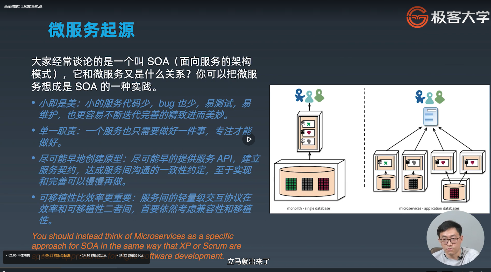

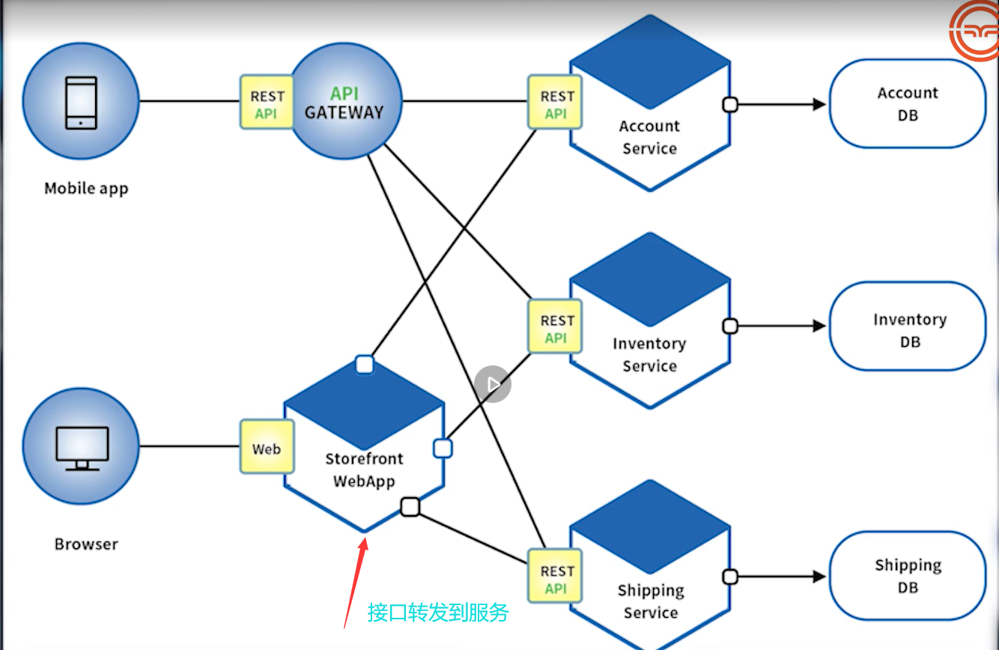

## 3. 微服务定义

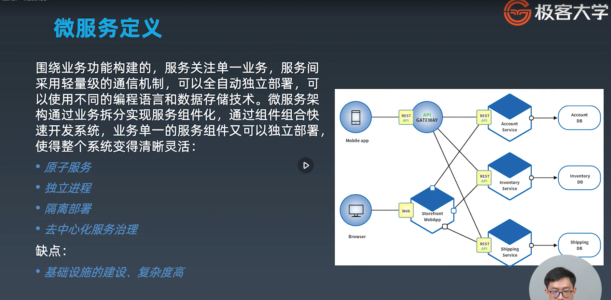

## 4. 微服务的不足

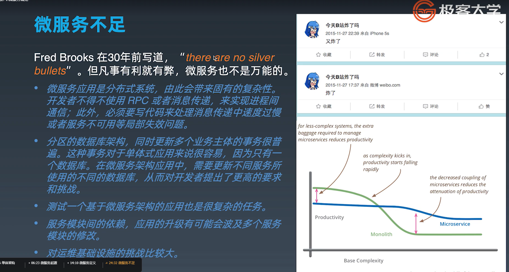

随着复杂性的增加，绿色的是巨石架构，它的性能是降低的，蓝色的是微服务， 它的性能也是降低的

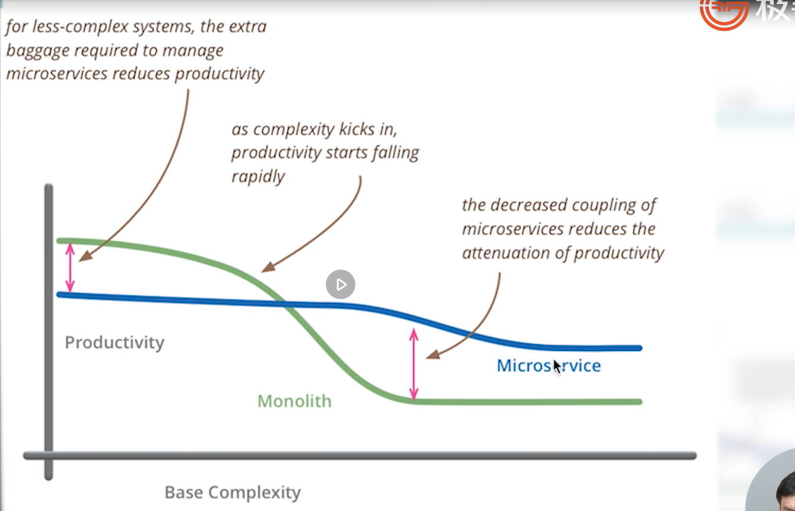

## 5. 组件服务化

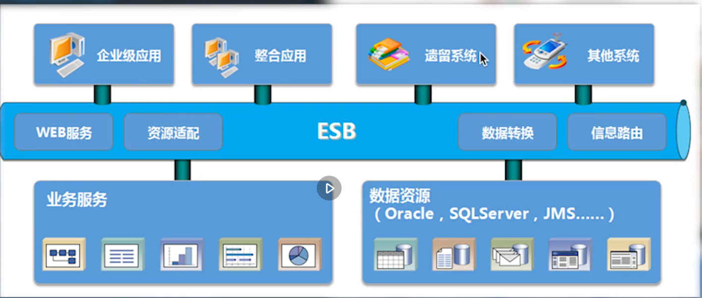

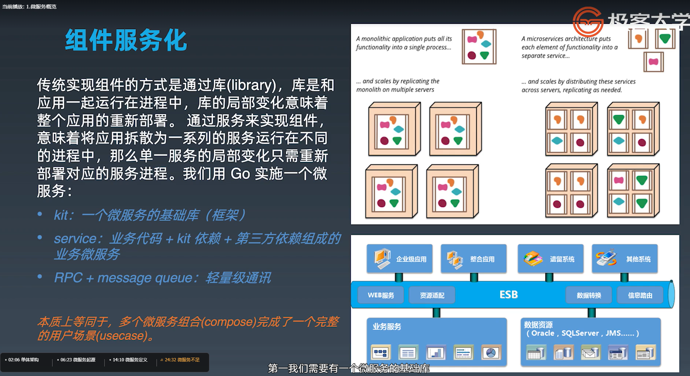

## 6. 按业务组织服务

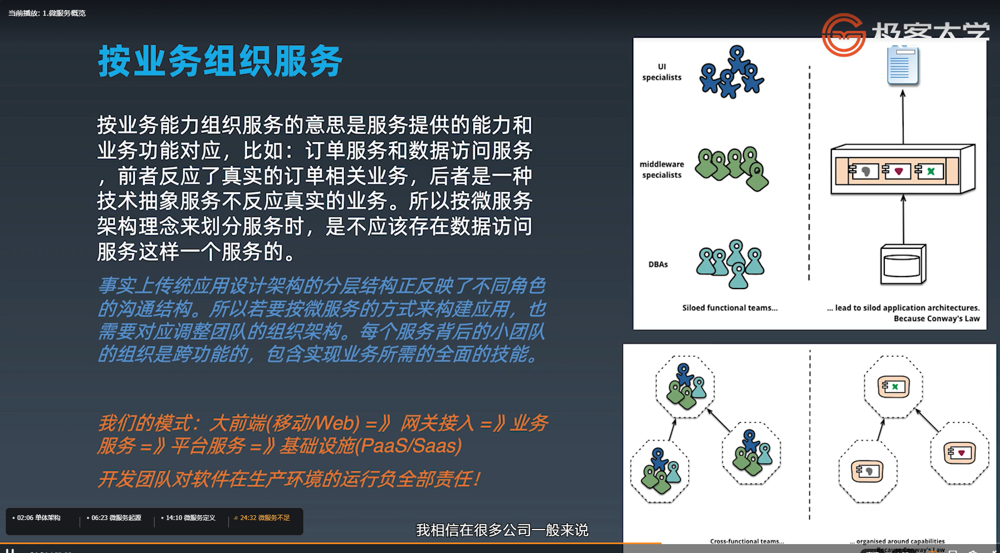

## 7. 去中心化

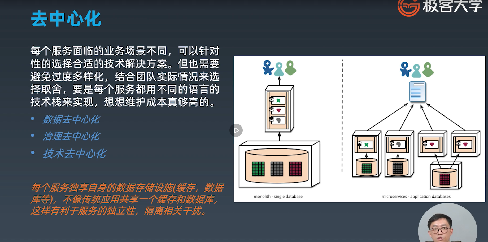

## 8. 基础设施自动化

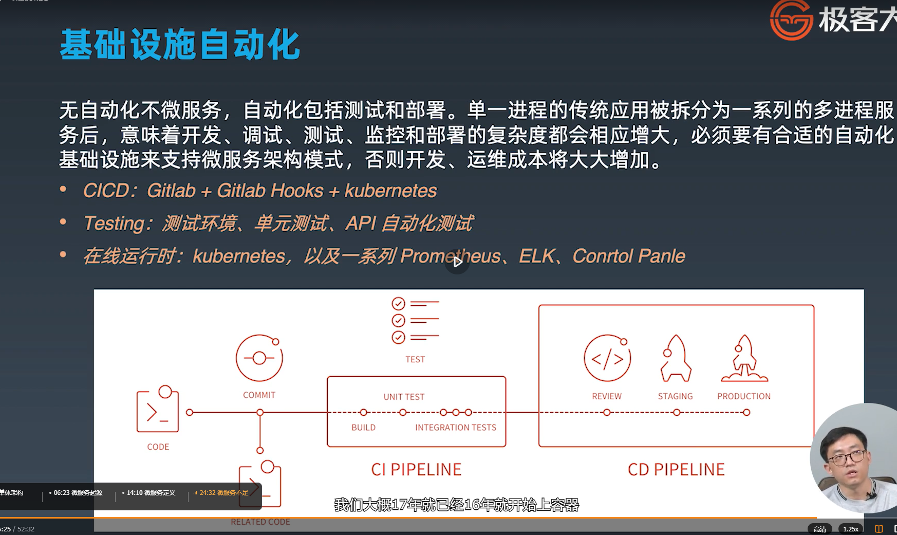

## 9. 可用性与兼容性设计

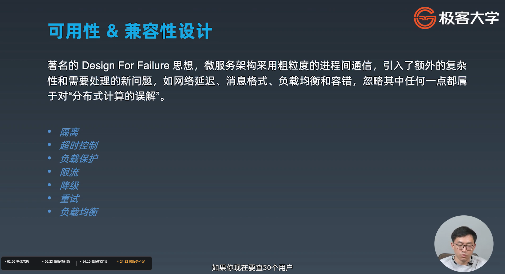

