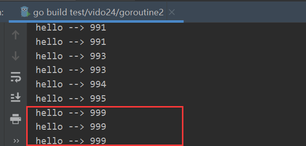

# GoLang 的goroutine与channel


## 001 描述

`gorouotine` 是在语言层面实现的语言层面实现的线程，实际上，操作系统线程还是线程，`goroutine`就相当于go作者给提供了一个高效的线程池。

```go
package main

import (
	"fmt"
	"sync"
)

var wg sync.WaitGroup

func main() {
	for i := 0; i < 1000; i++ {
		wg.Add(1)  // 计数牌+1
		go func() { // 匿名函数, 还是一个闭包
			fmt.Println("hello -->", i) // i是去外部的作用域中找
			wg.Done() // 
		}()
	}
	//time.Sleep(1)
	fmt.Println("hello main")
	wg.Wait() // 阻塞 等所有小弟都干完活才收兵， 等到计数器=0时退出
}

```

结果：



可以看出有好多999的情况，为啥呢？？

因为下边这个代码块不只是匿名函数，还是一个闭包， 这个 i 不是内部的参数，而是外部的， 当执行到的时候，去外部作用域查找，当区找的时候，外部的 i 可能已经走了很多，或者可能还没走，所以会出现重复的情况。

```go
go func() { // 匿名函数, 还是一个闭包
			fmt.Println("hello -->", i) // i是去外部的作用域中找
			wg.Done() // 
		}()
```


**根本原因是上面是一个闭包，解决办法是当执行这个函数的时候，把 i 传入函数，而不用去外边找**。

```go
package main

import (
	"fmt"
	"sync"
)

var wg sync.WaitGroup

func main() {
	for i := 0; i < 1000; i++ {
		wg.Add(1)  // 计数牌+1
		go func(i int) { // 匿名函数, 还是一个闭包
			fmt.Println("hello -->", i) // i是去外部的作用域中找
			wg.Done() //
		}(i)
	}
	//time.Sleep(1)
	fmt.Println("hello main")
	wg.Wait() // 阻塞 等所有小弟都干完活才收兵， 等到计数器=0时退出
}

```


## 002 goroutine和线程的区别？

操作系统的线程一般都有固定的栈内存（通常为`2MB`）， 一个`goroutine` 的栈在其生命周期开始时只有很小的栈（一般为`2KB`）， `goroutine`的栈不是固定的，时按需增大或缩小，`goroutine`是在**代码里去实现的一个用户态的线程.**


- 一个操作系统线程对应用户态多个`goroutine`
- `go `程序可以同时使用多个操作系统线程
- `goroutine` 和操作系统线程是多对多的关系，即`m:n`


## 003 goroutine调度GMP

`GMP`是Go语言运行时层面的实现，是go语言自己实现的一套调度系统，区别于操作系统调度线程

- `G`就代表`goroutine` ， 里面除了存放本`goroutine` 信息外，还有与所有P 的绑定信息
- `M（machine）`是Go运行时（`runtime`）对操作系统内核线程的虚拟，`M`与内核线程一般是一一映射的关系，一个`goutine`最终是要放到`M`上执行的。
- `P `管理着一组`goroutine`队列，`P`里面存储当前`goroutine`运行的上下文环境（函数指针、堆栈地址、地址边界）， P 会对自己管理的 `goroutine `队列做一些调度（比如把`CPU`时间较长的`goroutine`暂停、运行后续的`goroutine`等），当自己队列消费完了就去全局队列里取， 如果全局队列里也消费完了会取其他`P `的队列里抢任务。


## 004 GOMAXPROCS

`runtime.GOMAXPROCS(6) `  指定占用CPU核数， 默认是当前系统CPU核数目

```GO
package main

import (
	"fmt"
	"runtime"
	"sync"
)

func a() {
	for i := 1; i < 10; i++ {
		fmt.Println("A:", i)
	}
	wg.Done()
}

func b() {
	for i := 1; i < 10; i++ {
		fmt.Println("B:", i)
	}
	wg.Done()
}

var wg sync.WaitGroup

func main() {
	// 例如在一个8核心的机器上，调度器会把Go代码同时调度到8个OS线程上（GOMAXPROCS是m:n调度中的n）
	runtime.GOMAXPROCS(6)  // 指定占用CPU核数， 默认是当前系统CPU核数目
	// 这个就是GO1.5之前的样子，它只用一个核
	wg.Add(2)
	go a()
	go b()
	wg.Wait()
}
```


## 005 channel

go语言的并发模型是`CSP（communication sequential process）`, 提倡通过通信共享内存，而不是通过共享内存来实现通信。

如果说`goroutine`是go程序的并发执行体， channel就是他们之间的连接，channel是可以让一个`goroutine`发送特定值到另一个`goroutine`的通信机制。

Go语言的通道`channel` 是一种特殊的类型，通道就像一个传送带或者一个队列，总是遵循先入先出的规则，保证发送数据的顺序，每一个通道都是一个具体类型的导管，也就是声明`channel`的时候需要为其指定元素类型。

### channel 类型

**channel 是一种引用类型，需要`make`初始化才能使用**，声明格式如下：

```go
var ch1 chan int
var ch2 chan bool
var ch3 chan []int
```


在go语言中需要用make初始化的有：

- slice
- map
- chan


### 创建channel

```go
var ch1 chan int
cha2 := make(chan int, 2)
```


### channel 操作

定义一个channel：、

```go
ch := make(chan int)
```

#### 发送

```go
ch <- 10 // 将10发送到通道中
```

#### 接收

```go
x := <- ch // 从channel中接收值， 并付给变量x
<-ch // 从ch接收值， 忽略结果
```

#### 关闭

```go
close(ch)
```


有缓冲区和无缓冲区的通道的区别：

- 如果使用无缓冲区通道，程序会死锁，只有在另外一个`goroutine`在取得时候，程序才不会死锁， 手把手交付
- 有缓冲区得通道，快递可以暂存

```go
package main

import "fmt"

func  main()  {

	var ch1 chan int // 引用类型， 需要初始化才能使用
	ch1 = make(chan int, 10) // 后边有值说明是带缓冲区的通道

	// ch2 := make(chan int) // 后边没值的说明是无缓存区的通道, 又称为同步通道
	// ch2 <- 10 // 阻塞， 报错！
	ch1 <- 10
	x := <- ch1
	//y := <- ch2
	fmt.Println(x)
	//fmt.Println(y)
	close(ch1)
	//close(ch2)
}

```


```go
package main

import "fmt"

func  main()  {

	var ch1 chan int // 引用类型， 需要初始化才能使用
	ch1 = make(chan int, 10) // 后边有值说明是带缓冲区的通道

	//ch2 := make(chan int) // 后边没值的说明是无缓存区的通道
	//ch2 <- 10
	ch1 <- 10
	fmt.Println(len(ch1))
	x := <- ch1
	//y := <- ch2
	fmt.Println(x)
	fmt.Println(len(ch1))
	//fmt.Println(y)
	close(ch1)
	//close(ch2)
}

```


#### 限制函数对通道操作

```go
package main

import "fmt"

func f1(ch chan<- int)  { // 只能发
	for i := 0; i < 100; i++ {
		ch <- i
	}
	close(ch)
}

func f2(ch1 <-chan int, ch2 chan<- int)  { // ch1 只能取,ch2只能， 限制了函数对通道得操作
	for{
		tmp, ok := <- ch1
		if !ok {
			break
		}
		ch2 <- tmp*tmp
	}
	close(ch2)

}


func  main()  {

	ch1 := make(chan int, 100) // 后边有值说明是带缓冲区的通道
	ch2 := make(chan int, 100) // 后边有值说明是带缓冲区的通道

	go f1(ch1)
	go f2(ch1, ch2)
	// 从通道中取值得方式2
	for ret := range ch2 {
		fmt.Println(ret)
	}

}

```


关闭厚的通道有以下特点：


## 006 select 多路复用

在某些场景下我们需要同时从多个通道接收数据，通道在接收数据时，如果没有数据可以接收会发生阻塞。

```go
select{
	case <- ch1
		// ...
	case <- ch2
		// ...
	default:
		// ...
}
```


## 007 并发同步和锁

