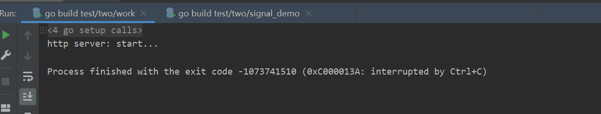
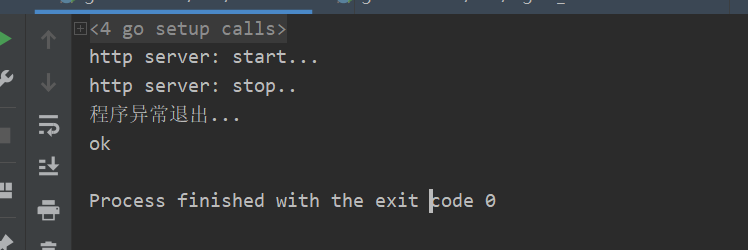

# 第三周作业


## 001 问题描述

基于 `errgroup`实现一个` http server` 的启动和关闭 ，以及 `linux signa`l 信号的注册和处理，要保证能够一个退出，全部注销退出。


## 002 关键字知识点


### 01 errgroup

官网描述：

> Package errgroup provides synchronization, error propagation, and Context cancelation for groups of goroutines working on subtasks of a common task.

解释：

> 在多个goroutine并发处理的时候，errgroup 包提供了goroutine之间的同步、**错误传播**和上下文取消

所以有可能实现问题中的一个退出，全部撤销退出的情况


官网中的例子：

```go
package main

import (
	"context"
	"fmt"
	"os"

	"golang.org/x/sync/errgroup"
)

var (
	Web   = fakeSearch("web")
	Image = fakeSearch("image")
	Video = fakeSearch("video")
)

type Result string
type Search func(ctx context.Context, query string) (Result, error)

func fakeSearch(kind string) Search {
	return func(_ context.Context, query string) (Result, error) {
		return Result(fmt.Sprintf("%s result for %q", kind, query)), nil
	}
}

func main() {
	Google := func(ctx context.Context, query string) ([]Result, error) {
		g, ctx := errgroup.WithContext(ctx)

		searches := []Search{Web, Image, Video}
		results := make([]Result, len(searches))
		for i, search := range searches {
			i, search := i, search // https://golang.org/doc/faq#closures_and_goroutines
			g.Go(func() error { // 创建协程去执行函数
				result, err := search(ctx, query)
				if err == nil {
					results[i] = result
				}
				return err
			})
		}
		if err := g.Wait(); err != nil {
			return nil, err
		}
		return results, nil
	}

	results, err := Google(context.Background(), "golang")
	if err != nil {
		fmt.Fprintln(os.Stderr, err)
		return
	}
	for _, result := range results {
		fmt.Println(result)
	}

}

```


### 02 http server 实现

```go
package main

import (
	"context"
	"io"
	"log"
	"net/http"
)


func helloServer(w http.ResponseWriter, req *http.Request){
	io.WriteString(w,"hello!  shaungshaung, i love u!")
}
func main(){

	// 定义 server
	server := &http.Server{
		Addr: ":8080",
	}
	http.HandleFunc("/hello", helloServer)
	// 监听
	if err := server.ListenAndServe(); err!=nil{
		log.Fatal("server start error: ", err)
	}

	// 关闭服务端
	server.Shutdown(context.TODO())

}

```


结合errgroup的服务端启动

```go
package main

import (
	"context"
	"fmt"
	"golang.org/x/sync/errgroup"
	"io"
	"net/http"
)


func helloServer(w http.ResponseWriter, req *http.Request){
	io.WriteString(w,"hello! shuangshuang, i love u!")
}


func main(){

	all := func(ctx context.Context) (error) {
		g, ctx := errgroup.WithContext(ctx)
		// 定义 server
		server := &http.Server{
			Addr: ":8080",
		}

		// HTTP服务启动
		g.Go(func() error {
			http.HandleFunc("/hello", helloServer)
			fmt.Println("http server: start...")
			err := server.ListenAndServe()
			return err
		})

		g.Go(func() error {
			<-ctx.Done()  //阻塞。因为 cancel、timeout、deadline 都可能导致 Done 被 close
			fmt.Println("http server: stop..")
			// 关闭服务端
			return server.Shutdown(context.TODO())
		})


		if err := g.Wait(); err != nil {
			return err
		}
		return nil
	}

	if err := all(context.Background()); err != nil{
		fmt.Println("程序异常退出...")
	}
	fmt.Println("ok")
}

```

但是退出时程序并不能流畅的退出



### 03 信号注册与处理

```go
package main

import (
	"context"
	"errors"
	"fmt"
	"golang.org/x/sync/errgroup"
	"io"
	"net/http"
	"os"
	"os/signal"
	"syscall"
)


func helloServer(w http.ResponseWriter, req *http.Request){
	io.WriteString(w,"hello! shuangshuang, i love u!")
}


func main(){

	all := func(ctx context.Context) (error) {
		g, ctx := errgroup.WithContext(ctx)
		// 定义 server
		server := &http.Server{
			Addr: ":8080",
		}

		// 创建一个os.Signal channel
		sigs := make(chan os.Signal, 1)
		signal.Notify(sigs, syscall.SIGINT, syscall.SIGTERM) // 绑定结束信号到sig通道


		// HTTP服务启动
		g.Go(func() error {
			http.HandleFunc("/hello", helloServer)
			fmt.Println("http server: start...")
			err := server.ListenAndServe()
			return err
		})

		g.Go(func() error {
			<-ctx.Done()  //阻塞。因为 cancel、timeout、deadline 都可能导致 Done 被 close
			fmt.Println("http server: stop..")
			// 关闭服务端
			return server.Shutdown(context.TODO())
		})

		g.Go(func() error{
			sig := <-sigs
			if sig != nil{
				return errors.New("程序结束")
			}
			return nil
		})


		if err := g.Wait(); err != nil {
			return err
		}
		return nil
	}

	if err := all(context.Background()); err != nil{
		fmt.Println("程序异常退出...")
	}
	fmt.Println("ok")
}

```

这样就可以流畅退出了




## 003总结

- 使用信号机制监听系统退出信号，以保证主程序流畅结束

- `errgroup `保证多个协程一个报错，全部退出

  

