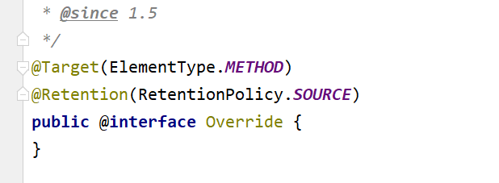

# Java 注解 `Annotation`

注解的基类：

`java.lang.annotation.Annotation`

**注解的本质**就是一个继承了` Annotation `接口的接口。

**一个注解准确意义上来说，只不过是一种特殊的注释而已，如果没有解析它的代码，它可能连注释都不如。**

>典型的就是注解 `@Override`，一旦编译器检测到某个方法被修饰了 `@Override `注解，编译器就会检查当前方法的方法签名是否真正重写了父类的某个方法，也就是比较父类中是否具有一个同样的方法签名。

**解析一个类或者方法的注解往往有两种形式:**

- 一种是编译期直接的扫描
- 一种是运行期反射。


## 编译期扫描

编译器的扫描指的是编译器在对` java` 代码编译字节码的过程中会检测到某个类或者方法被一些注解修饰，这时它就会对于这些注解进行某些处理。

### 例如如`@Override`

注解 `@Override`，标记式注解, 一旦编译器检测到某个方法被修饰了 `@Override` 注解，**编译器就会检查当前方法的方法签名是否真正重写了父类的某个方法**，也就是比较父类中是否具有一个同样的方法签名。

**<font color='red'>这一种情况只适用于那些编译器已经熟知的注解类</font>**，比如 JDK 内置的几个注解，而你自定义的注解，编译器是不知道你这个注解的作用的，当然也不知道该如何处理，往往只是会根据该注解的作用范围来选择是否编译进字节码文件，仅此而已。


### 如何写一个自己的注解？？

#### 元注解

> 元注解是用于修饰注解的注解，通常用在注解的定义上

```java
@Target(ElementType.METHOD)
@Retention(RetentionPolicy.SOURCE)
public @interface Override {

}
```



#### Java中的元注解

- `@Target`：注解的作用目标
- `@Retention`：注解的生命周期
- `@Documented`：注解是否应当被包含在` JavaDoc` 文档中
- `@Inherited`：是否允许子类继承该注解


#### `@Target`

```java
/* @since 1.5
 * @jls 9.6.4.1 @Target
 * @jls 9.7.4 Where Annotations May Appear
 * @jls 9.7.5 Multiple Annotations of the Same Type
 */
@Documented
@Retention(RetentionPolicy.RUNTIME)
@Target(ElementType.ANNOTATION_TYPE)
public @interface Target {
    /**
     * Returns an array of the kinds of elements an annotation type
     * can be applied to.
     * @return an array of the kinds of elements an annotation type
     * can be applied to
     */
    ElementType[] value();
}

```

可以通过`@Target(value = {ElementType.FIELD})`这种方式给`Target`的`value`传值。

>- `ElementType.TYPE`：允许被修饰的注解作用在类、接口和枚举上
>- `ElementType.FIELD`：允许作用在属性字段上
>- `ElementType.METHOD`：允许作用在方法上
>- `ElementType.PARAMETER`：允许作用在方法参数上
>- `ElementType.CONSTRUCTOR`：允许作用在构造器上
>- `ElementType.LOCAL_VARIABLE`：允许作用在本地局部变量上
>- `ElementType.ANNOTATION_TYPE`：允许作用在注解上
>- `ElementType.PACKAGE`：允许作用在包上


#### 注解与反射

自己写一个注解：

```java
@Target(value={ElementType.FIELD, ElementType.MODULE})
@Retention(value = RetentionPolicy.RUNTIME)
public @interface Test {
    String value();
}

```


**虚拟机规范定义了一系列和注解相关的属性表**，也就是说，无论是字段、方法或是类本身，**如果被注解修饰了，就可以被写进字节码文件**。属性表有以下几种：

- `RuntimeVisibleAnnotations`：运行时可见的注解

- `RuntimeInVisibleAnnotations`：运行时不可见的注解
- `RuntimeVisibleParameterAnnotations`：运行时可见的方法参数注解
- `RuntimeInVisibleParameterAnnotations`：运行时不可见的方法参数注解
- `AnnotationDefault`：注解类元素的默认值

**对于一个类或者接口来说，Class 类中提供了以下一些方法用于反射注解**:

- `getAnnotation`：返回指定的注解
- `isAnnotationPresent`：判定当前元素是否被指定注解修饰
- `getAnnotations`：返回所有的注解
- `getDeclaredAnnotation`：返回本元素的指定注解
- `getDeclaredAnnotations`：返回本元素的所有注解，不包含父类继承而来的


[JAVA 注解的基本原理 - Single_Yam - 博客园 (cnblogs.com)](https://www.cnblogs.com/yangming1996/p/9295168.html)
