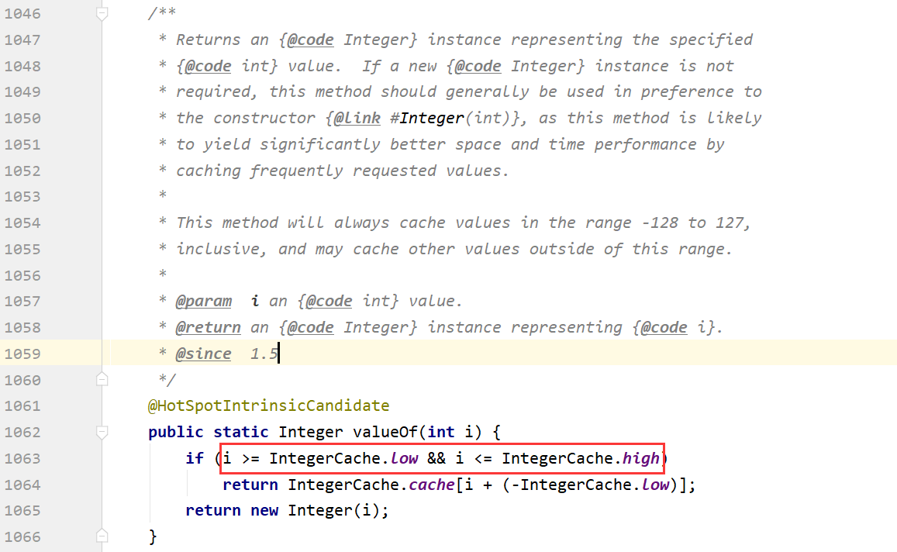
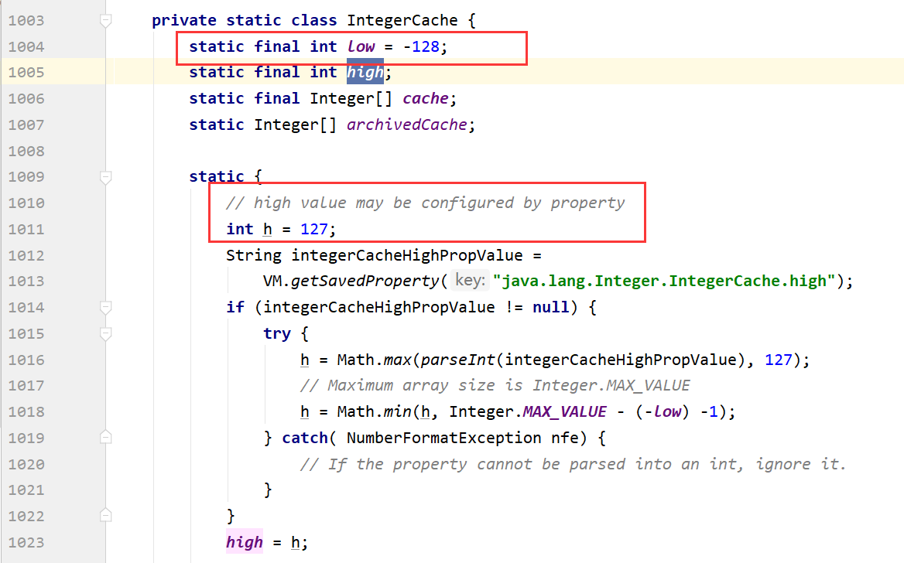

# <center>Java基本类型封装</center>

### 1. Java基本类型有：

> byte  char  short  int  long  float  double


### 2. 包装类的拆箱和装箱

在JDK1.5以后，Java提供了自动装箱和自动拆箱的功能

> 装箱： 将基本数据类型转换为包装类

> 拆箱： 将包装类转换为基本数据类型


当`int`和`Integer`进行比较的适合，`Integer`会自动拆箱，转换为`int`值进行比较。


### 3. 如何做到的？？

`Integer`、`Byte`、`Double`、`Float`、`Short`、 `Long`都继承自`Number`子类，Number类提供了一些返回本类型的操作。

```Java
public abstract int intValue();
public abstract long longValue();
public abstract float floatValue();
public abstract double doubleValue();
public byte byteValue() {return (byte)intValue();}
public short shortValue() {return (short)intValue();}
```


### 4. 自动装箱和拆箱的源码：




## 5. IntegerCache（Integer中的<font color='red'>静态内部类</font>）

- **一个是-128<= x<=127的整数，将会直接缓存在`IntegerCache`中那么当赋值在这个区间的时候，不会创建新的`Integer`对象，而是从缓存中获取已经创建好的`Integer`对象**。

- 当大于这个范围的时候，直接`new Integer`来创建`Integer`对象。
- ` new Integer(1) `和`Integer a = 1`不同，前者会创建对象，存储在堆中，而后者因为在-128到127的范围内，不会创建新的对象，而是从`IntegerCache`中获取的。**那么`Integer a = 128`, 大于该范围的话才会直接通过`new Integer（128）`创建对象，进行装箱**.


```Java
public class Test {
 
	public static void main(String[] args) {
		
		Integer i = new Integer(128);
		Integer i2 = 128;
		
		System.out.println(i == i2);
		
		Integer i3 = new Integer(127);
		Integer i4 = 127;
		System.out.println(i3 == i4);
		
		Integer i5 = 128;
		Integer i6 = 128;
		System.out.println(i5 == i6);
		
		Integer i7 = 127;
		Integer i8 = 127;
		System.out.println(i7 == i8);
	}
}
```

**结果：**

>false
>
>false
>
>false
>
>true


**IntegerCache对于high与low的定义**：（-128  - +127）



