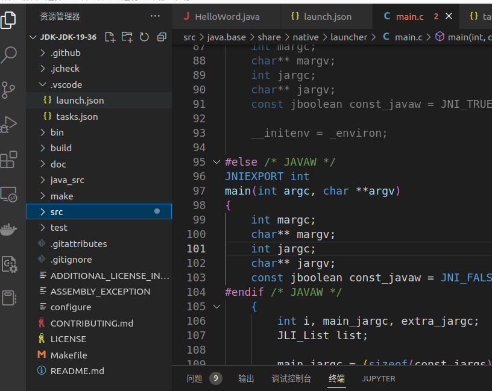

## 一步一步编译JDK

### 1. 文档

首先，官方文档如下：

```bash
https://github.com/openjdk/jdk/blob/master/doc/building.md
```

1. 安装开发人员包

```bash
sudo apt-get install build-essential
```

2. 进行配置

```bash
sudo bash configure
```

------

## 2. 本地编译与调试JDK环境初步搭建

1. 下载openjdk源码（注意： **下载openjdk中打过tag的源码**）

2. 进入JDK源码目录
   
   ```shell
   bash configure --with-debug-level=slowdebug --with-jvm-variants=server  --disable-warnings-as-errors
   ```
   
   
   
   ```shell
   sudo make all
   ```
   
   然后等待...

3. make完成后，使用vs code 打开源码目录(换行后再按下换行就对齐了)



4. 在根目录下创建.vscode文件夹，然后创建launch.json文件
   
   在launch.json文件中填写：（鼠标放上配置后有描述）

```json
{
    "version": "0.2.0",
    "configurations": [
        {
            "name": "jdk19s-src",
            "type": "cppdbg",
            "request": "launch",
            "program": "/home/tina/workspace/xuexi/jdktest/jdk-jdk-19-36/build/linux-x86_64-server-slowdebug/jdk/bin/java", //要运行的目标程序
            "args": [
                "HelloWord" //要运行的.class文件的包名
            ],
            "stopAtEntry": true,
            "cwd": "${workspaceFolder}/java_src", // 鼠标放上去有惊喜,目标的工作目录
            "environment": [ //配置环境变量
                // {
                //     "name": "CLASSPATH",
                //     "value": "/home/tina/workspace/stepbystep/LeetCode/HelloWorld/out/production"
                // },
            ],
            "setupCommands": [
                {
                    "text": "handle SIGSEGV pass noprint nostop", 
                    "description": "ignore SIGSEGV", 
                    "ignoreFailures": true 
                }
            ],
            "externalConsole": false,
            "MIMode": "gdb",
            // "preLaunchTask": "jdk11s-build"  //运行编译任务
        }
    ]
}
```

5. 调试一下
