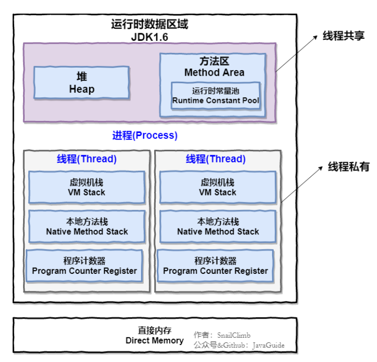

# Java内存管理

## 1. Java内存区域

该图是JDK1.8以前的内存分布图

主要有：

- 堆
- 方法区
- 本地方法栈
- 虚拟机栈
- 程序计数器

###  1.1 程序计数器

程序计数器用来存储下一条需要执行的字节码指令的位置。

为了线程切换后能恢复到正常的执行位置，每条线程都需要有一个独立的程序计数器，各线程之间的程序计数器互不影响，独立存储。（就相当于用进程中的部分空间虚拟出来的一个内存区域，用来存储线程的下一个执行地址）

程序计数器是唯一一个不会出现`outofMemoryError`的内存区域，它的生命周期随着线程的创建而创建，随着线程的结束而结束。

### 1.2 本地方法栈

和虚拟机栈所发挥的作用相似，虚拟机栈是为虚拟机执行Java方法服务，而**本地方法栈为虚拟机私用到的Native方法**服务。

本地方法被执行的时候，在本地方法栈也会创建一个栈帧，用于存放该本地方法的局部变量表、操作数表、动态链接、出口信息

### 1.3 堆

Java虚拟机所管理的内存中最大的一块，Java堆是多有线程共享的一块内存区域，在虚拟机启动时创建。此内存区域的**唯一目的是存放对象实例**，几乎所有的对象实例以及数组都在这里分配内存。

Java堆是垃圾回收器管理的主要区域，因此也被称为GC堆，从垃圾回收的角度，由于现在收集器基本上都采用**分代垃圾回收算法**，所以Java堆还被细分为新生代和老年代。再细致一点：Eden空间、fromSurvivor， to Survivor空间等，进一步划分的目的是更好的回收内存，或者更快的分配内存。

**对象都会首先在 Eden 区域分配，在一次新生代垃圾回收后，**如果对象还存活，**则会进入 s0 或者 s1，并且对象的年龄还会加 1**(Eden 区->Survivor 区后对象的初始年龄变为 1)，当它的年龄增加到一定程度（默认为 15 岁），就会被晋升到老年代中。对象晋升到老年代的年龄阈值，

### 1.4 方法区

方法区与 Java 堆一样，是各个线程共享的内存区域，它用于存**储已被虚拟机加载的类信息、常量、静态变量、即时编译器编译后的代码等数**据。虽然 **Java 虚拟机规范把方法区描述为堆的一个逻辑部分**，但是它却有一个别名叫做 **Non-Heap（非堆）**，目的应该是与 Java 堆区分开来。

#### 1.4.1 运行时常量池

运行时常量池是方法区的一部分。**Class 文件中除了有类的版本、字段、方法、接口等描述信息外，还有常量池表**（用于存放编译期生成的各种字面量和符号引用）

