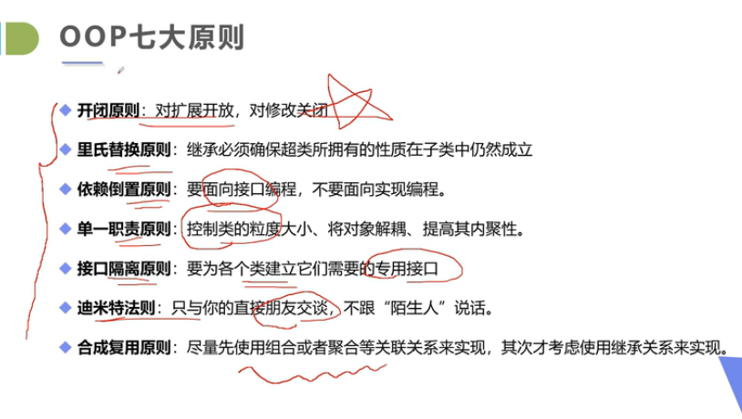

# 设计模式

设计模式是一个“四人帮”开发出来的

### 1. 学习设计模式的意义

- 设计模式的本质是面向对象设计原则的实际运用，是对类的封装性、继承性和多态性以及类的关联关系和组合关系的充分理解。

- 正确使用设计模式具有以下优点：
  
  - 可以提高程序员的思维能力、编程能力和设计能力
  
  - 使程序设计更加标准化、代码编制更加工程化，使软件开发效率大大提高，从而缩短软件的开发周期。
  
  - 使设计的代码可重用性高、可读性强、可靠性高、灵活性好、可维护性强。 

### 2. 设计模式的基本要素

（1）模式名称

（2）问题

（3）解决方案

（4）效果

### 3. 23种设计模式GoF

**创建型模式：**(特点就是想让对象的创建和使用分离)

- 单例模式、工厂模式、抽象工厂模式、创建者模式、原型模式

**结构型模式：**（主要是描述如何将类或者对象组合成某种更大的结构）

- 适配器模式、桥接模式、装饰模式、组合模式、外观模式、享元模式、代理模式

**行为型模式：**（重点描述类或者对象之间如何能相互协作，共同完成单个对象无法完成的任务，主要是分配一些职责）

- 模板方法模式、命令模式、迭代器模式、观察者模式、中介者模式、备忘录模式、解释器模式、状态模式、策略模式、职责链模式、访问者模式

### 4. 面向对象OOP的七大原则

- **开闭原则**：对扩展开放，对修改关闭（当应用需求发生改变的时候，尽量不去修改原来的代码对其进行扩展）

- **里氏替换原则**：继承必须确保超类所拥有的性质在子类中仍然成立（子类可以扩展父类的功能，但是不要改变父类原有的功能，尽量是去添加新的方法）

- **依赖倒置原则**：要面向接口编程，不要面向实现编程

- **单一职责原则**：控制类的粒度大小，将对象解耦、提高其内聚性

- **接口隔离原则**：要为各个类建立他们需要的专用接口

- **迪米特法则**：只与你的直接朋友交谈，不要跟陌生人说话

- **合成复用原则**：尽量先使用组合或者聚合等关联关系来实现，其次才考虑使用继承关系来实现。

