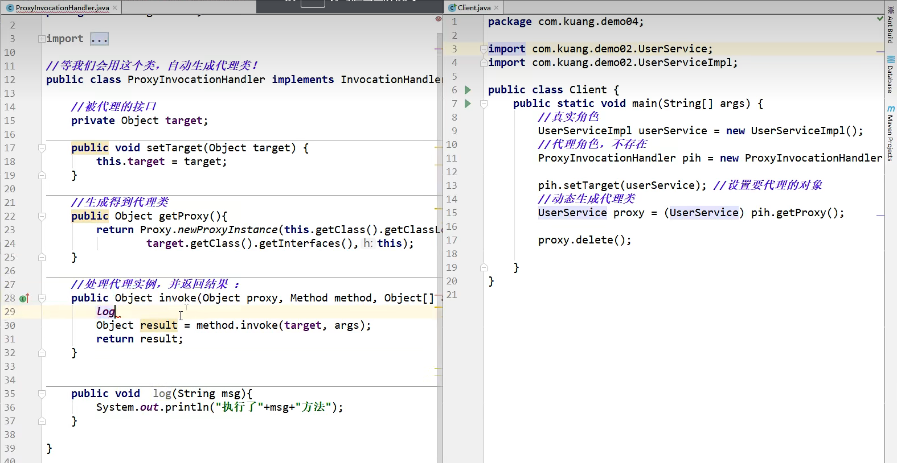

# 动态代理模式

## 1. 动态代理

- 动态代理与静态代理角色一样

- 动态代理的代理类是动态生成的，不是我们直接写好的

- 动态代理分为两大类：基于接口的动态代理和基于类的动态代理
  
  - 基于接口：JDK动态代理
  
  - 基于类：cglib
  
  - Java字节码实现：javasist

需要了解两个类: Proxy 和 InvocationHandler


## 2. 实例

```java
public interface Rent {
    public void rent();
}

```


```java
// 房东
public class Host implements Rent {

    @Override
    public void rent() {
        System.out.println("房东要租房子");
    }
}
```


```java

import java.lang.reflect.InvocationHandler;
import java.lang.reflect.Method;
import java.lang.reflect.Proxy;

// 等我们会用这个类，自动生成代理类。
public class ProxyInvocationHandler implements InvocationHandler {
    // 被代理的接口
    private Rent rent;


    public void setRent(Rent rent){
        this.rent = rent;
    }

    // 生成得到代理类
    public Object getProxy(){
        return Proxy.newProxyInstance(this.getClass().getClassLoader(), rent.getClass().getInterfaces(), this);
    }

    // 处理代理实例，并返回结果
    @Override
    public Object invoke(Object proxy, Method method, Object[] args) throws Throwable {
        // 动态代理的本质就是使用反射机制
        Object result = method.invoke(rent, args);
        return result;
    }
}

```


```java

public class Client {
    public static void main(String[] args){
        // 真实角色
        Host host = new Host();

        // 代理角色：
        ProxyInvocationHandler pih = new ProxyInvocationHandler();
        // 通过调用程序处理角色 来处理我们要调用的接口对象
        pih.setRent(host);
        Rent proxy = (Rent) pih.getProxy();
        proxy.rent();
    }
}

```


然后将Rent改为Object类，就可以代理任何的类了。**万能的动态代理类！**

```java

import java.lang.reflect.InvocationHandler;
import java.lang.reflect.Method;
import java.lang.reflect.Proxy;

// 等我们会用这个类，自动生成代理类。
public class ProxyInvocationHandler implements InvocationHandler {
    // 改成Object类，那么就可以代理任何类
    private Object rent;


    public void setRent(Rent rent){
        this.rent = rent;
    }

    // 生成得到代理类
    public Object getProxy(){
        return Proxy.newProxyInstance(this.getClass().getClassLoader(), rent.getClass().getInterfaces(), this);
    }

    // 处理代理实例，并返回结果
    @Override
    public Object invoke(Object proxy, Method method, Object[] args) throws Throwable {
        // 动态代理的本质就是使用反射机制
        Object result = method.invoke(rent, args);
        return result;
    }
}

```





