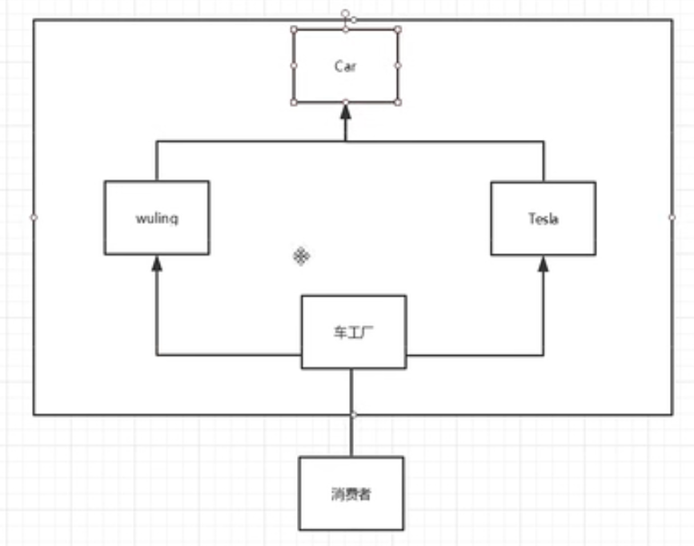
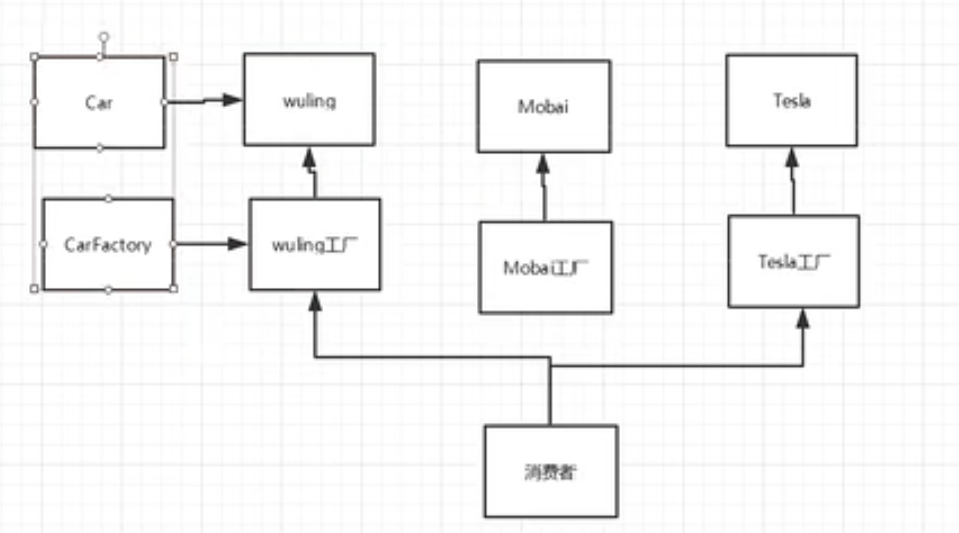

# 工厂模式

### 1. 工厂模式作用

- **实现了创建者和调用者的分离**

- 详细分类：
  
  - 简单工厂模式
  
  - 工厂方法模式
  
  - 抽象工厂模式

工厂模式中，需要用到面向对象的七大原则：

- **开闭原则**：一个软件的实体应当对扩展开放，对修改关闭
- **依赖倒转原则**：要针对接口编程，不要针对实现编程
- **迪米特法则**：只与你直接的朋友通信，而避免和陌生人通信

### 2. 核心本质

- 实例化对象不使用new，**用工厂方法代替**

- 将选择实现类，创建对象同意管理和控制，从而将调用者跟我们的实现类解耦

### 3. 实现方式

#### 3.1 简单工厂模式

简单工厂模式也叫静态工厂模式，因为工厂类中使用的是静态方法。

用于生产同意等级结构中的任意产品（对于增加新的产品，需要修改已有代码）

```java
// interface -> Car

public interface Car{
    void name();
}
```

```java
public class WuLing implements Car{

    @Override
    public void name(){
        System.out.println("五菱宏光");
    }
}

public class TeSiLa implements Car{
    @Override
    public void name(){
        System.out.println("特斯拉");
    }
}
```

```java
public class Consumer{
    public static void main(String[] args){
        // 原来创建对象的方式
        Car car = new WuLing();
        Car car2 = new TeSiLa();

        // 使用工厂创建
        // 使用工厂创建的好处就是不用在意一些细节，比如一些初始化参数等。
        Car car = CarFactory.getCar("五菱");

    }
}
```

```java
public class CarFactory{

    public static Car getCar(String car){
        if(car.equals("五菱")){
            return new WuLing();
        }else if(car.equals("特斯拉"){
            return new TeSiLa();
        }else{
            return null;
        }
    }

}
```

**抽象图:**



**但是**如果需要新增产品，还需要在工厂的`getCar`的方法中修改代码。这就不满足**开闭原则**了。

#### 3.2 工厂方法模式

用来生产同一等级结构中的固定产品（支持增加任意产品）

```java
// interface -> Car

public interface Car{
    void name();
}
```

```java
public class WuLing implements Car{

    @Override
    public void name(){
        System.out.println("五菱宏光");
    }
}

public class TeSiLa implements Car{
    @Override
    public void name(){
        System.out.println("特斯拉");
    }
}
```

```java
public class Consumer{
    public static void main(String[] args){
        // 原来创建对象的方式
        Car car = new WuLing();
        Car car2 = new TeSiLa();


        // 当前方法
        Car car = TeSiLaFactory.getCar();
        Car car2 = WuLingFactory.getCar();
    }
```

**这里是新增：**

```java
public interface CarFactory{
    Car getCar();    
}
```

```java
public class TeSiLaFactory implements CarFactory{
    @Override
    public Car getCar(){
        return TeSiLa();
    }
}


public class WuLingFactory implements CarFactory{
    @Override
    public Car getCar(){
        return WuLing();
    }
}
```

**抽象图如下：**



这里都是一个`Car`一套接口，但是如果有非常多的`Car`类型，需要设计一大堆接口。

#### 3.3 抽象工厂模式

围绕一个超级工厂创建其他工厂，该工厂又被称为其他工厂的工厂。

详细在下一节 [抽象工厂模式](抽象工厂模式.md)讲。

### 4. 小结

- 简单工厂模式（静态工厂模式）
  
  - 虽然某种程度上不符合设计原则，但是实际使用最多！

- 工厂方法模式
  
  - 不修改已有类的前提下，通过增加新的工厂类实现扩展

- 抽象工厂模式
  
  - 不可以增加产品，可以增加产品族！

### 5. 应用场景

- JDK中的`Calendar`的`getInstance`方法

- JDBC中的`Connection`对象的获取

- Spring中IOC容器创建管理Bean对象

- 反射中Class对象的`newInstance`方法
