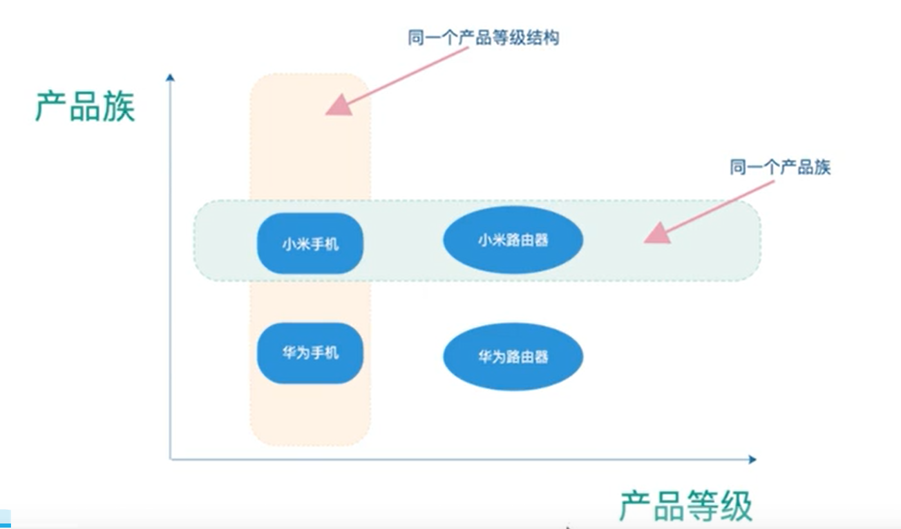
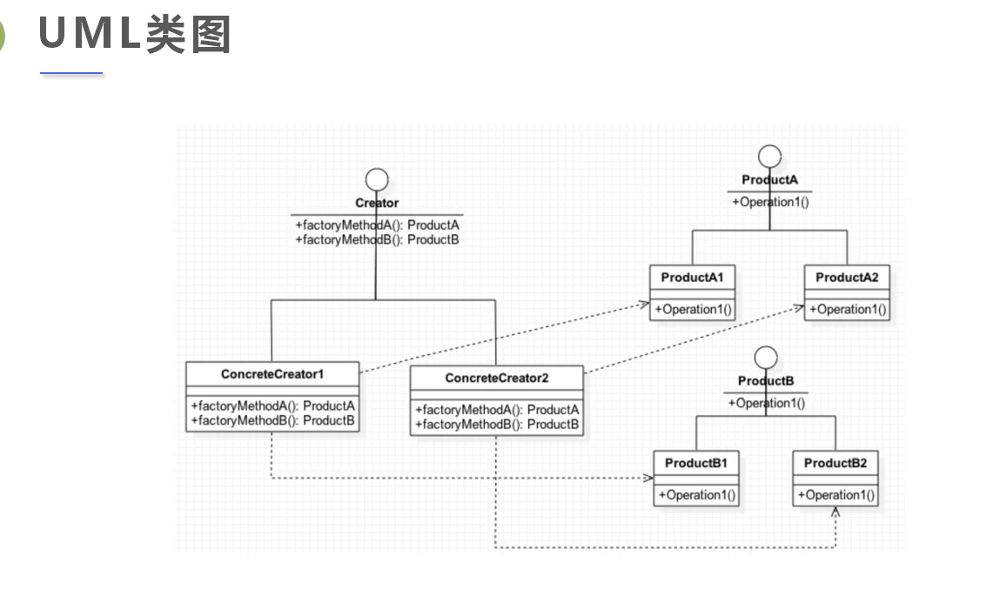

# 抽象工厂模式

### 1. 定义

它是一个超级工厂，用来创建其他工厂的。

抽象工厂模式提供了一个创建一系列相关或者相互依赖对象的接口，无需指定他们具体的类。

#### 1.1 产品族和产品等级的区别



如果**产品族比较固定**的情况下，可以考虑使用抽象工厂模式。

### 2. 适用场景

- 客户端（应用层）不依赖于产品类实例如何被创建、实现等细节

- 强调一系列相关的产品对象（属于同一产品族），一起使用创建对象需要大量的重复代码。

- 提供一个产品类的库，所有产品以同样的接口出现，从而使得客户端不依赖于具体得实现。

### 3. 代码实现




```java
// 手机产品接口
public interface IphoneProduct{
    void start();    
    void shutdown();
    void callup();
    void sendSMS();
    // ...
}
```


