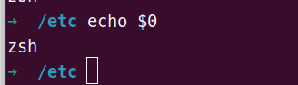

**（1）交互（interactive）式与非交互式shell**

> ****echo $0

交互式（与用户交互）： 在终端上执行，shell等待输入嘛并且立即执行用户提交的命令。

非交互式： 以shell script方式执行。 shell不与用户交互，直接读取指令执行。

`/etc/profile `是用户登录（su username）shell后运行的第一个启动脚本。

**（2）启动后加载配置文件的流程图：**

