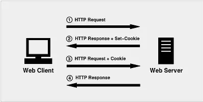
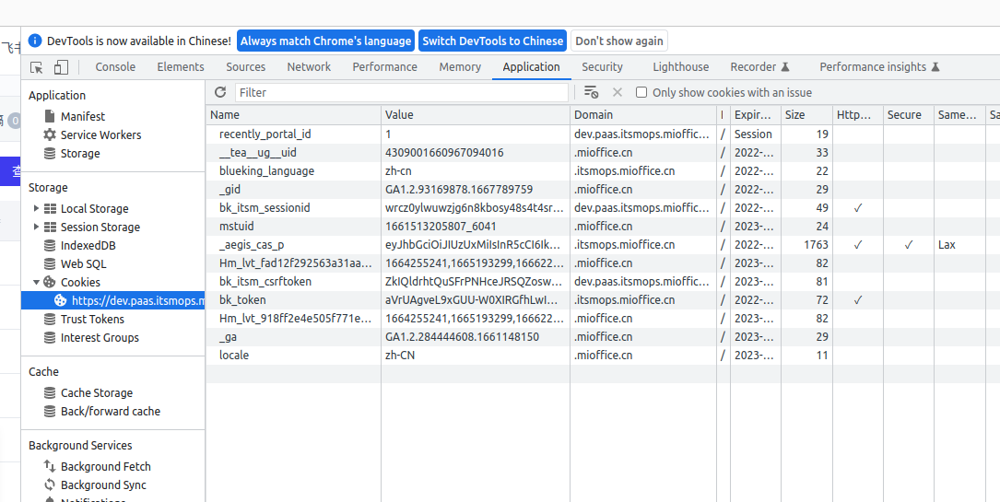

## 1. Cookie的交互机制

1. 浏览器(客户端)发送一个请求到服务器
2. 服务器响应。并在HttpResponse里增加一个响应头：Set-Cookie
3. 浏览器保存此cookie在本地，然后以后每次请求都带着它，且请求头为：Cookie
4. 服务器收到请求便可读取到此Cookie，做相应逻辑后给出响应

**在浏览器的Application中可以看到网站的Cookie**

