#### 1. docker 的基本使用流程

[Docker (简体中文) - ArchWiki](https://wiki.archlinux.org/title/Docker_(%E7%AE%80%E4%BD%93%E4%B8%AD%E6%96%87))

（1）新建一个新的容器并运行(`-i`: 表示交互式， `-t`: 表示tty，`-d`: 表示守护进程)

> docker run -it ubuntu:22.04 /bin/bash

（2）查看所有容器

> docker ps -a

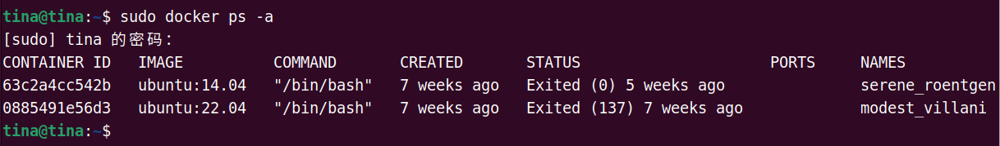

（3）启动一个容器

> docker container start id
> 
> docker start id

> docker exec -it id /bin/bash


（4）查看正在运行的容器

> docker container ls

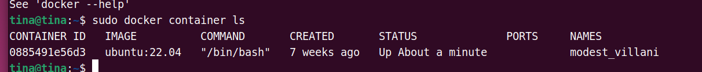

> docker ps

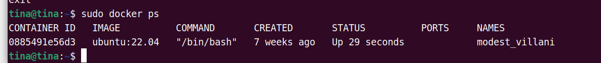

（5）进入正在运行的容器：

> docker attach containerID

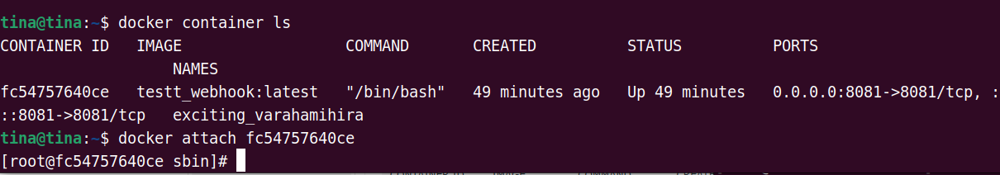

（6）删除容器

> docker rm -f  id

（7）关闭容器

> docker container stop id

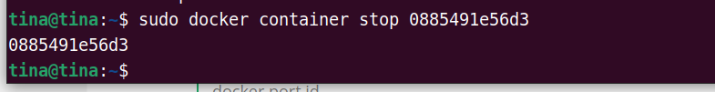

#### 2. 外部访问容器

:star2:  docker 容器如果在启动的时候，如果不指定端口映射的参数，容器外部不能通过网络来访问容器内部。

（1）将容器80端口映射到宿主机的8000端口

> docker run -it -p 8000:80  id /bin/bash

（2）查看端口映射配置

> docker port id

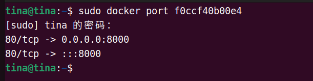

#### 3. 挂载外部文件或目录

（1）单目录挂载

> docker run -it -v /宿主机目录 : /容器目录

将当前目录挂载到容器的`/usr/local/src`目录上：

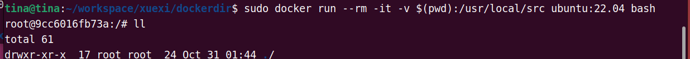

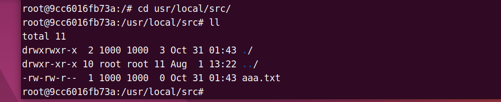

需要注意的是： 当宿主机对文件进行修改，那么容器中的文件也会被修改，被称为：**双向数据同步**。

#### 4. 从镜像仓库拉取指定镜像

> docker pull  [OPTIONS] NAME[:TAG|@DIGEST]

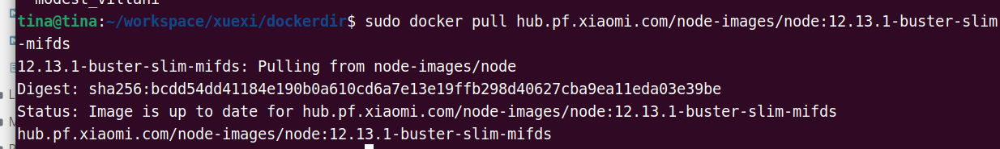

#### 5. docker 免sudo登录

**文件权限：`drwxrwxrwx`**

- 第一: 文件类型;

- 前三位：属主权限；

- 中三位：属组权限；

- 后三位：其他人权限;

（1）搜索docker执行文件：

> sudo find / -name 'docker' 2>/dev/null

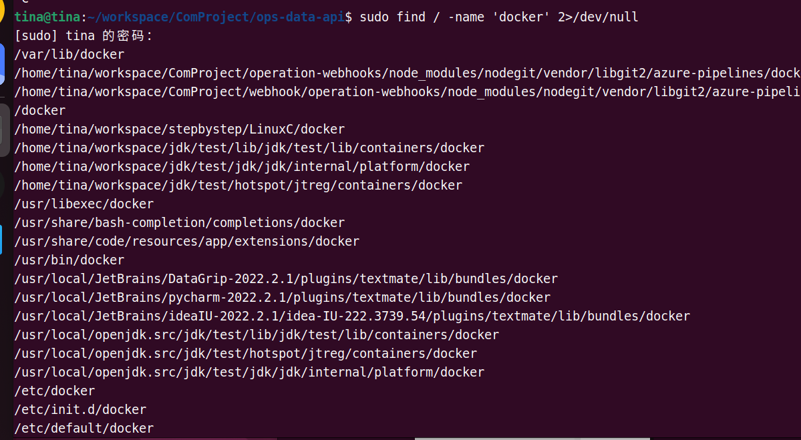

（2）查看docker执行文件权限


（3）docker其属组为docker

给docker属组添加当前用户：

> docker gpasswd -a ${USER} docker

系统重启生效。

#### 6. dockerfile 执行

> docker build -t <image_name> -f <dockerfile_name> <dockerfile_path>

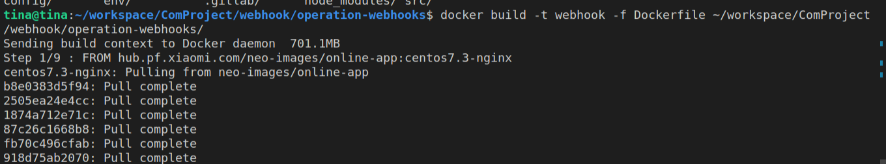

写一个Dockerfile

```shell
FROM ubuntu:22.04

RUN echo '这里是nginx'

RUN cd ~ 

RUN touch aaa.txt
```

然后执行dockerfile (记得加上最后的那个点)

> docker build -t shuang .   

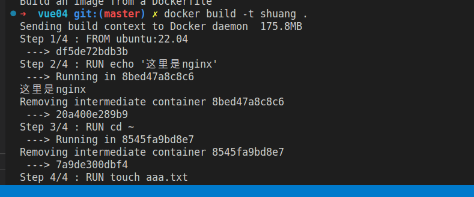

`--->`后面是镜像的ID

进入镜像去看一眼：

> docker run -it id /bin/bash

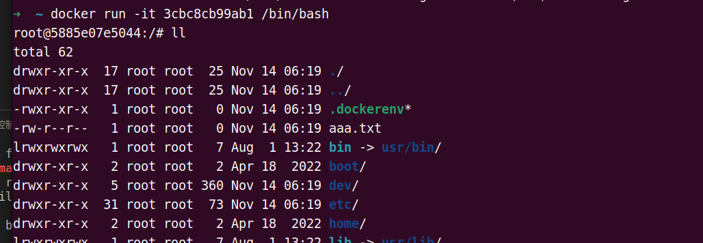

可以看到已经创建了aaa.txt这个文件

#### 7. 实例随宿主机开机启动

> docker run -m 512m --memory-swap 1G-it -p 58080:8080 --restart=always --name bvrfis --volumes -from logdata mytomcat:4.0 /root/run.sh  

`–restart`具体参数值详细信息：

> - no - 容器不自动重启
> - on-failure - 容器退出状态不为0时自动重启
> - on-failure:[n] - 容器退出状态不为0时自动重启，最大尝试n次
> - always - 始终尝试自动重启

#### 8. docker实例开机自起

（1）首先在dockerfile中新增

```
ENTRYPOINT ["java","-Dspring.config.location=/home/work/itsm/application-dev.yml", "-jar","/home/work/itsm/horizon-itsm-msgcenter.jar"]
```

（2）然后生成镜像

> docker build -t v1 -f Dockerfile .

（3）最后守护进程启动

> docker run -itd --name test-entrypoint  -p 6669:6669  5f71514c8798 /bin/bash

这样实例就自己启动了~

#### 9. 查看docker信息

指令：

> docker info


```shell
  ~ docker info
Client: Docker Engine - Community
 Version:    24.0.7
 Context:    default
 Debug Mode: false
 Plugins:
  buildx: Docker Buildx (Docker Inc.)
    Version:  v0.11.2
    Path:     /usr/libexec/docker/cli-plugins/docker-buildx
  compose: Docker Compose (Docker Inc.)
    Version:  v2.21.0
    Path:     /usr/libexec/docker/cli-plugins/docker-compose
  scan: Docker Scan (Docker Inc.)
    Version:  v0.23.0
    Path:     /usr/libexec/docker/cli-plugins/docker-scan

Server:
 Containers: 7
  Running: 0
  Paused: 0
  Stopped: 7
 Images: 9
 Server Version: 24.0.7
 Storage Driver: overlay2
  Backing Filesystem: extfs
  Supports d_type: true
  Using metacopy: false
  Native Overlay Diff: true
  userxattr: false
 Logging Driver: json-file
 Cgroup Driver: systemd
 Cgroup Version: 2
 Plugins:
  Volume: local
  Network: bridge host ipvlan macvlan null overlay
  Log: awslogs fluentd gcplogs gelf journald json-file local logentries splunk syslog
 Swarm: inactive
 Runtimes: io.containerd.runc.v2 runc
 Default Runtime: runc
 Init Binary: docker-init
 containerd version: 61f9fd88f79f081d64d6fa3bb1a0dc71ec870523
 runc version: v1.1.9-0-gccaecfc
 init version: de40ad0
 Security Options:
  apparmor
  seccomp
   Profile: builtin
  cgroupns
 Kernel Version: 6.2.0-39-generic
 Operating System: Ubuntu 22.04.3 LTS
 OSType: linux
 Architecture: x86_64
 CPUs: 20
 Total Memory: 31.11GiB
 Name: home
 ID: BGDS:P3WW:74SI:VRV7:767E:L6LD:OT4M:U45D:AERG:XSBV:EY67:DXOC
 Docker Root Dir: /var/lib/docker
 Debug Mode: false
 Experimental: false
 Insecure Registries:
  127.0.0.0/8
 Live Restore Enabled: false


```

#### 10. docker清理空间

> docker system prune

- 该指令默认会清除所有如下资源：
  - 已停止的容器（container）
  - 未被任何容器所使用的卷（volume）
  - 未被任何容器所关联的网络（network）
  - 所有悬空镜像（image）。

所以需要注意： 如果有暂时暂停的实例，不要用这个指令
