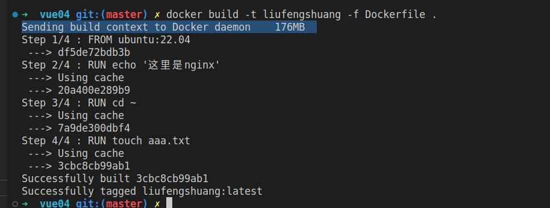

**:boom: 1. 多阶段构建的原因：**

编译的时候，可能会用到非常多的依赖，但是发布的时候，只需要编译后的产物，那么就可以创建一个用于编译的镜像重复使用。这样节省了资源，不必每次都下载很多编译依赖。

多阶段构建是在一个Dockerfile文件中可以有多个FROM， 也就是说多个容器之间相关联。

[Docker 的多阶段构建 · 从 Docker 到 Kubernetes 进阶手册](https://www.qikqiak.com/k8s-book/docs/12.Docker%E7%9A%84%E5%A4%9A%E9%98%B6%E6%AE%B5%E6%9E%84%E5%BB%BA.html)

**:exclamation: 2. 写一个Dockerfile需要注意的点：**

Dockerfile中，每一个指令都会新建一层，每一个RUN，都会新建一层。所以 **尽可能的少写RUN，应该如下这么写：能在一个RUN中写的，不要分开写**。

```docker
FROM debian:jessie
RUN buildDeps='gcc libc6-dev make' \
    && apt-get update \
    && apt-get install -y $buildDeps \
    && wget -O redis.tar.gz "http://download.redis.io/releases/redis-3.2.5.tar.gz" \
    && mkdir -p /usr/src/redis \
    && tar -xzf redis.tar.gz -C /usr/src/redis --strip-components=1 \
    && make -C /usr/src/redis \
    && make -C /usr/src/redis install \
    && rm -rf /var/lib/apt/lists/* \
    && rm redis.tar.gz \
    && rm -r /usr/src/redis \
    && apt-get purge -y --auto-remove $buildDeps
```

（1）Dockerfile 支持 Shell 类的**行尾添加`\`的命令**换行方式，以及**行首`#`进行注释**的格式 。良好的格式，比如换行、缩进、注释等，会让维护、排障更为容易，这是一个比较好的习惯。

（2）镜像是多层存储，每一层的东西并不会在下一层被删除，会一直跟随着镜像。因此镜像构建时，一定要确保每一层只添加真正需要添加的东西，任何无关的东西都应该清理掉。**不要忘记每一层构建的最后清理掉无关文件。** 就比如：

```
 && apt-get purge -y --auto-remove $buildDeps
```

**:maple_leaf:3. docker build 原理：**

（1）服务端和客户端

Docker 在运行是分为Docker引擎（服务端守护进程）和客户端工具。

Docker引擎提供了一组REST API， Docker客户端的命令是通过这组API与Docker引擎进行交互。

（2）上下文概念

> docker build -t xxx -f Dockerfile .

这个**点**表示的是当前目录，是指定的上下文路径，不是Dockerfile文件的路径。只是上下文路径中刚好包含了Dockerfile文件。

docker build命令构建镜像，并非在本地构建，而是在服务端（Docker 引擎）构建。

为了能让服务端获得本地文件，因此引入了**上下文**的概念，**点**指定的就是上下文的路径，当docker build这个命令知道了上下文的路径以后，会将这个路径下的所有内容打包，然后上传给服务端（Docker引擎），服务端获取到这个上下文的包以后，展开就会获得构建镜像所需的一切文件。



在上面的图中可以看到

> Sending build context to docker daemon

这个打印的信息就是显示向docker引擎守护进程发送当前上下文信息。
