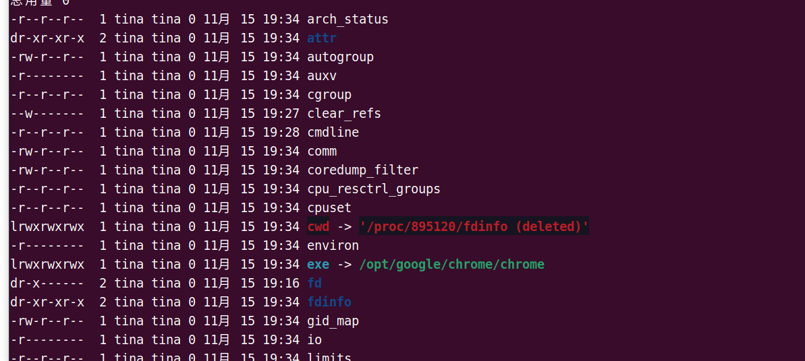
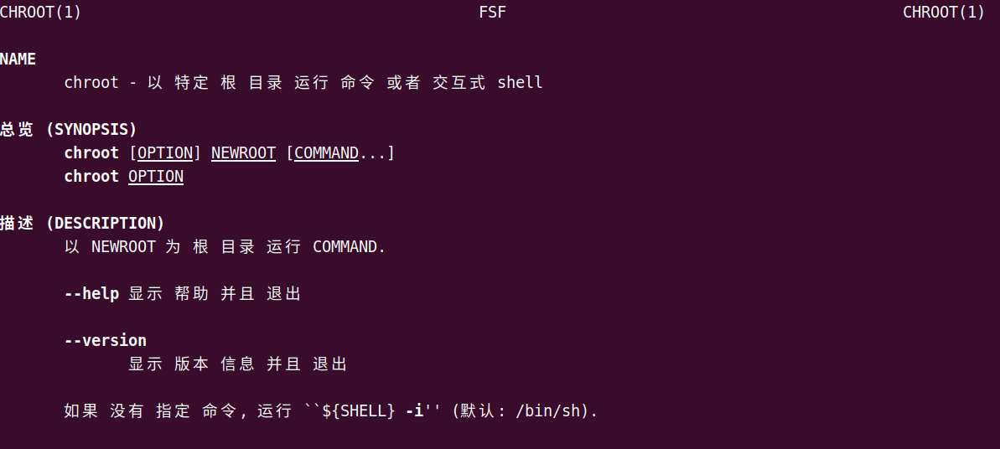
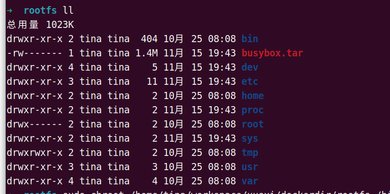
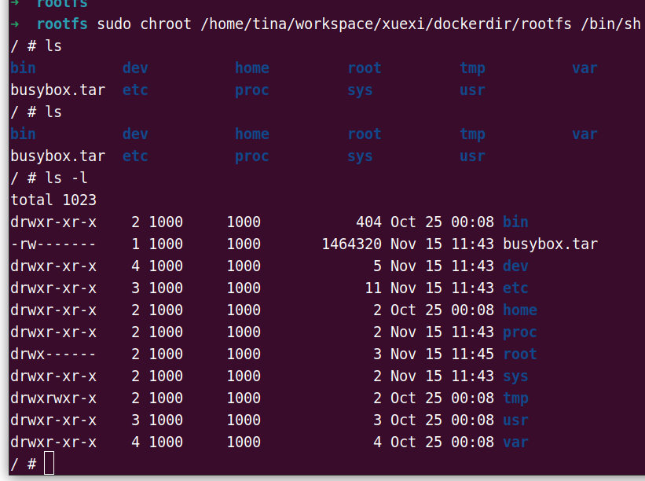
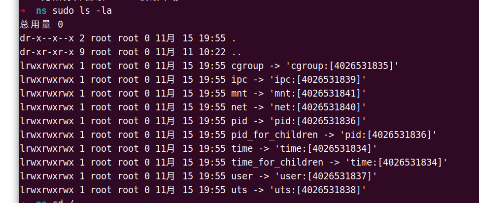
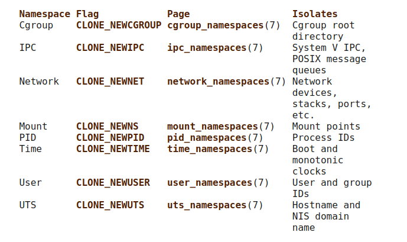
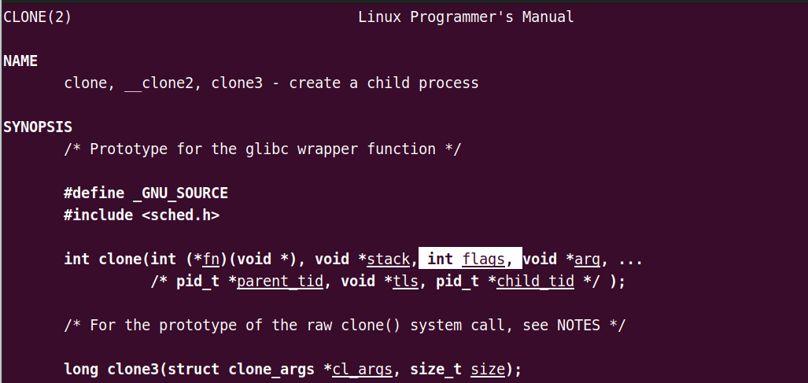
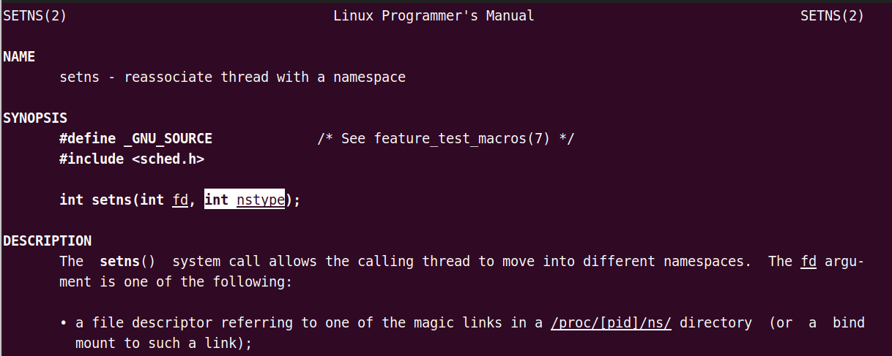
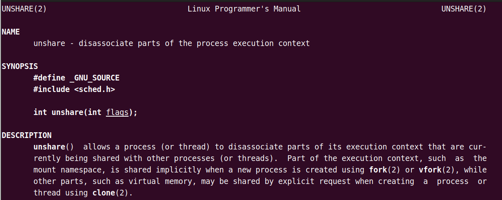
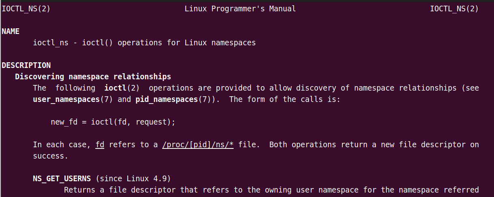

## :sparkles:1.chroot

**（1）前言：**

/proc/[pid]文件夹下记录了进程的所有信息：



cwd是进程的运行目录，

environ记录了进程运行时的环境变量

fd是进程打开或者使用的文件的符号链接

exe指向的是执行程序的绝对路径。

ns 是进程命名空间指针

**（2）chroot**

一个进程中，包

> man chroot



针对特定的目录，且在经过chroot设置更目录的程序，不能对这个指定根目录之外的文件进行访问。

也就是说，chroot可以修改某个进程的跟目录，使这个程序不能访问该目录之外的目录。



> sudo chroot /home/tina/workspace/xuexi/dockerdir/rootfs /bin/sh

将`/home/tina/workspace/xuexi/dockerdir/rootfs`目录设置为`/bin/sh`进程的根目录。



这样就实现了当前进程与主机的隔离。

## :sparkles:2.namespace

**（1）namespace描述**

[namespaces](https://man7.org/linux/man-pages/man7/namespaces.7.html)是 Linux 内核的一项功能，该功能对内核资源进行隔离，使得容器中的进程都可以在单独的命名空间中运行，并且只可以访问当前容器命名空间的资源。

> cd /proc/pid/ns
> 
> sudo ls -la

在/proc/[pid]/ns 目录下，有关各种命名空间类型的指针



**（2）namespace的类型：** todo 这里自己总结一下。。。



**（3）namespace所涉及的API**

```c
clone()
// clone是一个系统调用，用于创建一个新的进程。如果在flag参数中指定一个或者多个
// CLONE_NEW[XX]的flag，则创建的新进程在相应的命名空间中，且且其子进程也在
// 该命名空间
```



```c
setns()
// 该函数为系统调用，允许调用的进程进入现有的命名空间。要加入的命名空间是通过
// /proc/[pid]/ns 下的文件描述符来指定
```



```c
unshare()
// 系统调用，将调用进程移动到一个新的命名空间。如果调用的flags参数指定
// 相应的CLONE_NEW[XX]标志，则为每个标志创建新的命名空间，且调用进程
// 成为这些命名空间的成员
```



```c
ioctl() 相关函数
//用于发现有关命名空间的信息
```

例如：

```c
ioctl_ns()
// 是ioctl对命名空间的相关操作
```



## :sparkles:3. cgroups

Cgroups 是一种 Linux 内核功能，可以限制和隔离进程的资源使用情况（CPU、内存、磁盘 I/O、网络等）。在容器的实现中，Cgroups 通常用来限制容器的 CPU 和内存等资源的使用。
