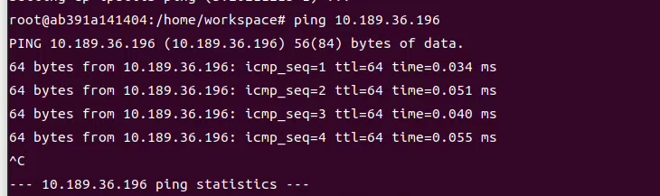
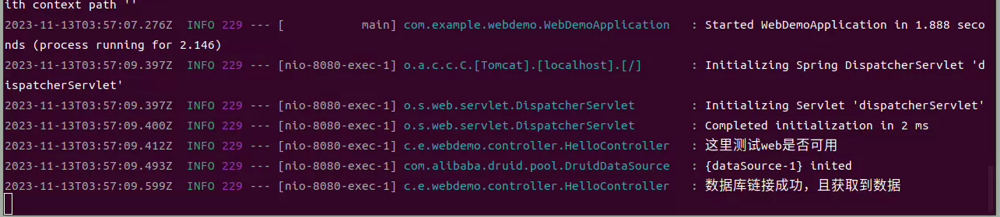
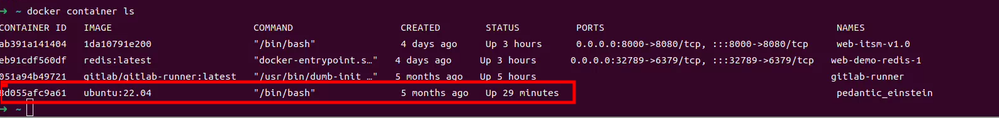
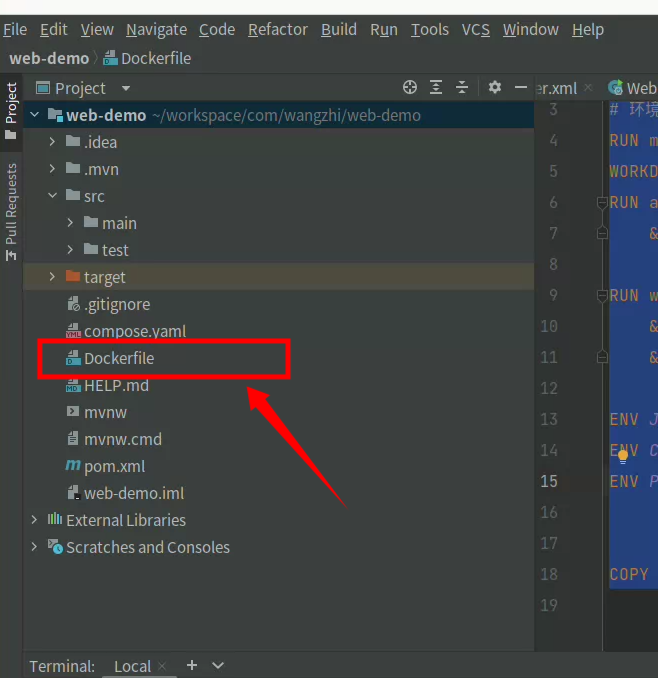
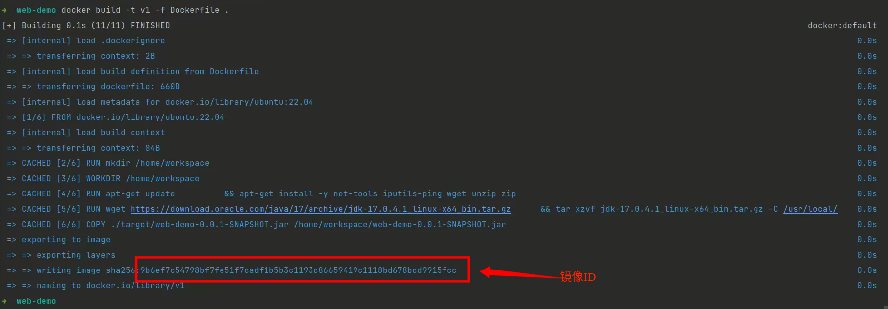
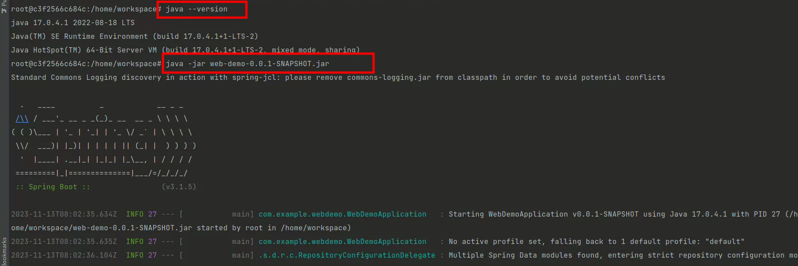

### Docker搭建项目环境

(1)拉取基础环境

```shell
docker run  --name test-itsm   -it ubuntu:22.04 /bin/bash
```


（2）进入实例

```shell
docker ps -a
docker container start 51dee006902e
docker exec -it 51dee006902e /bin/bash
```


（3）实例修改apt源「暂不需要」

（4）安装开发包

```shell
apt-get install build-essential
```

（5）下载openjdk源码「**可以直接apt-get install openjdk**」

链接：[Tags · openjdk/jdk · GitHub](https://github.com/openjdk/jdk/tags)

找到JDK20下载源码，下载引导JDK19， 同时编译JDK20源码

```shell
 cd /usr/local/src/
 apt-get install wget
 wget https://github.com/openjdk/jdk/archive/refs/tags/jdk-20+1.tar.gz
 tar -zxvf jdk-20+1.tar.gz 
 apt-get install autoconf
 apt-get install file
 apt-get install unzip
 apt-get install zip
 wget https://download.oracle.com/java/19/archive/jdk-19.0.2_linux-x64_bin.tar.gz
 tar -zxvf jdk-19.0.2_linux-x64_bin.tar.gz
 bash configure --with-boot-jdk=/usr/local/src/jdk-19.0.2
 apt-get install libasound2-dev
 apt-get install libcups2-dev
 apt-get install libfontconfig1-dev
 apt-get install libx11-dev libxext-dev libxrender-dev libxrandr-dev libxtst-dev libxt-dev
 make all
 cd build/
```

（6）安装redis

```shell
 apt install lsb-release curl gpg
 curl -fsSL https://packages.redis.io/gpg | sudo gpg --dearmor -o /usr/share/keyrings/redis-archive-keyring.gpg

echo "deb [signed-by=/usr/share/keyrings/redis-archive-keyring.gpg] https://packages.redis.io/deb $(lsb_release -cs) main" | sudo tee /etc/apt/sources.list.d/redis.list

sudo apt-get update
sudo apt-get install redis
```

todo : 配置

（7）安装maven (本地打好Jar包，不用maven)

（8）安装mysql

（9）将文件拷贝至容器

> docker cp web-demo-0.0.1-SNAPSHOT.jar 51dee006902e:/home/workspace

（10）运行app.jar

> java -jar web-demo-0.0.1-SNAPSHOT.jar


执行成功

(11) 生成镜像

> docker commit 51dee006902e test-itsm:v1

（12）创建一个带端口映射的实例

> docker image ls


> docker run -it --name web-itsm-v1.0 -p 8000:8080 1da10791e200 /bin/bash


> docker ps -a


> docker container start ab391a141404


> docker container ls


> docker exec -it ab391a141404 /bin/bash


（13）项目跑起来后，宿主机观察结果

结果是正常的，是因为项目还没写东西 ~ 0 ~ 


（14）查看本机IP， 并保证容器可ping宿主机

```shell
# 安装依赖
apt-get install net-tools
apt-get install iputils-ping
```



（15）数据库保证可远程链接

（16）新增数据库链接代码后， 重新打包运行。

```java
    @GetMapping("/testWeb")
    public String testWeb(){
        log.info("这里测试web是否可用");
        UserDo dp = userMapper.hasUser11("18832282468");
        if(dp == null){
            log.info("数据库获取为空");
        }else{
            log.info("数据库链接成功，且获取到数据");
        }
        return "ok";
    }
```



到此，可以保证容器内Application可以与外界数据库连接。

（17）将mysql替换为docker内运行。

创建一个mysql的docker容器， 然后切换Application中的mysql IP， 依然可执行。



（18）连接RocketMq

```shell
wget https://dist.apache.org/repos/dist/release/rocketmq/5.1.4/rocketmq-all-5.1.4-bin-release.zip
unzip rocketmq-all-5.1.4-bin-release.zip

sh mqnamesrv
```

基本上其他的组件跟mysql类似，使用一个容器跑起来。

（19）环境搭建OK， 那么开始在项目根写Dockerfile



```dockerfile
FROM ubuntu:22.04 as itsm-web-v1-0-0

# 环境搭建
RUN mkdir /home/workspace
WORKDIR /home/workspace
RUN apt-get update      \
    && apt-get install -y net-tools iputils-ping wget unzip zip

RUN wget https://download.oracle.com/java/17/archive/jdk-17.0.4.1_linux-x64_bin.tar.gz  \
    && tar xzvf jdk-17.0.4.1_linux-x64_bin.tar.gz -C /usr/local/  \
    && rm -rf jdk-17.0.4.1_linux-x64_bin.tar.gz

ENV JAVA_HOME=/usr/local/jdk-17.0.4.1/
ENV CLASSPATH=.:$JAVA_HOME/lib/dt.jar:$JAVA_HOME/lib/tools.jar
ENV PATH=$PATH:$JAVA_HOME/bin


COPY ./target/web-demo-0.0.1-SNAPSHOT.jar /home/workspace/web-demo-0.0.1-SNAPSHOT.jar
```

（21）Dockerfile写好后，在项目根目录下执行一下命令，构建镜像

```shell
 docker build -t v1 -f Dockerfile .  
```



然后根据镜像ID创建项目实例

```shell
docker run -it --name dockerfile-make-itsm-v3 -p 8000:8080 9b6ef7c54798bf   /bin/bash
```

实例创建后，进入看项目是否能正确运行~， 即可


