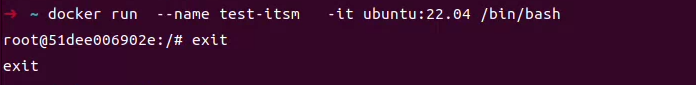
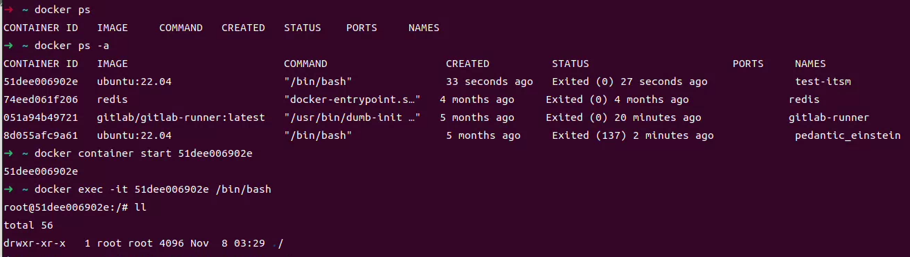
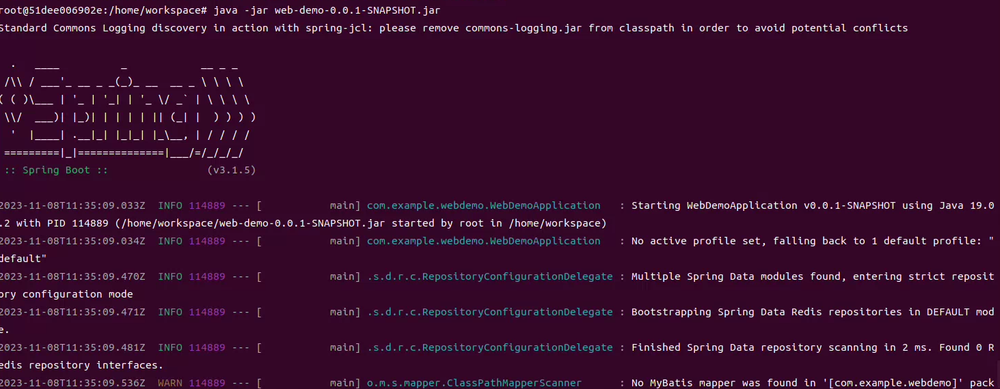
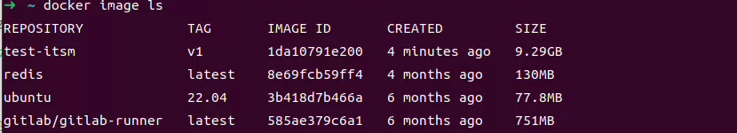
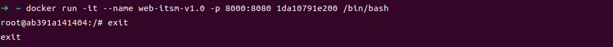
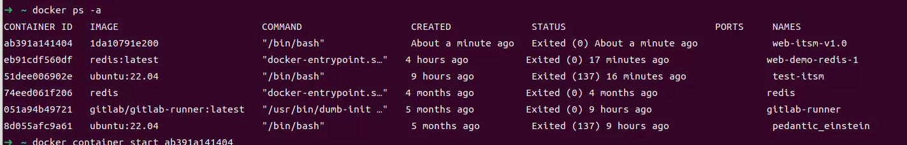
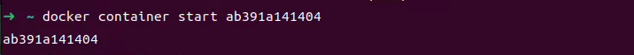
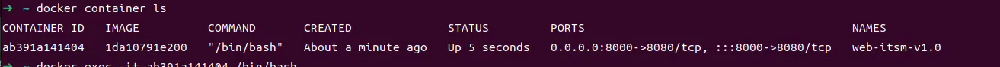
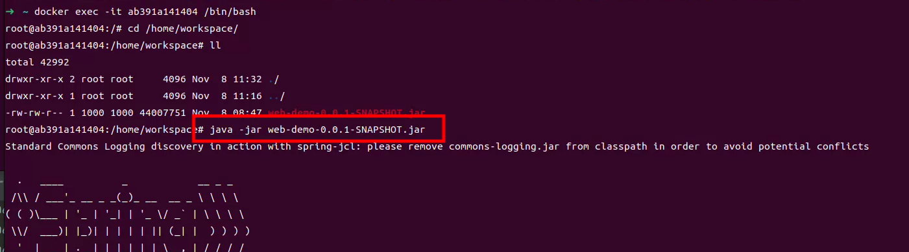
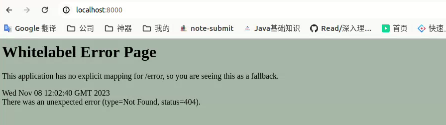

### Docker搭建项目环境

(1)拉取基础环境

```shell
docker run  --name test-itsm   -it ubuntu:22.04 /bin/bash
```



（2）进入实例

```shell
docker ps -a
docker container start 51dee006902e
docker exec -it 51dee006902e /bin/bash
```



（3）实例修改apt源「暂不需要」

（4）安装开发包

```shell
apt-get install build-essential
```

（5）下载openjdk源码「**可以直接apt-get install openjdk**」

链接：[Tags · openjdk/jdk · GitHub](https://github.com/openjdk/jdk/tags)

找到JDK20下载源码，下载引导JDK19， 同时编译JDK20源码

```shell
 cd /usr/local/src/
 apt-get install wget
 wget https://github.com/openjdk/jdk/archive/refs/tags/jdk-20+1.tar.gz
 tar -zxvf jdk-20+1.tar.gz 
 apt-get install autoconf
 apt-get install file
 apt-get install unzip
 apt-get install zip
 wget https://download.oracle.com/java/19/archive/jdk-19.0.2_linux-x64_bin.tar.gz
 tar -zxvf jdk-19.0.2_linux-x64_bin.tar.gz
 bash configure --with-boot-jdk=/usr/local/src/jdk-19.0.2
 apt-get install libasound2-dev
 apt-get install libcups2-dev
 apt-get install libfontconfig1-dev
 apt-get install libx11-dev libxext-dev libxrender-dev libxrandr-dev libxtst-dev libxt-dev
 make all
 cd build/
```

（6）安装redis

```shell
 apt install lsb-release curl gpg
 curl -fsSL https://packages.redis.io/gpg | sudo gpg --dearmor -o /usr/share/keyrings/redis-archive-keyring.gpg

echo "deb [signed-by=/usr/share/keyrings/redis-archive-keyring.gpg] https://packages.redis.io/deb $(lsb_release -cs) main" | sudo tee /etc/apt/sources.list.d/redis.list

sudo apt-get update
sudo apt-get install redis
```

todo : 配置

（7）安装maven (本地打好Jar包，不用maven)

（8）安装mysql

（9）将文件拷贝至容器

> docker cp web-demo-0.0.1-SNAPSHOT.jar 51dee006902e:/home/workspace

（10）运行app.jar

> java -jar web-demo-0.0.1-SNAPSHOT.jar



执行成功

(11) 生成镜像

> docker commit 51dee006902e test-itsm:v1

（12）创建一个带端口映射的实例

> docker image ls



> docker run -it --name web-itsm-v1.0 -p 8000:8080 1da10791e200 /bin/bash



> docker ps -a



> docker container start ab391a141404



> docker container ls



> docker exec -it ab391a141404 /bin/bash



（13）项目跑起来后，宿主机观察结果

结果是正常的，是因为项目还没写东西 ~ 0 ~ 


