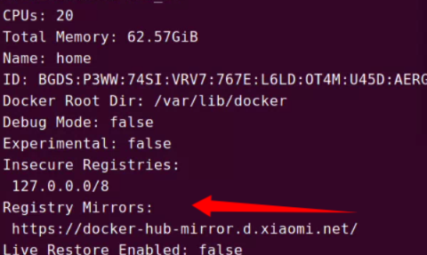

## ubuntu 设置docker镜像代理

1. 编辑或创建Docker的配置文件`/etc/docker/daemon.json`

> sudo vim /etc/docker/daemon.json

2. 添加以下内容
   
   ```json
   {
     "registry-mirrors": ["https://<your-id>.mirror.aliyuncs.com"]
   }
   ```

3. 重启docker服务
   
   ```shell
   sudo systemctl daemon-reload
   sudo systemctl restart docker
   ```

4. 验证是否生效
   
   ```shell
   docker info
   ```
   
   


