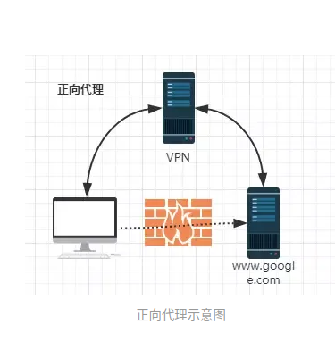
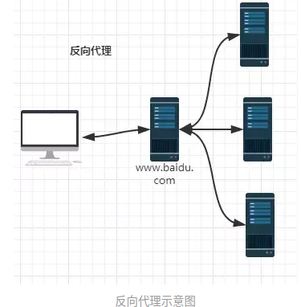
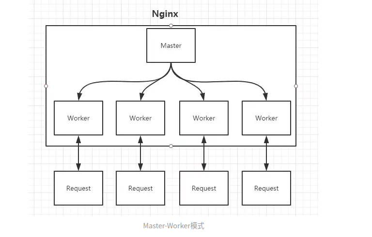

nginx是轻量级的web服务器、反向代理服务器。

（1）正向代理

（2）反向代理

启动Nginx后，其实就是在80端口启动了Socket服务进行监听，如图所示，Nginx涉及Master进程和Worker进程。

Master进程的作用是？

**读取并验证配置文件nginx.conf；管理worker进程；**

Worker进程的作用是？

**每一个Worker进程都维护一个线程（避免线程切换），处理连接和请求；注意Worker进程的个数由配置文件决定，一般和CPU个数相关（有利于进程切换），配置几个就有几个Worker进程。**

https://zhuanlan.zhihu.com/p/34943332
