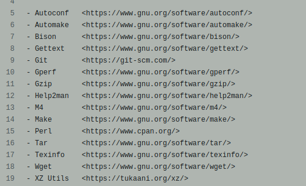
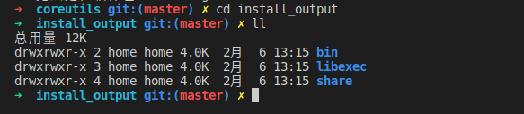

# coreutil配置调试环境

## 1. 准备

### 1.1 下载源码

github地址： https://github.com/coreutils/coreutils/

将源码下载到本地

### 1.2 相关软件准备

参考：[coreutils/README-prereq at master · coreutils/coreutils · GitHub](https://github.com/coreutils/coreutils/blob/master/README-prereq)

本地需要安装以下软件：



大部分都可以使用`sudo apt install xxx` 来安装（注意：首字母要小写）

如果不能被apt安装，则按照地址下载源码，编译安装。例如：autoconf的安装

```shell
  prefix=$HOME/prefix   # (or wherever else you choose)
  export PATH=$prefix/bin:$PATH
  wget https://ftp.gnu.org/pub/gnu/autoconf/autoconf-2.71.tar.gz
  gzip -d <autoconf-2.71.tar.gz | tar xf -
  cd autoconf-2.71
  ./configure --prefix=$prefix
  make install
```

## 2. 开发环境vscode配置

使用vscode打开源码目录，然后创建.vscode文件夹，并在其中创建以下文件。

**（1）c_cpp_properties.json**

```json
{
    "configurations": [
        {
            "name": "Linux",
            "includePath": [
                "${workspaceFolder}/src/",
                "/usr/include",
                "/usr/local/include",
                "/usr/include/linux/",
                "/home/home/workspace/xuexi/coreutils/**" // 直接填项目绝对路径，咱也不知道为啥
            ],
            "browse": {
                "path": ["${workspaceFolder}/src/"],
                "limitSymbolsToIncludedHeaders": true,
                "databaseFilename": ""
            },
            "defines": [],
            "compilerPath": "/usr/bin/gcc",
            "cStandard": "c11",
            "cppStandard": "c++17",
            "intelliSenseMode": "linux-gcc-x64"
        }
    ],
    "version": 4
}
```

## 3. 进行配置编译

在项目根目录下执行：

> ./bootstrap

然后进行配置(描述好安装路径)

> ./configure  -prefix=/home/home/workspace/xuexi/coreutils/install_output --disable-nls

配置完成后，然后执行编译安装

> make install

可以看到安装路径下已经有了打包好的可执行文件。



## 4. 进行调试运行配置

使用vscode打开源码目录，然后创建.vscode文件夹，并在其中创建以下文件。

**（1）launch.json**

```json
{
    // 使用 IntelliSense 了解相关属性。 
    // 悬停以查看现有属性的描述。
    // 欲了解更多信息，请访问: https://go.microsoft.com/fwlink/?linkid=830387
    "version": "0.2.0",
    "configurations": [
        {
            "name": "coreutil-src",
            "type": "cppdbg",
            "request": "launch",
            "program": "/home/home/workspace/xuexi/coreutils/install_output/bin/nohup", //要运行的目标程序
            "args": ["idea.sh"], // 这个是执行参数
            "stopAtEntry": true,
            "cwd": "${workspaceFolder}/src/", // 鼠标放上去有惊喜,目标的工作目录
            "environment": [ //配置环境变量
                // {
                //     "name": "CLASSPATH",
                //     "value": "/home/tina/workspace/stepbystep/LeetCode/HelloWorld/out/production"
                // },
            ],
            "setupCommands": [
                {
                    "text": "handle SIGSEGV pass noprint nostop", 
                    "description": "ignore SIGSEGV", 
                    "ignoreFailures": true 
                }
            ],
            "externalConsole": false,
            "MIMode": "gdb",
            // "preLaunchTask": "jdk11s-build"  //运行编译任务
        }
    ]
}
```

然后就可以调试程序了，也可以切换为其他的程序。


