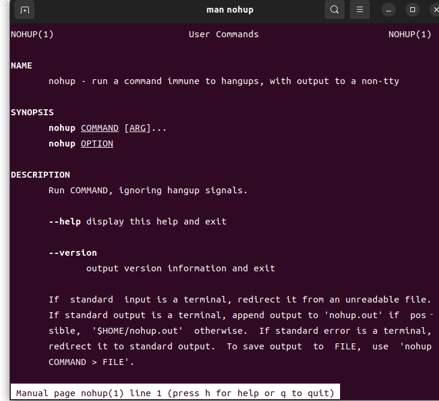

# nohup

## 1. 描述

该命令可以使一个进程在后台运行，即关闭终端，但是程序不退出。

## 2. 用法

用法： 

> nohup xxx


`man`一下看：



## 3. 源码分析

源码位置：[coreutils/nohup.c at master · coreutils/coreutils · GitHub](https://github.com/coreutils/coreutils/blob/master/src/nohup.c)

[coreutils/nohup.c at master · shuangshuangshuangfeng/coreutils · GitHub](https://github.com/shuangshuangshuangfeng/coreutils/blob/master/src/nohup.c)

### 3.1 引用

**（1）emit_try_help()**

`emit_try_help()；`:  源自： `system.h`   [src/system.h - coreutils-8.23](http://agentzh.org/misc/code/coreutils/system.h.html), 即打印需要帮助的信息。源码如下；

```c
‌emit_try_help (void)
{
  fprintf (stderr, _("Try '%s --help' for more information.\n"), program_name);
}
```

**（2）EXIT_SUCCESS**

https://en.cppreference.com/w/cpp/utility/program/EXIT_status

| `EXIT_SUCCESS` | 程序执行成功 |
| -------------- | ------ |
| `EXIT_FAILURE` | 程序执行失败 |

**（3）STDOUT_FILENO 和 STDERR_FILENO**

`STDIN_FILENO` ：File number of *stdin*. It is 0. 即 标准输入的文件编号： 0

`STDOUT_FILENO` ： File number of *stdout*. It is 1. 即 标准输出的文件编号： 1

`STDERR_FILENO `： File number of *stderr*. It is 2. 即 标准错误的文件编号： 2

源自：`unistd.h` [&lt;unistd.h&gt;](https://pubs.opengroup.org/onlinepubs/7908799/xsh/unistd.h.html)
