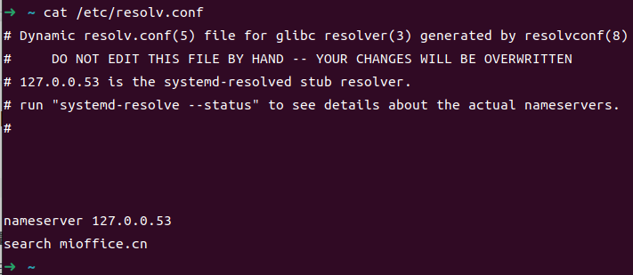

## 1. 修改本地DNS

**（1）系统默认设置**

目录`/etc/systemd`目录下的文件均为初始配置文件，只包含了默认值，便于系统管理员查看和直接修改。

**（2）用户个性化设置**

个性化配置需要写在目录` /usr/lib/systemd/ *.conf.d/`或者` /etc/systemd/resolved.conf.d/*.conf`下。

### 1.1 配置目录优先级

1. /etc/systemd/ 目录中的初始配置文件（最好不要动）

2. /usr/lib/systemd/*.conf.d/ 目录（**优先级最高**）（自己改的地方）

**注意：** 以下文件千万别改！

大佬说： 好多conf、proc都可以man

**官方文档：**

https://manpages.ubuntu.com/manpages/jammy/zh_CN/man5/resolved.conf.5.html
