# 03 文件系统

具体内容：

**（类ls的实现， 如`myls`）贯穿始终**

- 目录和文件
  
  - 如何获取文件属性
  
  - 文件访问权限问题
  
  - `umask`
  
  - `chmod`, `fchmod `文件权限更改/管理
  
  - 粘住位
  
  - 文件系统：`FAT`, `UFS`
  
  - 硬链接， 符号链接
  
  - `utime`
  
  - 目录的创建和销毁
  
  - 更改当前工作路径
  
  - 分析目录/读取目录内容

- 系统数据文件和信息

- 进程环境

## 目录和文件

## 命令

一个命令的格式如下：

`cmd --长格式  -短格式`  非选项的传参

比如 `ls --all` 和 `ls -a `他们的结果是一样的。

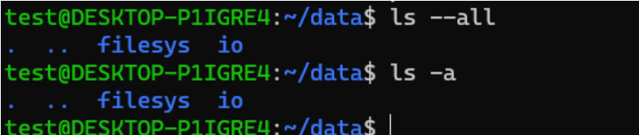

明明短格式是可以的，那么为什么要有长格式？？

可能两个单词的首字母什么的会相同。或者两个单词的缩写撞在了一起。

如果我想创建一个名字是-a的文件，那么，该如何？？

- `touch -- -a` 命令**后面加上两个减号，表示当前的命令结束。**

- `touch ./-a` 将路径写上，就不会被认作命令参数了。

例子：

然后实现一个`myls`的命令， 支持`myls -l , -a , -n, -i`

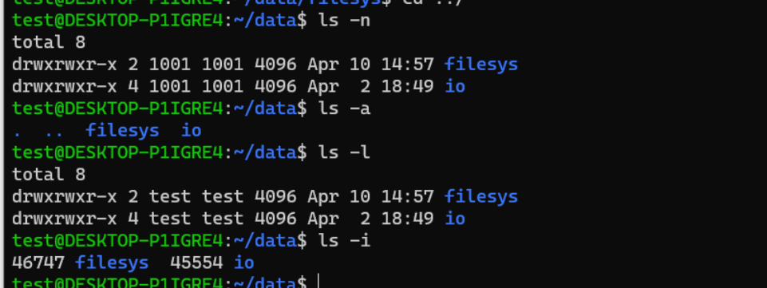

**注意**： `ls -l` 和` ls -n `的区别：一个用户ID和用户NAME的区别：

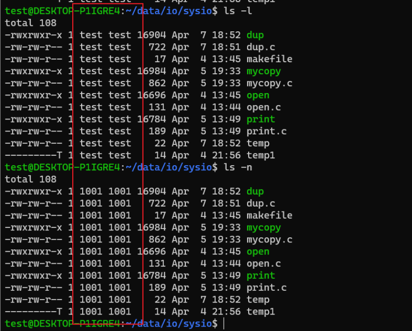

## /etc/passwd 和 /etc/group文件

说到用户名和ID，有两个文件，分别是: `/etc/passwd` 和` /etc/group`

`/etc/passwd`文件，用户名:group名:用户ID:groupID

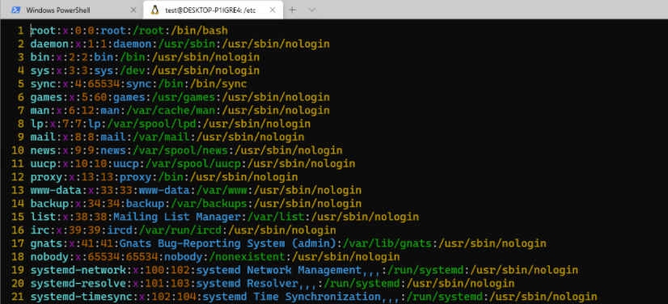

`/etc/group`文件， 用户名: 组名 : 组号

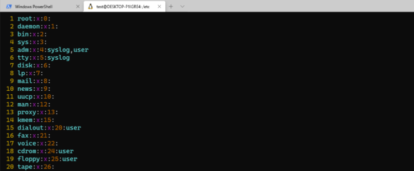

有这两个文件，就可以根据`userName` 获得ID号，或者根据ID号获得用户名

## 如何获取文件属性信息 stat, 系统调用

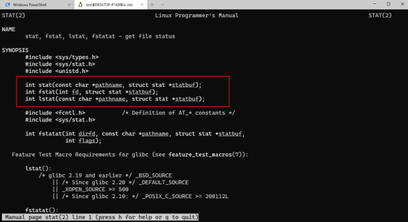

**注意**：这三个函数的格式，在`linux`当中，很多函数的封装是沿用这样的规律的，很多命名规则都是这样的

- `stat `： 通过名字做这件事

- `fstat`: 通过文件描述符来做这件事情

- `lstat`: ` lstat` 和` stat` 在参数和返回上都一样，但是他们在`link`的处理上是不同的

`stat`结构体长这样：关于一个文件的所有内容几乎都在这里了。。。

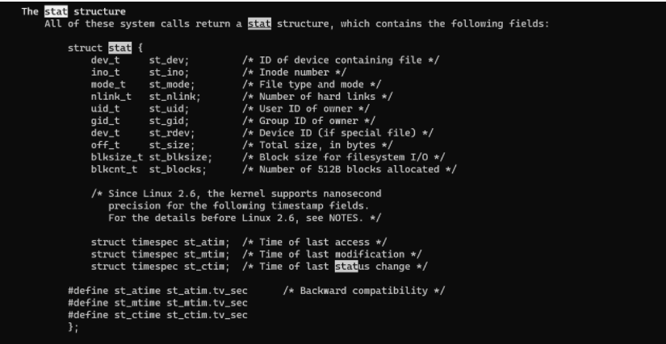

同时`stat `也是一个命令：用来显示一个文件的属性， 所以stat这个命令是用`stat`这个函数封装出来的。

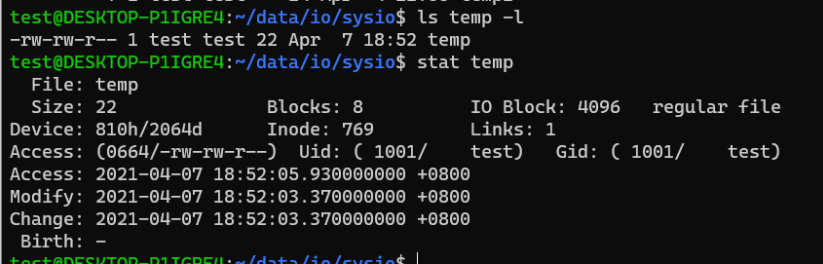

例子： 显示一个文件的大小：

```c
#include <stdio.h>
#include <stdlib.h>
#include <sys/types.h>
#include <sys/stat.h>
#include <unistd.h>

static int flen(const char *fname) // static表示这个函数禁止外部扩展
{
    struct stat statres;
    if(stat(fname, &statres) < 0)
    {
        perror("stat");
        exit(1);
    }
    return statres.st_size;
}

int main(int argc, char **argv)
{
    if(argc < 2)
    {
        fprintf(stderr, "Usage ... \n");
        exit(1);
    }
    printf("%d \n", flen(argv[1));
    exit(0);
}
```

**注意**：这个程序是有个小`bug`的，因为`st_size`的类型是`off_t`， `off_t `类型是32位还是64位是不知道的，它只是说在一些体系结构会把`off_t`类型和`long`型一样定义成32位的，但是它确定是多少位是不知道的。

最好的解决办法是使用`makefile`， 然后确定`off_t`的类型的大小

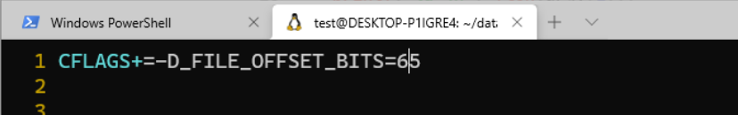

**注意**：实际上，`windows`中，一个文件的大小就是所占的磁盘的大小，但是在`linux`中，并不是这样的，**一个文件所占的大小是由这个文件所占用的`block`大小和`block`数量决定的**，`block`是指一个文件所占用**的块数， 永远指的是扇区数。**

## 空洞文件

我们做一个非常大的文件，但是占用磁盘空间很小，甚至不占用。

```c
#include <stdio.h>
#include <stdlib.h>
#include <sys/types.h>
#include <sys/stat.h>
#include <unistd.h>
#include <fcntl.h>

int main(int argc, char **argv)
{
        int fd;
        if(argc < 2)
        {
                fprintf(stderr, "Usage ...\n");
                exit(-1);
        }

        fd = open(argv[1], O_WRONLY|O_CREAT|O_TRUNC, 0600);
        if(fd < 0)
        {
                perror("open");
                exit(-1);
        }

        lseek(fd, 5*1024*1024, SEEK_SET); // 5G, 将文件尾指针一下子扯过去
        /* if error*/

        write(fd, "", 1); // 使用一次系统调用，如果没有这次系统调用，当前文件是不占用空间的
        close(fd);
        exit(0);
}
```

运行这个文件，然后得到一个大文件，可以看到，虽然这个文件显示的是5G大小，但是它所占磁盘空间才8k， 很小很小。

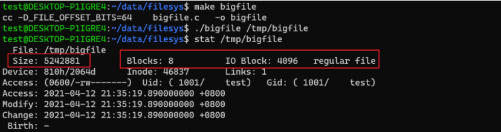

**然后cp 拷贝一下这个文件，你会发现拷贝以后的文件所占磁盘大小尾0， 为什么呢？？**

因为cp在拷贝的时候，会判断这个文件是否是空洞文件，如果中间有空字符，它会记住空字符的长度，但是不会存这个空字符，所以它拷贝以后的这个文件是0字节。

## 文件属性

当执行命令`ll`的时候，如下: （红框框中的内容是文件的权限信息）。

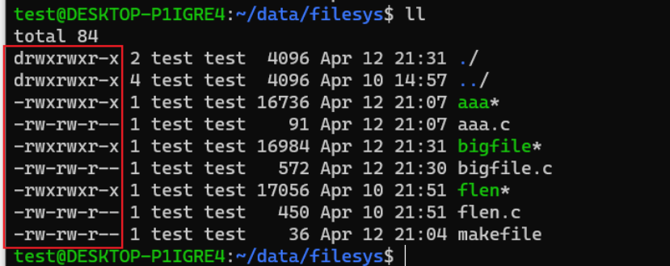

文件的权限信息包括：（文件的权限信息存在于`st_mode`当中，`st_mode`的存放形**式是以位图的形式存放的**， 是16位的一个整型数，为什么是16位？基本位是9位，加另外3位（...），文件类型是7类，用二进制表示使用3位， 加一起是15位，但是没有15位的整型数，**所以是使用16位的整型数表示的**。）

`st_mode`存了两种类型：

- 文件类型（分为`dcb-lsp`七种文件类型） **d:目录； c:字符设备文件; b:块设备文件;  -:常规文件;  l:符号链接文件;  s:网络套接字`socket`文件; p:管道文**

- 文件权限（当前用户， 当前组用户， 其他用户）

注意： **`st_mode`是一个16位的位图，用于表示文件类型，文件访问权限及特殊权限位。**

## `umask`

1. `umask`是一条命令，用来查看当前`umask`的值是多少，也可以更改当前`umask`的值，

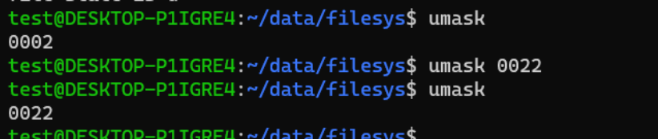

创建文件的化，权限会满足`0666& ~umask`的表达式

这种机制的存在就是为了防止产生权限过松的文件。

2. `umask`还是 一个系统调用，如果在进程当中想要设置这个`umask`的值的化，可以调用`umask`这个函数， 如下：

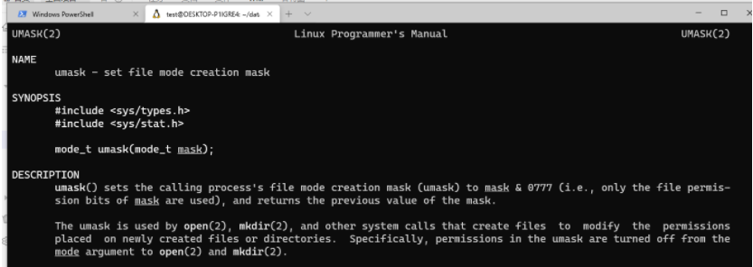

## 文件权限管理 `chmod`, `fchmod`

1. `chmod `的作用是在终端上更改文件权限, 

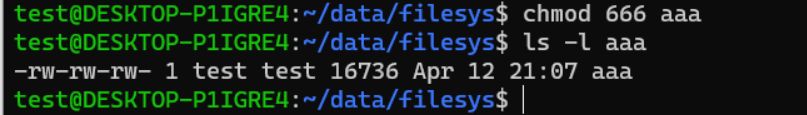

比如说，我们写的脚本，本来脚本是没有运行权限的，然后我们使用`chmod a+x  aaa`

`a+x`表示的是所有用户有可执行权限，所以我们还可以使用`u+x`， `g+x`, `o+x`

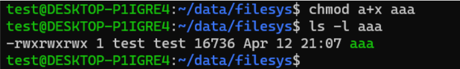

2. 如果在一个进程当中操作一个文件的时候，需要临时改变一个文件的权限信息，就需要`fchmod`函数， 这个是一个系统调用。

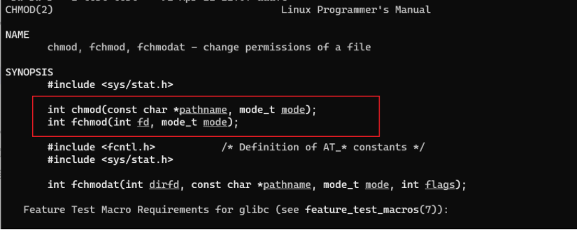

## 粘住位  `t位`

t位原始的功能：给某一个当前二进制命令设置t位，设置t位的作用是把某一个命令的使用痕迹进行保留，为的是下次再装载这个模块的时候比较快。通俗的讲就是：在内存当中保留它的使用痕迹，下次装载会比较快。通常是给一个可执行的命令进行设计。

现状这个设计无所谓了，因为有了page的设计，本来使用的内存块就会留在内存当中，所以这个t位在慢慢的淡化，现状常用于给目录设置t位。

目前目录设置t位的是`/tmp/`：

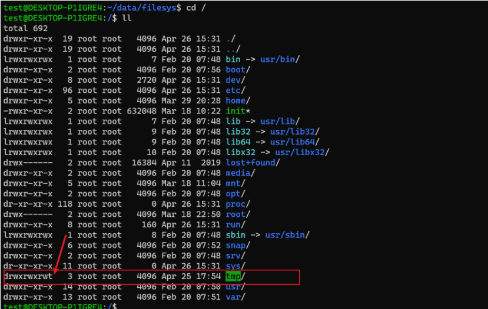

给这个目录加上t位以后，各个用户对于目录的操作，以及对目录下的文件的操作就比较特殊化了。

## 文件系统： `FAT` 、`UFS`

文件系统：实际上是文件或者数据的存储格式问题。归根结底是为了帮助我们存储或管理文件。

比如说：钱存在中国银行叫人民币，存在美国银行叫美元，但是钱是一样的。数据也是一样，只是存在在了不同的文件系统当中。

### 微软的`FAT`系统：

`FAT`的实质是一个静态存储的单链表,， 具体的实际结构如下

```c
struct{
    int next[N];
    char data[N][data_size];
}
```

正是因为N的存在，`FAT`存储的文件是有限的，不能超过N个数据块。

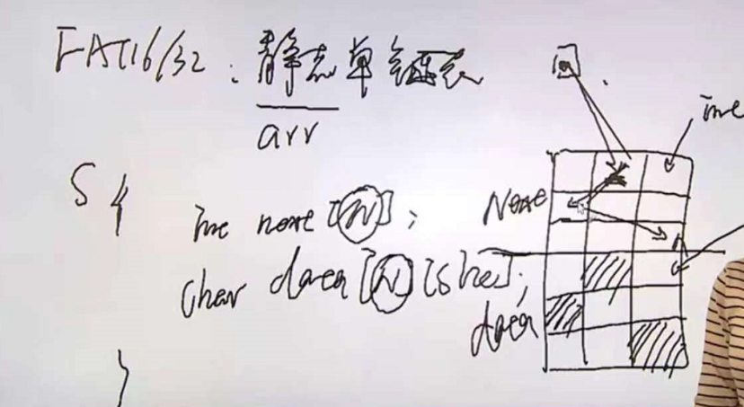

拿到`windows`的时候，首先第一件事是要分区，为什么要分区，因为那个时候的FAT系统承载能力有限，过多的文件或者很大的文件当前承载不了，所以说要分区。

**`FAT`文件系统最大的缺陷就是使用了静态单链表**，单链表最大的缺陷是一个走向，指针不能往回指。如今FAT系统还是在使用的，比如说小u盘， 小SD卡，为了轻量级。

360内存清理： 用一个进程不停的吃内存吃内存（要内存），在抢资源，留在内存中的常用的数据块就在往swap交换分区去挪，当进程强占资源到一定程度的时候，就会立马结束，然后给用户提示，内存清理成功，实际上全都挤到交换分区中去了。当你用的时候，交换到`swap`分区中的数据又会回来，在自己逗自己玩。

**注意**： 当内存换出率和换入率都在直线上升的时候，才是内存吃紧的时候。

## `UFS`文件系统

`FAT`文件系统时巨怕大文件的。。。

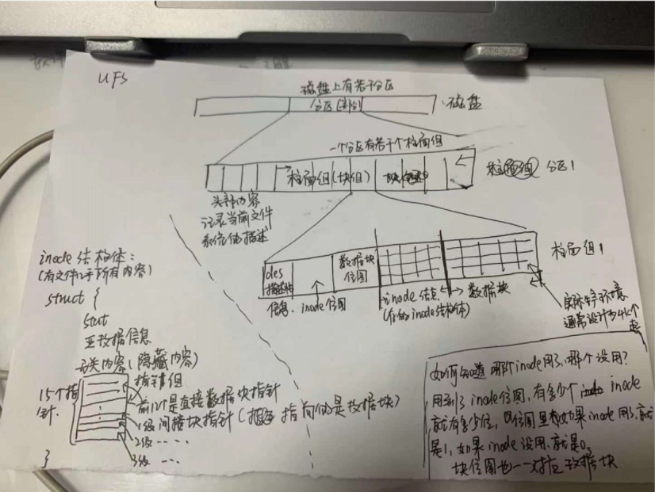
