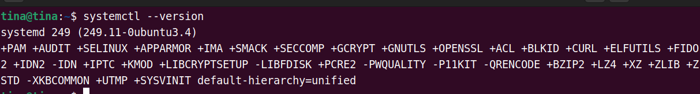
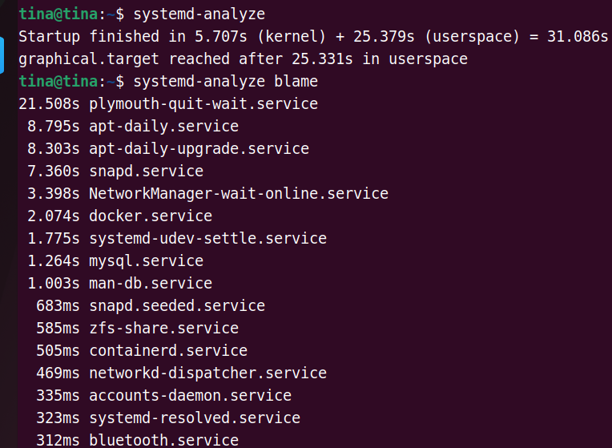
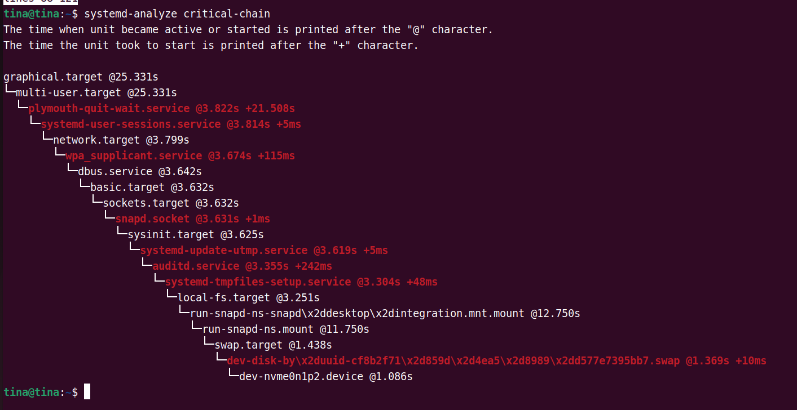

之前的Linux启动一直使用init进程：

> sudo /etc/init.d/xxx start

这种方式有两个缺点：

- 启动时间长：init进程是串行启动，只有前一个进程启动完后，才会启动下一个进程

- 启动脚本复杂。init进程只启动执行脚本，不管其他。

## Systemd

为了解决以上两个问题，使用Systemd，二不再使用init。 Systemd取代了initd，成为系统的第一个进程（PID为1），其他的进程都是它的子进程。

以Systemd为父进程的进程：

> ps -efa | grep [s]ystemd

分析启动时各个进程花费的时间：

> systemd-analyze

分析启动时的关键链：

> system-analyze critical-chain

启动、重启、停止、重载、杀死相关服务：

> systemctl start httpd.service

> systemctl restart xxx

> systemctl stop xxx

> systemctl reload xxx

> systemctl kill xxx

 Systemd 架构图:

[技术|systemctl 命令完全指南](https://linux.cn/article-5926-1.html)

https://www.ruanyifeng.com/blog/2016/03/systemd-tutorial-commands.html

