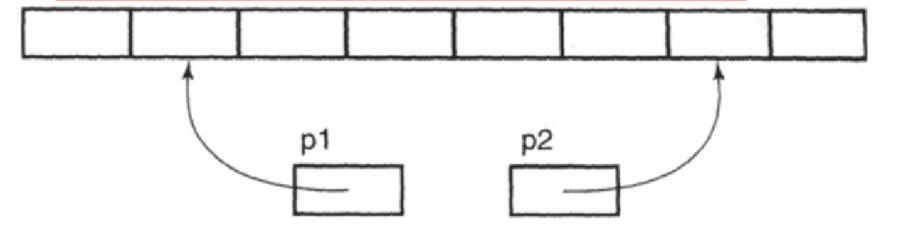

# C和指针


## 1. 指针运算

指针运算的几种方式：

- 指针±整数
- 指针-指针

### 1.1 指针±整数

数组中的元素存储于连续的内存位置中，后面元素的地址大于前面元素的地址。因此，**我们很容易看出，对一个指针加1使它指向数组中下一个元素**，加5使它向右移动5个元素的位置，依次类推。把一个指针减去3使它向左移动3个元素的位置。对整数进行扩展保证对指针执行加法运算能产生这种结果，而不管数组元素的长度如何。


指针运算只有作用于数组中其结果才是可以预测的。**对任何并非指向数组元素的指针执行算术运算是非法的**（但常常很难被检测到）。如果一个指针减去一个整数后，运算结果产生的指针所指向的位置在数组第一个元素之前，那么它也是非法的。


### 1.2 指针-指针

只有当两个指针都指向同一个数组中的元素时，才允许从一个指针减去另一个指针。



两个指针相减的结果的类型是` ptrdiff_t`，它是一种有符号整数类型。减法运算的值是两个指针在内存中的距离（以数组元素的长度为单位，而不是以字节为单位），因为减法运算的结果将除以数组元素类型的长度。例如，如果`p1`指向`array[i]`而`p2`指向`array[j]`，那么`p2-p1`的值就是`j-i`的值。


如果两个指针都指向同一个数组中的元素，那么它们之间可以相减。指针减法的结果经过调整（除以数组元素类型的长度），表示两个指针在数组中相隔多少个元素。如果两个指针并不是指向同一个数组的元素，那么它们之间进行相减就是错误的。


### 1.3 指针比较

任何指针之间都可以进行比较，测试它们相等或不相等。如果两个指针都指向同一个数组中的元素，那么它们之间还可以执行`<`、`<=`、`>`和`>=`等关系运算，用于判断它们在数组中的相对位置。对两个不相关的指针执行关系运算，其结果是未定义的。


## 2 const和define区别

  C++ 语言可以用const来定义常量，也可以用 #define来定义常量。但是前者比后者有更多的优点：

（1）  const常量有数据类型，而宏常量没有数据类型。编译器可以对前者进行类型安全检查。而对后者只进行字符替换，没有类型安全检查，并且在字符替换可能会产生意料不到的错误（边际效应）。

（2）  有些集成化的调试工具可以对const常量进行调试，但是不能对宏常量进行调试。

 

## 3. 常考题型

### 3.1.用变量a给出下面的定义.

a) 一个整型数
b) 一个指向整型数的指针
c) 一个指向指针的的指针，它指向的指针是指向一个整型数
d) 一个有10个整型数的数组
e) 一个有10个指针的数组，该指针是指向一个整型数的
f) 一个指向有10个整型数数组的指针
g) 一个指向函数的指针，该函数有一个整型参数并返回一个整型数
h) 一个有10个指针的数组，该指针指向一个函数，该函数有一个整型参数并返回一个整型数

```c
a) int a;
b) int *a;
c) int **a;
d) int a[10];
e) int *a[10];
f) int (*a)[10];
g) int (*a)(int);
h) int (*a[10])(int);
```

### 3.2 写一个“标准”宏MIN，这个输入两个参数并返回较小的一个

```c
#define Min(a,b) ( ((a)>=(b))?(b):(a))
```

### 3.3 引用和指针的区别？

- 1.引用必须要初始化，指针可以不用初始化；
- 2.不存在指向空值的引用，但是存在指向空值的指针；
- 3.引用初始化后不能改变，但存在指向空值的指针；
- 4.引用是变量的别名，本身不单独分配自己的内存空间，而指针有自己的内存空间;

### 3.4 关键字static的作用是什么?

在c语言中static有三个明显的作用:

- **static在修饰局部变量**的时候，其使得**局部变量的生命周期发生改变，使得其放在data段，直到程序运行结束才结束。**
- **static在修饰全局变量**的时候，作用是**改变其作用域**，使得全局变量只能在定义的文件中使用
- static在修饰函数的时候，同样也**是只能使函数只能在当前的文件中使用**
  

### 3.5 C语言链表与数组的区别?

链表跟数组都属于一种数据结构。可以分为两个点来看：
**从逻辑结构来看**

- 数组必须事先定义固定的长度，不能适应数据动态地增减的情况。当数据增加时，可能超出原先定义的元素个数；当数据减少时，造成内存浪费；数组可以根据下标直接存取。
- 链表动态地进行存储分配，可以适应数据动态地增减的情况，且可以方便地插入、删除数据项。链表必须根据next指针找到下一个元素。

**从内存存储来看**

- (静态)数组从**栈**中分配空间, 对于程序员方便快速,但是自由度小
- 链表从**堆**中分配空间, 自由度大但是申请管理比较麻烦

### 3.6 #include <…h> 和#include “…h” 有什么区别？

对于#include <…h> ，编译器从**标准库路径**开始搜索.h， 系统标准库使用<>
对于#include “…h” ，编译器从**用户的工作路径**开始搜索.h， 用户自定义的头文件使用""

### 3.7 c语言程序运行的时候内存分布？

- 堆区：在动态申请内存的时候，在堆里开辟内存。

- 栈区： 主要存放局部变量（在函数内部，或复合语句内部定义的变量）。

- 静态/全局区
  - 未初始化的静态全局区 （bss区）：
    静态变量（定义的时候，前面加 static 修饰），或全局变量 ，没有初始化的。
  - 初始化的静态全局区 全局变量、静态变量，赋过初值的，存放在此区 。

- 代码区：存放咱们的程序代码

- 文字常量区 ：存放常量的。
  

### 3.8 进程之间通信有哪些？

1） 管道（pipe）：管道是一种半双工的通信方式，数据只能单向流动，而且只能在具有血缘关系的进程间使用。进程的血缘关系通常指父子进程关系。
2）有名管道（named pipe）：有名管道也是半双工的通信方式，但是它允许无亲缘关系进程间通信。
3）信号量（semophore）：信号量是一个计数器，可以用来控制多个进程对共享资源的访问。它通常作为一种锁机制，防止某进程正在访问共享资源时，其他进程也访问该资源。因此，主要作为进程间以及同一进程内不同线程之间的同步手段。
4）消息队列（message queue）：消息队列是由消息组成的链表，存放在内核中 并由消息队列标识符标识。消息队列克服了信号传递信息少，管道只能承载无格式字节流以及缓冲区大小受限等缺点。
5）信号处理机制（signal）：信号是一种比较复杂的通信方式，用于通知接收进程某一事件已经发生。
6）共享内存（shared memory）：共享内存就是映射一段能被其他进程所访问的内存，这段共享内存由一个进程创建，但多个进程都可以访问，共享内存是最快的IPC方式，它是针对其他进程间的通信方式运行效率低而专门设计的。它往往与其他通信机制，如信号量配合使用，来实现进程间的同步和通信。
7）套接字（socket）：套接字也是一种进程间的通信机制，与其他通信机制不同的是它可以用于不同机器间的进程通信。

