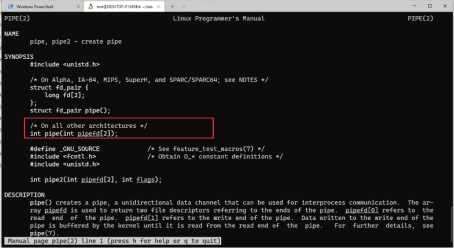
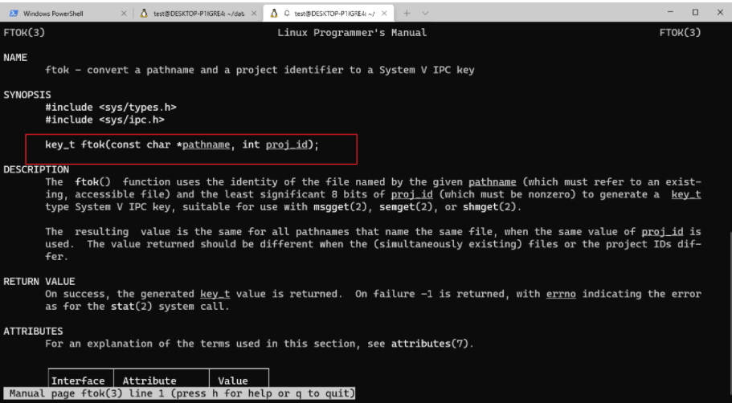
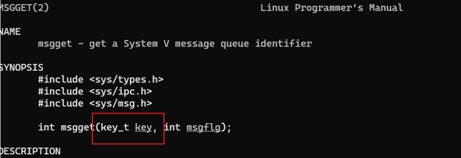

# 进程间通信

只要是两个进程之间需要进行数据交换，就会用到进程通信的内容。

`ipc : inter-process Communication` 进程间通信

**进程间的通信方式：**

- 管道
- 匿名管道
- 消息队列
- 信号
- 共享内存
- 套接字

## 1. 匿名管道

输入参数是两个文件描述符，0端做为读端，1端作为写端

匿名管道最方便的是：可以用在具有亲缘关系的进程间进行通信。实际上管道这个通信机制，是大家用的非常多的一种进程通信方式，包括匿名管道和命名管道。

建议在使用管道的时候，把自己目前不用的一端给关掉，不要给自己制造出错的机会。

**注意：** 只能在具有亲缘关系进程间 通信

## 2. 命名管道

磁盘上看到的文件类型为`p`开头的文件是命名管道` mkfifo`

**注意：** 管道必须凑齐读写双方，才能够正常实现，许无亲缘关系的进程间使用

## 3. `XSI `-> `SysV`

`XSI`有三种通信机制：

- `Message Queues`： 消息队列  `msg`
- `Semaphore Arrays`： 信号量数组  `sem`

- `Shared Memory`: 共享内存 `shm`

- `key`: 使用`key`来确定通信的双方拿到的是用一种通信机制，`ftok() `用来产生同一机制

### 3.1 概述

- 主动端：先发包的一方

- 被动端：先收方的一方

主动端和被动端是很容易区分的，因为很多`CS`端是很难区分的。

#### 3.1.1 `ktok`： 使双方拿到同一个`key`值

通过文件的`inode`值`hash`出一个唯一的值来。

通信双方要想通信，必须要有一个唯一的值，时戳、进程号、`inode`值都是唯一的，但是时戳时时刻刻都不同，进程号一开始运行之前是不知道它是多少的，所以只能用`inode`， 当前对`inode`的值进行`hash`也可以，如果直接用也可以。

#### 3.1.2 命名一致

**注意**： 这块的函数都有命名上的一致性：

- `xxxget`
- `xxxop`
- `xxxctl`

比如获取一个消息队列` msgget`, 获取信号量数组 `semget`， 获取一块内存 `shmget`

### 3.2 消息队列

创建消息队列, 会发现第一个参数是一个key值，返回的是一个`id`, 通信双方拿着同一个`id`， 就说明双方拿到了同一种通信机制，

消息队列是一种消息的链表，存放在内核中并由消息队列标识符表示。**消息队列克服了信号传递信息少，管道只能承载无格式的字节流以及缓冲区大小受限的问题**。

### 3.3 信号量数组  `Semaphore Arrays`

#### 3.3.1 三个函数：

- `semget()`

- `semop()`

- `semctl()`

#### 3.3.2 为什么使用信号量数组？

为什么会有`Semaphore Array`这个东西，之前的`Semaphore`不够用吗？？

**信号量是在互斥量之后讲的，互斥量是以独占的形式使用当前资源， 但是一个进程可能会同时需要多中资源，需要同时独占多种资源，就需要用到了信号量数组了。**

如果两个进程同时争夺多种资源，获取多种资源和释放多种资源如果不是原子操作的化，就可能会产生死锁，两个进程僵死。

### 3.4 共享内存 `Shared Memory`

之前的共享内存是使用`mmap`来做的，`mmap`是完成`IO`存储的映射， 是将`IO`映射在多个进程当中，实现进程间的通信。

这里的共享内存要比之前讲的麻烦一些，使用以下三个函数：

- `shmget()`

- `shmop()`

- `shmctl()`

共享内存就是映射一段能够被其他进程所访问的内存，这段共享内存由一个进程创建，但是多个进程可以访问。

共享内存是最快的进程间通信方式，因为**它只对数据进行了两次复制**，而其他**进程间通信方式需要进行四次数据复制**，它往往与信号量配合使用，来实现进程间的同步和通信。

### 3.5 `socket`

`socket`是一种进程间通信机制，与其他通信机制不同的是，它可以用于**不同设备与机器间**的进程通信。

 

