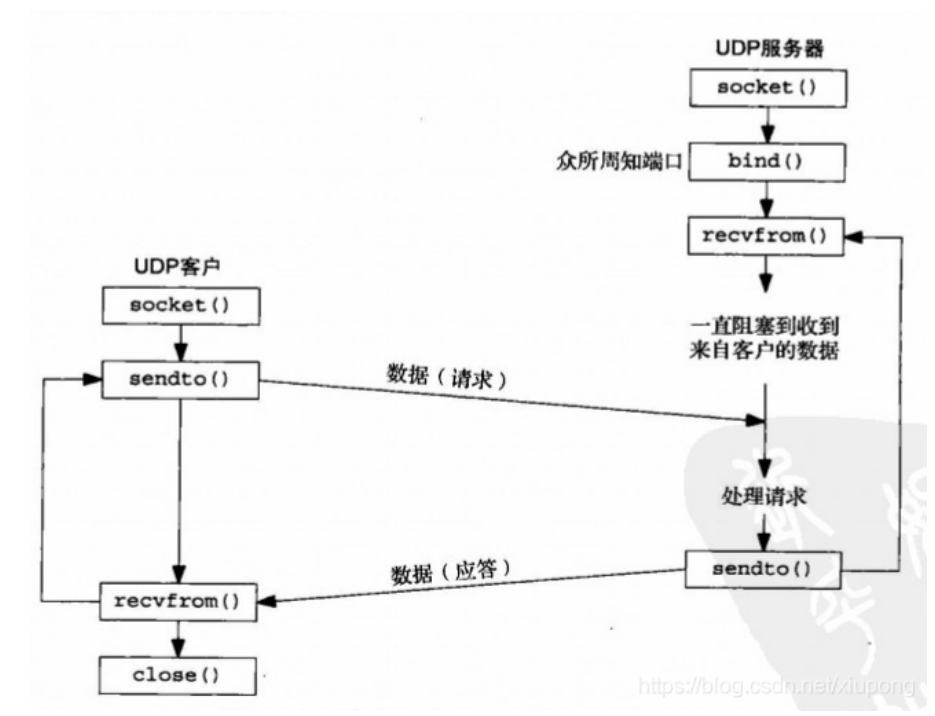

## 1. TCP 三次握手

TCP报文如下，有32位的确认序号、32位序列号，确认位ACK、请求位SYN、结束位FIN


## 2. TCP 四次挥手


## 


# 1. 网络套接字-**Socket**

**一个程序员的基本素养： 至少精通两门语言，至少精通一门脚本，非常扎实的网络知识，这些都是基本功。**


## 1.1 讨论: 跨主机的传输要注意的问题：

### 1. 字节序问题， 解决办法是网络序和主机序

intel用的小端序x86、x64的都是小端序，学习一下调试器使用

典型的有两种存储方式：大端存储、小端存储，

> 大端： 低地址处放高字节

> 小端： 低地址处放低字节 （**正常逻辑**）

大小端和发送有什么样的区别吗？？？**不管是文件传输还是IO的时候，永远都是低地址处的数据先出去，高地址处的数据后出去。**

我们不再纠结大端存储和小端存储，我们只区分主机字节序和网络字节序

- 主机字节序： host

- 网络字节序：network

`- _ to _ _: htons(host to network short) ,  htonl(host to network long)`

### 2. 对齐问题， 解决办法是不对齐

```text
struct{
	int i;
	float f;
	char ch;
};
```

结构体中有如上的类型，在学到C语言的时候，老师可能讲的是这个结构体的字节数是所有成员字节数的相加之和，**而实际上把这个字节在任何的编译器上编译的 话，基本上不会看到它占九个字节的时候，为什么呢？？？因为编译器把结构体给对齐了，对齐的 是加速节省当前的取指周期，凡是参与网络通信的结构体，我们一定要禁止对齐，所以结构体在定义的时候一定要指定禁止编译器编译。**

<font color='red'>三十二位的环境上，是四个字节一对齐。</font>

硬件存储的原理：硬件存储的时候会分自存储、双自存储、半自存储等等，基本上是往自存储上靠拢，对于对齐这块，如果不从底层存储的角度来解释的话， 从应用层的角度来解释的话，**编译器在进行对齐的时候，可以理解为一个公式：如果当前起始地址号能够整除这个成员的sizeof的话，就把它放在这，**

在定义一个结构体的时候通过宏来指定给编译器，来不对齐。


### 3. 类型长度的问题

`int `

解决办法：` int32_t`, `uint32_t`, `int64_t, int8_t `


## 1.2 socket是什么？？

`socket`是一个中间层，它抽象出来了一个文件描述符，给你一个文件描述符，就可以完成套接字的传输问题，**它连接了底层实现协议与上层实现方式**


- `domain` 协议族

- `type `类型

- `protocol` 协议

使用某种协议族(`domain`)中的某个协议（`protocol`）完成某种类型（`type`）的传输。


## 1.3 报式套接字： 

先说报式套接字， 再说流式套接字，因为报式套接字需要程序员要指定和封装的内容稍微的丰富一些，看一个程序员是否会网络传输的程序，主要是看他能不能完成报式传输，因为在报式套接字需要程序员去指定和封装的部分很多，在报式套接字的使用上会体现前面说的三个问题。


报式套接字用到的函数：

- `socket()`

- `bind()`

- `sendto()`

- `rcvfrom()`

- `setsockopt()`  这只`socket`的一些参数   ` man 7 socket`可以看到socket层面的不同的设置属性

- `getsockopt()`


点式IP与大整数之间的转换的函数：

- `inet_pton()  `

- `inet_ntop()`

### 基础版

**被动端：（先运行）**

- 取得`socket`

- 给`socket`取得地址

- 收/发消息

- 关闭`socket`


**主动端：**

- 取得socket

- 给socket取得地址【可省略】

- 发/收消息

- 关闭socket




**为什么主动端能省略和本机约定地址的步骤呢？？？**

因为**不跟本机约定的话，当前socket建立成功，会给分配一个没人用的随机端口，当进程结束前这个端口都留给这个进程使用，不会给他人使用, 而被动端要约定端口，在端口接收数据，所以不能省略。**


**bind函数**


**不同协议族对于通信地址的约定实际上是不一致的**，所以压根都没有`struct sockaddr `这个类型。具体内容取决于协议族中如何实现的。

所以，不同的协议族，可以查看不同的`man`手册：

- `AF_INET  : man 7 ip`

- `AF_INET6 : man 7 ipv6 `

- .....

然后我们去做`man 7 ip`, 可以看到它里面的协议约定


所以，你用的是哪个协议族，就把那个协议的地址填到bind函数的addr上，然后后面天上这个地址的长度。


`netstat -anu`  **查看端口占用情况**

### 接收方

```c
#include <stdio.h>
#include <stdlib.h>
#include <sys/types.h>
#include <sys/socket.h>
#include <netinet/in.h>
#include <netinet/ip.h>
#include <arpa/inet.h>


#include "proto.h"


#define IPSTRSIZE  40

int main()
{
        int sd;
        struct sockaddr_in laddr, raddr;
        struct msg_st rcvbuf;
        socklen_t raddr_len;
        char ipstr[IPSTRSIZE];

        // 每个协议族中，如果有一个或多个协议的话，一定有一个是默认的，
        // 写0指的是使用默认的协议
        // AF_INET 当中的默认支持报式套接字的协议的实现
        sd = socket(AF_INET, SOCK_DGRAM, 0/*IPPROTO_UDP*/);
        if(sd < 0){
                perror("socket");
                exit(1);
        }

        // 填充laddr成员
        laddr.sin_family = AF_INET;
        laddr.sin_port = htons(atoi(RCVPORT));
        inet_pton(AF_INET, "0.0.0.0", &laddr.sin_addr);  // 0.0.0.0 的意思是any address
        // 32位整形数， 平时我们写ip地址为了方便记忆，都是点分式去写的，但是网络上传输的话，要使用一个数
        // 如何将点分式转换为大整数？？？
        // inet_pton  将ipv4/ipv6的点分式地址转换为大整数
        if(bind(sd, (void *)&laddr, sizeof(laddr)) < 0){
                perror("bind()");
                exit(1);
        }

        //!!!!!
        raddr_len = sizeof(raddr); // 需要回填的地址长度初始化
        while(1){

                recvfrom(sd, &rcvbuf, sizeof(rcvbuf), 0, (void *)&raddr, &raddr_len);
                printf("----MSG FROM %s: %d ----\n", inet_ntop(AF_INET, &raddr.sin_addr, ipstr, IPSTRSIZE), ntohs(raddr.sin_port));
                printf("NAME = %s \n", rcvbuf.name);
                printf("MATH = %d \n", ntohl(rcvbuf.math));
                printf("CHINESE = %d \n", ntohl(rcvbuf.chinese));
        }

        close(sd);

        exit(0);

}

```


### 发送方

```c
#include <stdio.h>
#include <stdlib.h>
#include <sys/types.h>
#include <sys/socket.h>
#include <arpa/inet.h>
#include <string.h>

#include "proto.h"


int main(int argc, char *argv[])
{
        int sd;
        struct msg_st sdbuf;
        struct sockaddr_in raddr;

        if(argc < 2){
                perror("usage ... \n");
                exit(1);
        }


        sd = socket(AF_INET, SOCK_DGRAM, 0);
        if(sd < 0)
        {
                perror("socket");
                exit(1);
        }
        // bind()
 // 随机分配

        strcpy(sdbuf.name, "Alan");
        sdbuf.math = htonl(rand()%100);
        sdbuf.chinese = htonl(rand()%100);

        raddr.sin_family = AF_INET;
        raddr.sin_port = htons(atoi(RCVPORT));
        inet_pton(AF_INET, argv[1], &raddr.sin_addr);


        if(sendto(sd, &sdbuf, sizeof(sdbuf), 0, (void *)&raddr, sizeof(raddr))< 0){
                perror("sendto");
                exit(0);
        }

        puts("ok");
        close(sd);


        exit(0);
}

```


### 多点通讯

多点通讯涵盖两种：

- 广播： 用于一个主机对**整个局域网**上所有主机上的数据通信，广播地址`255.255.255.255`
- 多播/组播： 对一组**特定的主机**进行通信，而不是整个局域网上的所有主机
- 单播：**两台主机**之间的端对端通信


查看路由：` ip ro sh`


修改发送方为多播：

```c
#include <stdio.h>
#include <stdlib.h>
#include <sys/types.h>
#include <sys/socket.h>
#include <arpa/inet.h>
#include <string.h>

#include "proto.h"


int main(int argc, char *argv[])
{
        int sd;
        struct msg_st sdbuf;
        struct sockaddr_in raddr;


        sd = socket(AF_INET, SOCK_DGRAM, 0);
        if(sd < 0)
        {
                perror("socket");
                exit(1);
        }
        // bind()
        int val = 1;
        // 设置socket多播属性
        if(setsockopt(sd, SOL_SOCKET, SO_BROADCAST, &val, sizeof(val)) < 0){
                perror("setsockopt\n");
                exit(1);
        }
        // 还可以绑定指定网卡

		memset(&sbuf, '\0', sizeof(sbuf)); // 内存清空，防止内存泄漏
        strcpy(sdbuf.name, "Alan");
        sdbuf.math = htonl(rand()%100);
        sdbuf.chinese = htonl(rand()%100);

        raddr.sin_family = AF_INET;
        raddr.sin_port = htons(atoi(RCVPORT));
		// 下边是多播
        inet_pton(AF_INET, "255.255.255.255", &raddr.sin_addr);


        if(sendto(sd, &sdbuf, sizeof(sdbuf), 0, (void *)&raddr, sizeof(raddr))< 0){
                perror("sendto");
                exit(0);
        }

        puts("ok");
        close(sd);


        exit(0);
}

```


### 抓包器使用 wireshark 

平时可以多用抓包器抓几个包分析一下。。。


抓包器的安装： `sudo apt install wireshark`

抓包器运行： `sudo wireshark`

然后选择要抓包的网卡（Filter）


### UDP传输分析

**UDP 丢包：由于阻塞造成的。**

**很多人误认为UDP丢包是因为TTL（time to live）耗尽了，其实不是。。。**

TTL是当前包最多能够经过的个数，在linux环境下默认是64， windows环境下一般定义为128， 这个值是可以定制的。这个数其实是完全足够的，


实际上UDP丢包是因为阻塞造成的，怎么会阻塞呢？？路由有它本身的等待队列，这种等待队列是有一种丢包的算法的，当我的等待队列到达了一定容量，我会随机选择丢包。

比如说这个点上网的人比较多，我的网页打不开，或者网页只打开了部分，其实对我们直观来讲就是丢了包，网不好。


**丢报的原因是阻塞，那么如何让他不阻塞呢？？？流控**

开环的流控：漏桶、令牌桶（但是不能用）

### 闭环流控： 停等式流控


那么 加了停等式流控就能降低丢包率吗？？其实不是的，其实丢包率不会降低，只是我们加了ACK来确保能够收到包，而牺牲了丢包率。


## 1.4 流式套接字：

字节流为单位，可能不会涉及到对齐的问题。


当前窗口大小比如说是10个，开始，我会一直发，发满整个窗口，然后后面接收到一个ACK，就再发一个包，接收到一个ACK再发一个


### 但是这种效率并不高，怎么办？？？--> 滑动窗口


一开始窗口的大小是10个，然后一直发，发满窗口，后面每接收到一个ACK， 再发两个包，每接收到一个ACK再发两个包，一直到网络因为阻塞了，没收到某一个ACK， 然后从检测到丢包的那个包开始，重新传。

所以有滑动窗口的作用就是： 把当前的包都扔出去，抢占当前路由的等待队列，最大限度抢占资源。


### 然后你会发现一个新的问题，你收到的ACK一定是顺序收到的吗？？？

因为包发出去后每个包的路径是不确定的，**所以C端和S端在开始之前，需要进行编号的约定**


 这就是**典型的TCP的三次握手。。。约定双方的对话格式**。


当S端如果已经完成了1，2两次握手了以后这个状态叫做：半连接状态，S端有一个池，这个池叫半连接池， 所有**半连接状态的连接都放在半连接池**中，当对方的信息过来的时候，会在半连接池中找到相应的信息，如果存在的化，说明已经成功建立了前两次握手，那么后面可以正常进行第三次握手和数据传输。有 一种攻击形式叫半连接洪水，是没有从根本上去防范的。


### 那么如何解决半连接洪水？？-->cookie 

将这个cookie在第二次握手时带走，第三次握手需要带过来，当包过来的时候，会验证当前cookie，不要那个半连接池就不会被半连接攻击。


### 流式套接字的实现


