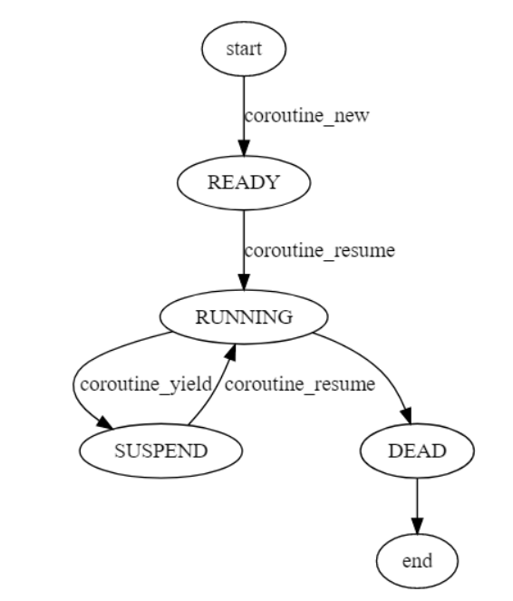

# 协程

**对学习懒惰而对重复勤奋，是程序员的大忌。**

## 01 描述

协程是一种基于线程之上，但是又比线程更加轻量级的存在，这种由程序员自己写程序来管理的轻量级线程就叫做协程。

通常创建协程时，会从进程的堆中分配一段内存作为协程的栈。线程的栈由8MB, 而协程栈的大小只有KB大小。


## 02 协程的优势

协程的优势如下：

1. 相比线程更加轻量级
   - **线程的创建和调度都是在内核态，而协程是在用户态**完成的
   - **线程的个数往往受限于CPU核数，线程过多，会造成大量的核间切换**。而协程无需考虑这些
2. **将异步流程同步化处理**：回调函数掩饰成串行同步的样子，尤其在` RPC`中进行多服务并发协作的时候，相比于回调式的做法，协程的好处更加明显。

## 03 协程实现原理

有栈协程就是实现了一个用户态的线程**，用户可以在堆上模拟出协程的栈空间，当需要进行协程上下文切换的时候，主线程只需要交换栈空间和恢复协程的一些相关的寄存器的状态就可以实现一个用户态的线程上下文切换**，没有了从用户态转换到内核态的切换成本，协程的执行也就更加高效。


大佬写的C语言协程代码: https://github.com/cloudwu/coroutine/

```c
/* coroutine.h
#ifndef C_COROUTINE_H
#define C_COROUTINE_H

#define COROUTINE_DEAD 0
#define COROUTINE_READY 1
#define COROUTINE_RUNNING 2
#define COROUTINE_SUSPEND 3

struct schedule;

typedef void (*coroutine_func)(struct schedule *, void *ud);

struct schedule * coroutine_open(void);
void coroutine_close(struct schedule *);

int coroutine_new(struct schedule *, coroutine_func, void *ud);
void coroutine_resume(struct schedule *, int id);
int coroutine_status(struct schedule *, int id);
int coroutine_running(struct schedule *);
void coroutine_yield(struct schedule *);

#endif
*/

#include "coroutine.h"
#include <stdio.h>
#include <stdlib.h>
#include <assert.h>
#include <stddef.h>
#include <string.h>
#include <stdint.h>

#if __APPLE__ && __MACH__
	#include <sys/ucontext.h>
#else 
	#include <ucontext.h>
#endif 

#define STACK_SIZE (1024*1024)
#define DEFAULT_COROUTINE 16

struct coroutine;

struct schedule { // 定义协程调度器
	char stack[STACK_SIZE]; // 运行时栈， 此栈即为共享栈
	ucontext_t main;        // 主协程的上下文
	int nco;                // 当前存活的协程个数
	int cap;                // 协程管理器的当前最大容量， 即最多可以同时支持多少协程
	int running;            // 正在运行的协程的ID 
	struct coroutine **co;  // 存放所有协程的数组，长度为cap
};

struct coroutine { // 定义协程
	coroutine_func func; // 协程所用函数
	void *ud;            // 协程参数
	ucontext_t ctx;      // 协程上下文
	struct schedule * sch;// 协程所属调度器
	ptrdiff_t cap;        // 已经分配的内存大小
	ptrdiff_t size;       // 当前协程运行时栈，保存起来后的大小
	int status;           // 协程当前状态
	char *stack;          // 当前协程的保存起来的运行时栈
};

struct coroutine * 
_co_new(struct schedule *S , coroutine_func func, void *ud) {
	struct coroutine * co = malloc(sizeof(*co));
	co->func = func;
	co->ud = ud;
	co->sch = S;
	co->cap = 0;
	co->size = 0;
	co->status = COROUTINE_READY;
	co->stack = NULL;
	return co;
}

void
_co_delete(struct coroutine *co) {
	free(co->stack);
	free(co);
}

struct schedule * 
coroutine_open(void) {
    // 创建协程调度器S，用来统一管理全部的协程
	struct schedule *S = malloc(sizeof(*S));
	S->nco = 0;
	S->cap = DEFAULT_COROUTINE;
	S->running = -1;
	S->co = malloc(sizeof(struct coroutine *) * S->cap);
	memset(S->co, 0, sizeof(struct coroutine *) * S->cap);
	return S;
}

void 
coroutine_close(struct schedule *S) {
    // 结束一个协程
	int i;
	for (i=0;i<S->cap;i++) {
		struct coroutine * co = S->co[i];
		if (co) {
			_co_delete(co);
		}
	}
	free(S->co);
	S->co = NULL;
	free(S);
}

int 
coroutine_new(struct schedule *S, coroutine_func func, void *ud) {
    // 创建一个协程
	struct coroutine *co = _co_new(S, func , ud);
	if (S->nco >= S->cap) {
		int id = S->cap;
		S->co = realloc(S->co, S->cap * 2 * sizeof(struct coroutine *));
		memset(S->co + S->cap , 0 , sizeof(struct coroutine *) * S->cap);
		S->co[S->cap] = co;
		S->cap *= 2;
		++S->nco;
		return id;
	} else {
		int i;
		for (i=0;i<S->cap;i++) {
			int id = (i+S->nco) % S->cap;
			if (S->co[id] == NULL) {
				S->co[id] = co;
				++S->nco;
				return id;
			}
		}
	}
	assert(0);
	return -1;
}

static void
mainfunc(uint32_t low32, uint32_t hi32) {
	uintptr_t ptr = (uintptr_t)low32 | ((uintptr_t)hi32 << 32);
	struct schedule *S = (struct schedule *)ptr;
	int id = S->running;
	struct coroutine *C = S->co[id];
	C->func(S,C->ud);
	_co_delete(C);
	S->co[id] = NULL;
	--S->nco;
	S->running = -1;
}

void 
coroutine_resume(struct schedule * S, int id) {
	// 切入协程
    assert(S->running == -1);
	assert(id >=0 && id < S->cap);
	struct coroutine *C = S->co[id];
	if (C == NULL)
		return;
	int status = C->status;
	switch(status) {
	case COROUTINE_READY:
		getcontext(&C->ctx);
		C->ctx.uc_stack.ss_sp = S->stack;
		C->ctx.uc_stack.ss_size = STACK_SIZE;
		C->ctx.uc_link = &S->main;
		S->running = id;
		C->status = COROUTINE_RUNNING;
		uintptr_t ptr = (uintptr_t)S;
		makecontext(&C->ctx, (void (*)(void)) mainfunc, 2, (uint32_t)ptr, (uint32_t)(ptr>>32));
		swapcontext(&S->main, &C->ctx);
		break;
	case COROUTINE_SUSPEND:
		memcpy(S->stack + STACK_SIZE - C->size, C->stack, C->size);
		S->running = id;
		C->status = COROUTINE_RUNNING;
		swapcontext(&S->main, &C->ctx);
		break;
	default:
		assert(0);
	}
}

static void
_save_stack(struct coroutine *C, char *top) {
	char dummy = 0;
	assert(top - &dummy <= STACK_SIZE);
	if (C->cap < top - &dummy) {
		free(C->stack);
		C->cap = top-&dummy;
		C->stack = malloc(C->cap);
	}
	C->size = top - &dummy;
	memcpy(C->stack, &dummy, C->size);
}

void
coroutine_yield(struct schedule * S) {
    // 切出协程
	int id = S->running;
	assert(id >= 0);
	struct coroutine * C = S->co[id];
	assert((char *)&C > S->stack);
	_save_stack(C,S->stack + STACK_SIZE);
	C->status = COROUTINE_SUSPEND;
	S->running = -1;
	swapcontext(&C->ctx , &S->main);
}

int 
coroutine_status(struct schedule * S, int id) {
	assert(id>=0 && id < S->cap);
	if (S->co[id] == NULL) {
		return COROUTINE_DEAD;
	}
	return S->co[id]->status;
}

int 
coroutine_running(struct schedule * S) {
	return S->running;
}

```


一个程序真正运行起来需要两个因素：可执行代码段和数据。体现在CPU上，主要包含以下几个方面：

- EIP寄存器： 用来存储CPU要读取指令的地址
- ESP寄存器：用来指向当前线程栈的栈顶位置
- 其他通用寄存器的内容
- 线程栈的内存内容

以上的内容，我们称之为"上下文"或者"现场"


有栈协程的原理：就是从线程的上下文下手，**如果把线程的上下文完全改变，即改变EIP寄存的内容，指向其他指令地址；改变线程栈的内存内容**等。这样的话，当前线程运行的程序也就完全改变了，是一个全新的程序。


**协程状态机转换：**




参考： https://www.cyhone.com/articles/analysis-of-cloudwu-coroutine/

