# 进程的基本知识

需要了解的内容:

- 1. 进程标识符 `pid`

类型`pid_t`， 有符号的16位整型数，也就是说可以同时进行三万多进程

命令：`ps`

- 2. 父子进程的产生 

    - `fork()`

    -  `vfork()`

- 3. 进程的消亡及释放资源

    - `wait()`

    - `waitpid()`

- 4. `exec`函数族的使用

    - `execl()`

    - `execp()`

    - `execv()`

    - `execvp()`

    - `execle()`

- 5. 用户权限和组权限

- 6. 观摩课：解释器文件

- 7. `system()`

- 8. 进程会计

- 9. 进程时间

- 10. 守护进程

- 11. 系统日志


## 01  进程标识符 `pid`

### `pid`的类型`pid_t`

**`pid`是有符号的16位整型数**，也就是说可以同时进行三万多进程。


### 命令：`ps`， 

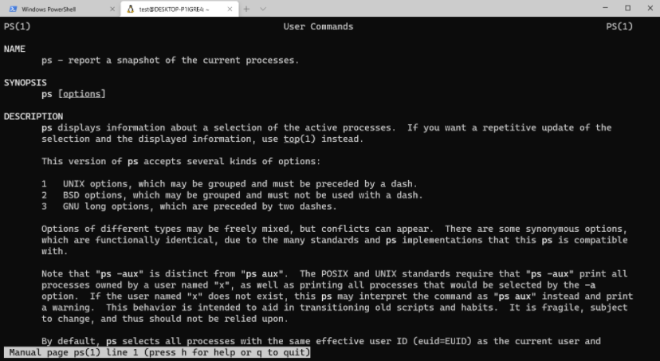

这个命令有不同的组合，不同的组合是去查看不同的内容

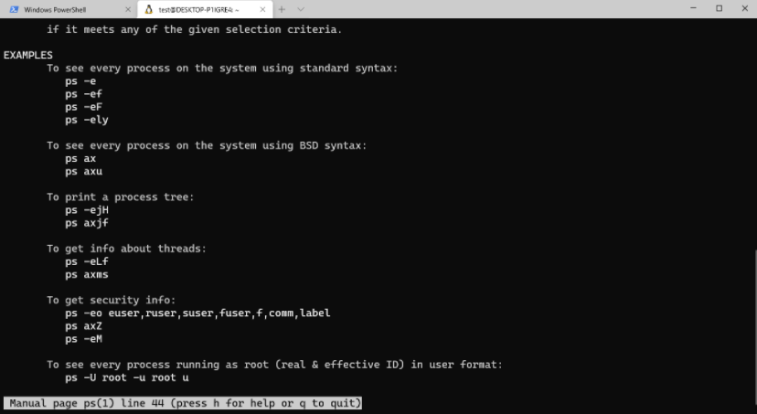

比如：` ps -axf `是描述当前进程，（这种阶梯关系的都是父子进程的关系，这种顶格写的他们的父进程都是1号`init`）

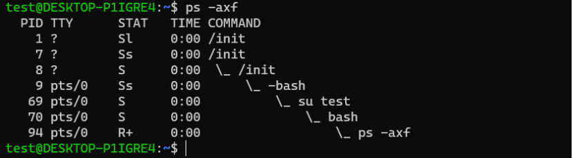

`ps -axm` 描述进程详细信息，m表示`more`

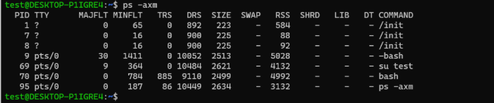

`ps ax -L`  以`linux`特有的方式进行查看

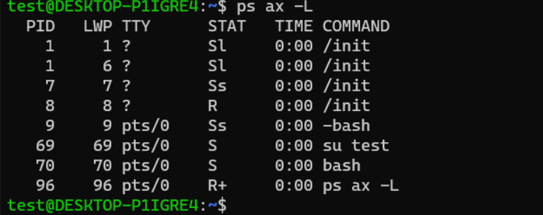


**注意**： **之前讲的文件描述符，是优先使用当前最小的文件描述符，但是进程标识符不一样，进程号是顺次向下使用， 即使前面有释放的，进程号也会一直变大。**


**进程的状态**：

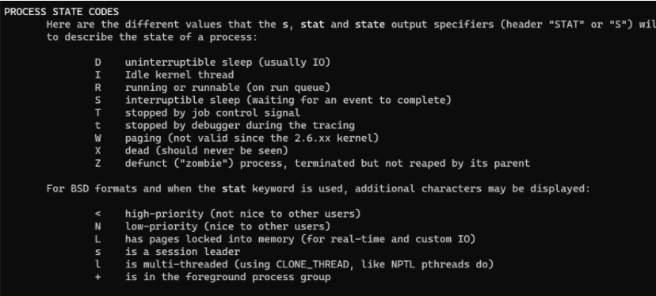

- D 不可中断的睡眠态

- R 运行时

- S 可中断的睡眠态

- T 停止

- Z 僵尸态


### 如何获得当前进程的进程号？

- `getpid()`函数用来获得当前进程的进程号

- `getppid()`函数获得当前进程的父进程进程号


## 02  父子进程的产生


### `fork`, 创建一个新的进程，通过复制当前进程

注意理解关键字： `duplicating`, 意味着拷贝，克隆，一模一样

**复制**标志是着： 副本和原本是一样的， 是通过复制父进程的方式来创建进程的，连执行到的位置都一样。

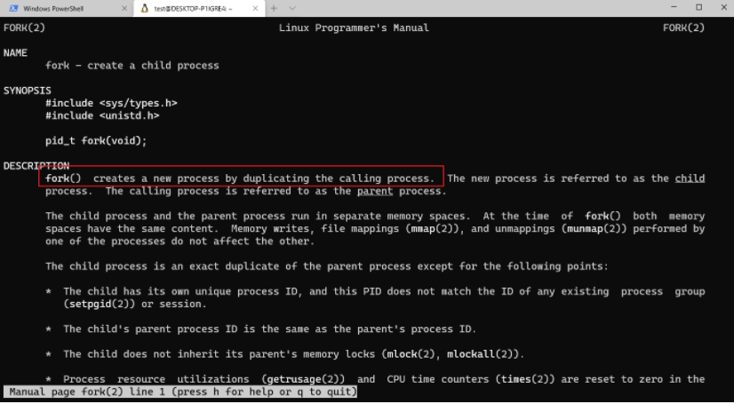


`fork`之后，新的进程与父进程的区别有如下：

- `fork`的返回值不一样

- `pid`不同

- `ppid`不同， 父进程ID

- 未决信号（悬而未决）和文件锁不继承

- 资源利用量归零


### `init`进程： 1号进程，是所有进程的祖先进程


### `fork` 返回值

当调用成功的时候，给父进程返回子进程的`pid`号， 返回给子进程0， 如果创建失败，则返回父进程-1

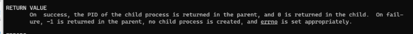


```c
#include <stdio.h>
#include <stdlib.h>
#include <sys/types.h>
#include <unistd.h>

int main()
{
		printf("[%d] begin!\n", getpid());
        pid_t pid = fork();
        if(pid < 0){
                perror("fork()");
                exit(1);
        }
        // pid_t currpid = getpid();
        if(pid == 0){ // child
                printf("[%d]: Child is working~\n", getpid());
        }else{  // parent
                printf("[%d]: Parent is working~\n", getpid());
        }
        printf("[%d] End!\n", getpid());
        //printf("current pid : %d,\n son pid: %d\n", currpid, pid);
        exit(0);
}

```

运行的结果如下：

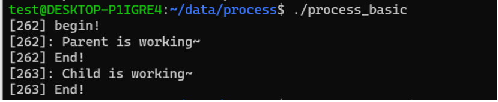

但是！**永远不要去猜父进程和子进程哪一个被调度**。调度器的调度策略来决定哪个进程先运行


### 面试题：`fflush`的重要性

看下执行的结果：

（begin是打印了一个，end一定是打印了两个，说明两个进程执行到的节点都是一样的。）

但是，如果将输出重定向到一个文件中，就会出现问题：打印了两个begin

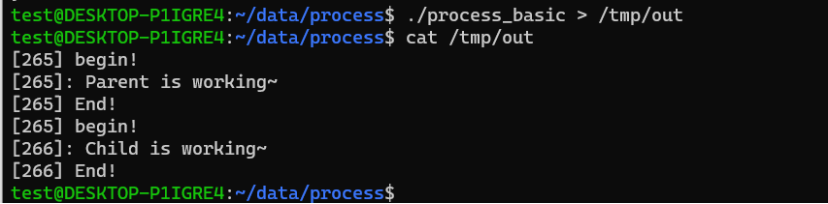

为什么呢？ 是因为在创建子进程的时候没有刷新缓冲区，导致，缓冲区中的数据没有更新。

因此应该这样做：**在fork()之前刷新所有该刷新的流**

```c
#include <stdio.h>
#include <stdlib.h>
#include <sys/types.h>
#include <unistd.h>

int main()
{
		printf("[%d] begin!\n", getpid());
		fflush(NULL);
        pid_t pid = fork();
        if(pid < 0){
                perror("fork()");
                exit(1);
        }
        // pid_t currpid = getpid();
        if(pid == 0){ // child
                printf("[%d]: Child is working~\n", getpid());
        }else{  // parent
                printf("[%d]: Parent is working~\n", getpid());
        }
        printf("[%d] End!\n", getpid());
        //printf("current pid : %d,\n son pid: %d\n", currpid, pid);
        exit(0);
}


```


那么，为什么我在终端中输出没有显示该问题，在输出到一个文件中去的时候会出现这个问题呢？？ 也就是说，加了`\n`以后，在终端输出不会出问题，在文件中输出会有问题呢？？

**因为只有当输出是标准输出设备，它的刷新模式是行缓冲模式，其他的是全缓冲模式。**

**但是如果我再写一个文件，文件是全缓冲模式，全缓冲模式**`\n`**不代表刷新缓冲区，因此会出现了问题。**所以才会输出两次begin。


### 质数的例子：

```c
#include <stdio.h>
#include <stdlib.h>
#include <unistd.h>

#define LEFT  30000000
#define RIGHT 30000200

int main()
{
        int i, j , mark;
        for(i=LEFT; i<= RIGHT; i++){
                mark = 1;
                for(j=2; j<i/2; j++){
                        if(i%j == 0){
                                // 非质数
                                mark = 0;
                                break;
                        }
                }
                if(mark == 1){
                        // 是质数
                        printf("%d 是s质数\n", i);
                }
        }


        exit(0);
}

```

如果我们想知道执行这个程序使用了多少时间：使用`time` 命令

`time ./primer0`

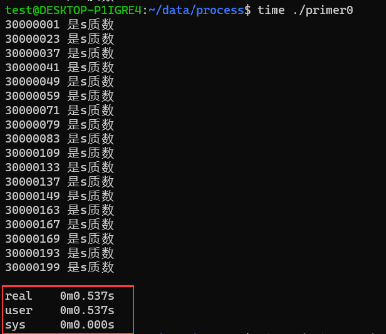

但是命令行还有别的输出，如果我们不想要这个其他的内容，可以把它输出到空设备`/dev/null`去，

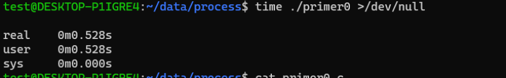


**如果把这个任务让多个任务去操作， 创建200 个子进程去计算**

```c
#include <stdio.h>
#include <stdlib.h>
#include <unistd.h>

#define LEFT  30000000
#define RIGHT 30000200


// 需要201个子进程进行计算
int main()
{
        pid_t pid;
        int i, j , mark;
        for(i=LEFT; i<= RIGHT; i++){
                pid = fork();
                if(pid < 0){
                        perror("fork");
                        exit(1);
                }

                if(pid == 0){
                        // i子进程， 干活

                        mark = 1;
                        for(j=2; j<i/2; j++){
                                if(i%j == 0){
                                        // 非质数
                                        mark = 0;
                                        break;
                                }
                        }
                        if(mark == 1) printf("%d 是质数\n", i);
                        exit(0); // 子进程结束
                }
        }
        exit(0);
}

```

结果是无序的：因为进程调度的问题

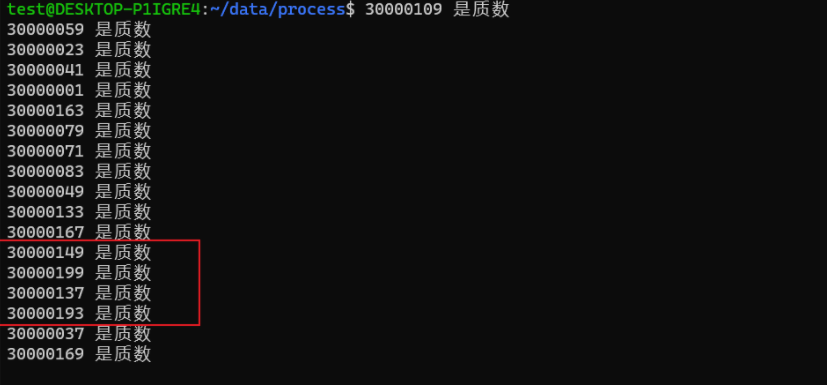


第一个程序与第二个程序的时间对比：

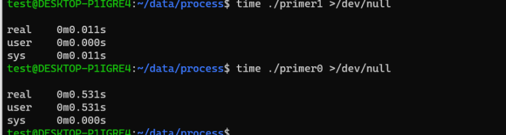

user的时间差距很大，**你可能会想**，程序0相当于一个人在干201个活， 程序1相当于一个人干一个活，共201个人干， 所以它的时间短，错了！

 因为当前系统是4核的，所以4个进程是可以平行运行的。如果是单核机器的话， 无论是多少个 进程，都要一个一个调度，所以单核机器使用的时间大小核有多少个进程没有关系。

**注意**：但是四核的机器运行的时间并不是单核机器运行时间的四分之一，所以还是时间是和调度有很大关系。


**谁打开谁关闭， 谁申请，谁释放**，父进程创建了子进程，那么父进程就是要给子进程“收尸”

如果程序当中出现僵尸态，僵尸态应该是一闪即逝的，因为表示及时收尸了； 或者如果你查看的时候有几个僵尸态进程，过了三五秒钟再看，还是有几个僵尸态，但是换了一批，这种情况表示要么就是当前操作系统比较忙，要么就是父进程比较忙，需要过一段时间进行批量的收尸。


### `vfork()`函数， 将废弃

`fork()`是通过复制父进程的方式产生子进程，它和父进程一样，只有那五点不一样。

我的父进程中从数据库中导入30万条记录，创建子进程，然后让子进程打印`hello world`， 然后退出，这样的fork成本比较高，但是注意，这说的只是fork的原始实现。

如果使用vfork的话，当使用vfork产生一个子进程的话，子进程和父进程公用用一个数据块，但是，如果子进程中修改了的，父进程可以看得到吗？？文档中说：使用vfork调用的进程，只能保证成功的调用_exit(2)或者exec(3) , 其他的都属于未定义范围。

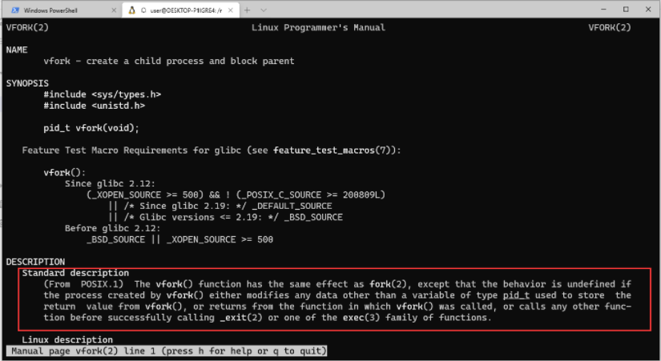


其实现在`fork`已经不是前面说的那样了，`fork`添加了**写时拷贝技术，在进行fork的时候，子进程与父进程确实是公用 数据块（只读不写）， 如果一个进程企图使用一个指针去写，首先会把数据拷贝一份，然后修改自己的那一份，不会影响其他的进程，谁改谁拷贝。**


## 03 进程的消亡与释放资源（收尸）

收尸：等进程状态发生变化，然后对进程收尸，资源回收。

前面执行primer程序的时候，命令行会先出现，然后后面的打印后出现，这个现象的原因是？？？


### `wait()`（没有指向的， 死等。。。）

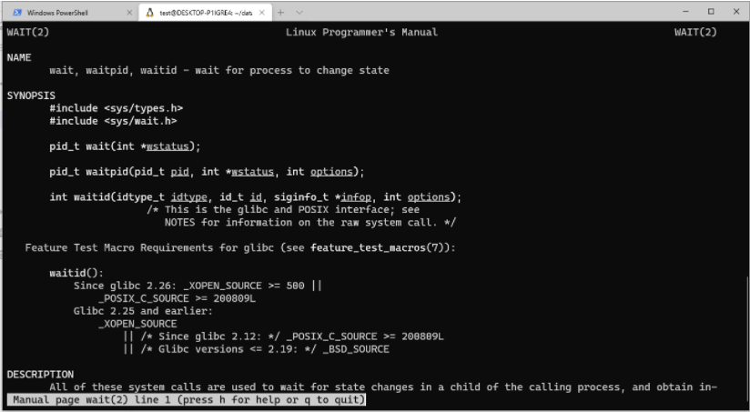

`pid_t wait(int *status)` 将当前子进程收尸收回来的状态放入到一个整形变量中，也就是说给他一个整形变量的地址值。**函数提供了一系列的宏，用于查看当前进程退出的状态是什么？**

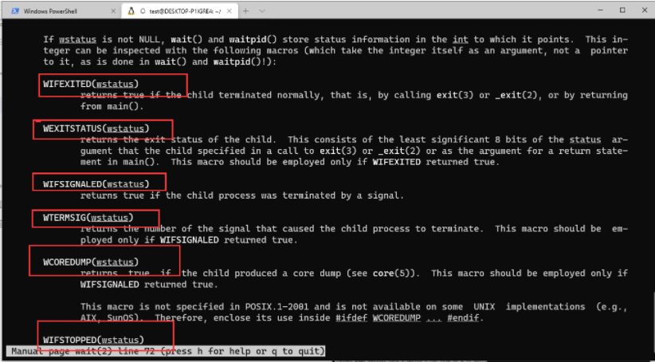

-  `WIFEXITED(status) `判断当前进程是否正常终止，**背五条正常终止，三条异常终止**

- `WEXITSTATUE(status) `返回子进程退出时的状态，在进程必须正常结束情况下

- `WIFSIGNALED(status) `不是正常结束的，是由一个信号终止的。


### `waitpid(pid_t pid)`  不用死等

waitpid()好用的地方是在options选项， options是一个位图，其中一个NOHANG. 不用死等，

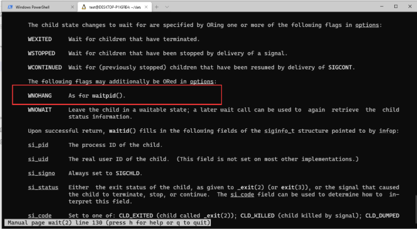

 

用户分组，进程组什么的，不管什么分组，唯一的好处就是好操作。一个进程创建出来的进程是跟它的父进程是同组进程。


**`pid`可以的值是多少？？**

- 0 回收同组进程

- -1 回收子进程

-  >0 回收指定子进程

- <-1 回收任何进程组号为pid的绝对值的子进程

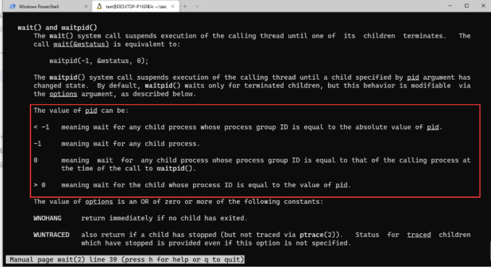


上面的代码加上收尸，如下:

```c
#include <stdio.h>
#include <stdlib.h>
#include <unistd.h>
#include <sys/wait.h>

#define LEFT  30000000
#define RIGHT 30000200


// 需要201个子进程进行计算
int main()
{
        pid_t pid;
        int i, j , mark;
        for(i=LEFT; i<= RIGHT; i++){
                pid = fork();
                if(pid < 0){
                        perror("fork");
                        exit(1);
                }

                if(pid == 0){
                        // i子进程， 干活

                        mark = 1;
                        for(j=2; j<i/2; j++){
                                if(i%j == 0){
                                        // 非质数
                                        mark = 0;
                                        break;
                                }
                        }
                        if(mark == 1) printf("%d 是质数\n", i);

                        exit(0); // 子进程结束

                }
        }
        // 收尸
        for(i=LEFT; i<=RIGHT; i++){
                wait(NULL);
        }

        exit(0);
}

```


数一下输出的行数：` ./primer2 | wc -l`

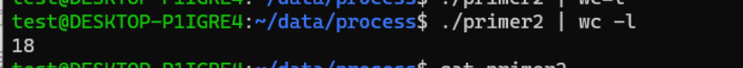


