# 进程的基本知识

需要了解的内容:

- 1. 进程标识符 pid

类型pid_t， 有符号的**16位整型数**，也就是说可以同时进行三万多进程

命令：ps

- 2. 父子进程的产生 

    - fork()

    -  vfork()

- 3. 进程的消亡及释放资源

    - wait()

    - waitpid()

- 4. 进程分配

- 5. exec函数族的使用

    - execl()

    - execp()

    - execle()

    - execv()

    - execvp()

- 6.  用户权限和组权限（u+s, g+s）

    - u+s

    - g+s

- 7. 观摩课：解释器文件

`#！/bin/sh`

- 8. system()

理解为fork, exec, wait的封装

- 9. 进程会计

acct()

- 10. 进程时间

times()

- 11. 守护进程

    - 会话session 标识sid

    - 终端

    - setsid() 成为守护进程

    - getpgrp() 返回当前进程组的ID

    - 单实例守护进程：锁文件/var/run/name.pid

    - 守护进程开机启动脚本文件 /etc/rc*...

- 12. 系统日志

    - syslogd服务

    - openlog();  

    - closelog();

    - syslog();


## 09  进程system

man system :就**相当于一个 fork, exec, wait 的简单封装**

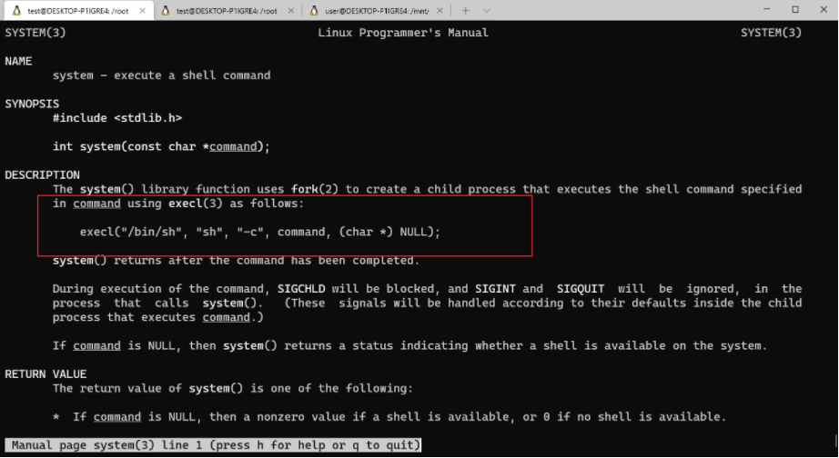


```c
#include <stdio.h>
#include <stdlib.h>

int main(){
        system("date +%s >/tmp/out");

        exit(0);
}

```


## 10  进程会计： acct(); 

方言，将进程信息写在一个文件中


## 11  进程时间 times();

`time ./primer1`  是执行primer1的时间，原理： 当前父进程在等子进程的时候在掐时间，所以说当前时间（等待子进程时间）包括等在子进程结束的时间，都会纳入到这个时间当中去。`times` 函数用来完成time命令的。


`man times `结果如下：

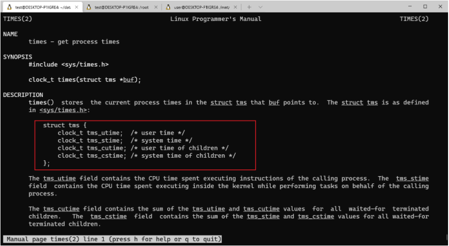

计时单位：clock_t  滴答数， 一秒钟的滴答数可以用一个宏来检测，如下

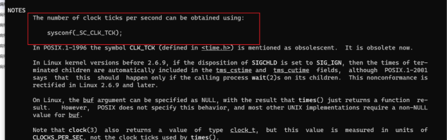

tms的四个时间碎片拼一起就是一个time命令。


## 12 守护进程

守护进程可以理解成服务，一些系统级模块，开机启动的时候，需要进程一直在后台跑的，这种程序被称为守护进程，比如:`Httpd`守护进程，` dhcp`（动态分配IP地址）， `ssh`服务，等等，

当我们执行`ps`命令的时候，看到的一些后台跑的内容，有很多本身就是守护进程。无论是windows还是linux, 都是有守护进程。

守护进程一般满足如下条件：

- 脱离控制终端（因为控制终端的输入和输出会对它有影响）

- 会话的`leader`

- `group`的`leader`


### 001 会话`session sid ` （终端）

我们平时接触的都是**虚拟终端**，实际意义上的终端是一个笨设备。。只会两个操作，输入和输出。。一般在银行这种要求安全性比较高的地方，可能会有真正意义上的终端存在。


在学并发这个模块的时候，就会发现，进程实际上就是容器，在我们的处理器处理当前的调度的时候，其实它是以线程为单位来调度的，所以认为多线程的并发要比多进程的并发要更规范，

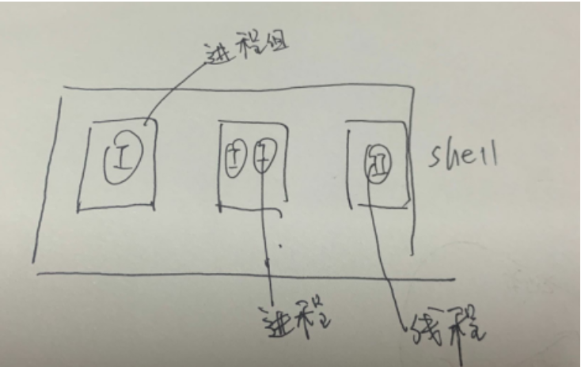


**进程组分为：前台进程组和后台进程组，最多可以有一个前台进程组，可以没有前台进程组**。

如果一个程序运行的会久一些，我不希望它占着我的命令行，终端，我还会做别的事情，那我在这条命令后面加一个地址符号，也就意味着，当前这条命令我要放到后台去运行。

前台进程组能够接受标准输入，能够标准输出，后台进程组不行。如果不区分前台进程组和后台进程组，我们不知道命令行输出的是哪个进程组的。

**所以我们的守护进程的标准的输入和输出我们会进行重定向。**


### 002 `session`标识：`sid`

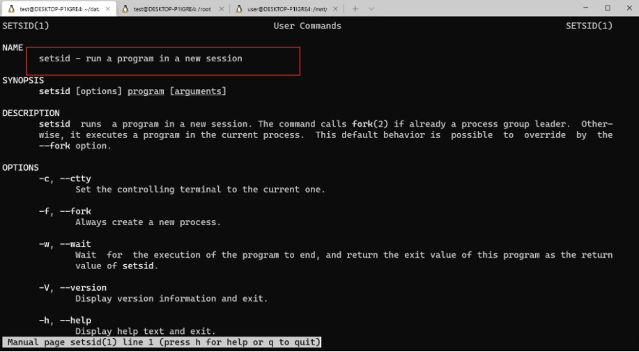

如果当前调用这个函数的进程不是一个`group leader`的话，会创建一个新的`session`。调用这个函数的进程会成为新的`session`的`leader`。其实**调用setsid()进程的特点就是守护进程的特点**。


### 003 `setsid() `

**设置为守护进程**

`ps-axj `

- `TTY`表示的是控制终端，守护进程是脱离控制终端的， 所以打问号?的是守护进程。

- 利用`setsid()`之后，当前的进程会成为`session`的`leader`, 会成为`group`的`leader`， **所以说它的`PID, PGID,SID`是相同的。**

- 由于守护进程在执行的时候，父进程会一直在等着，比如：FTP是从开机就开始，父进程一直在等着，既然子进程调用`setsid()`以后会变成守护进程，直接让父进程退出，父进程不需要收尸，如果父进程退出了，那么当前守护进程的父进程的`PPID`值就为1， init进程

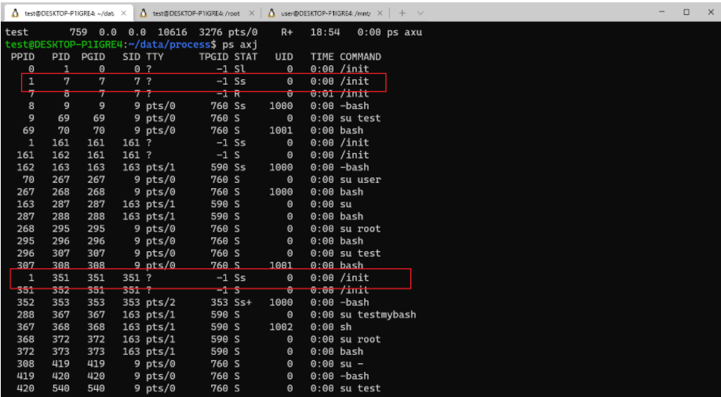


### 004 实例：

- `getpgrp()` 获得当前进程的进程组ID

- 

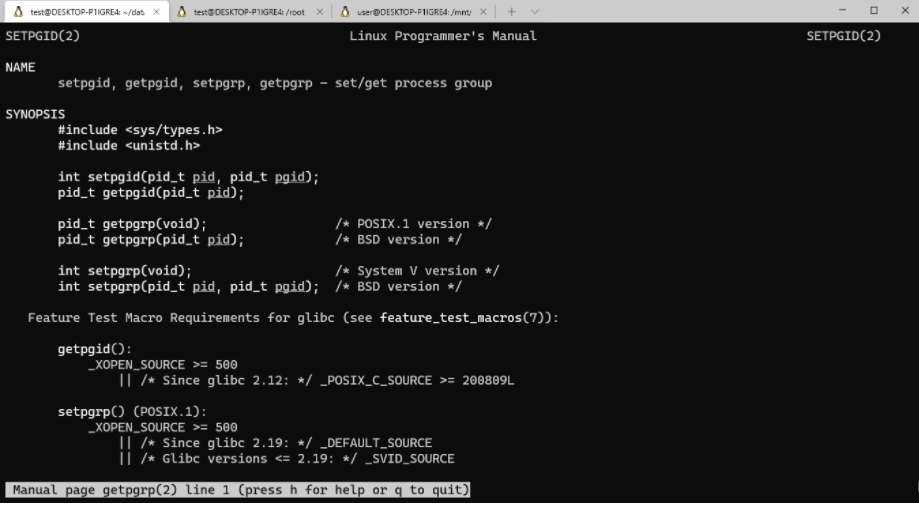


`vim`定位到第59行代码的时候，在控制模式下输入`:59`

**注意： 守护进程要根据进程号去`kil`掉， `kill `是通过发信号终止的进程**


### 005 单实例守护进程

锁文件：`/var/sun/name.pid`

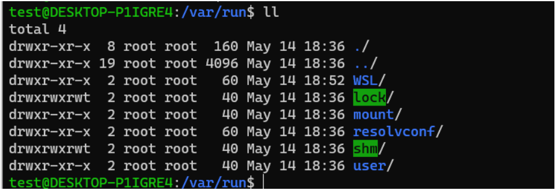

比如ssh

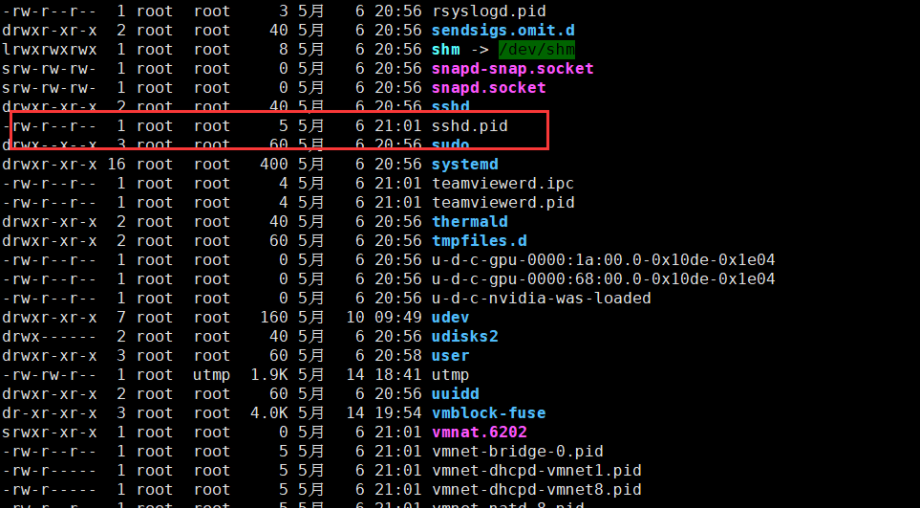

每次开机启动，守护进程都会在这个目录下产生一个锁文件，用来记录进程的pid，把当前这次的进程编号写进去。


### 006 开机启动脚本

**脚本文件 `/etc/rc*... `不同操作系统不一样的名字**

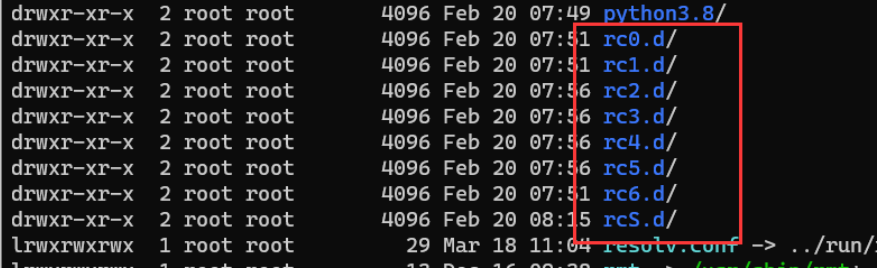

这个文件目录下的文件如下：文件都是开机启动脚本

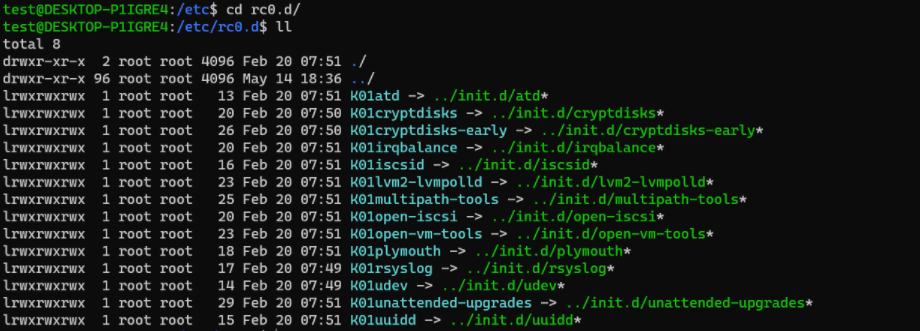

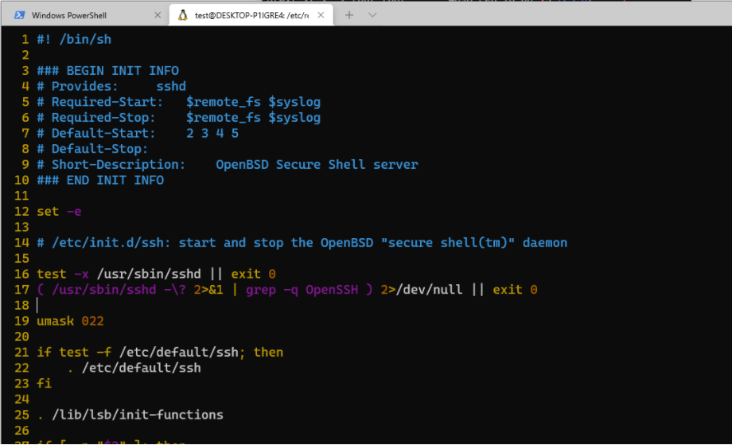


## 13 系统运行级别

刚刚看守护进程的截图：

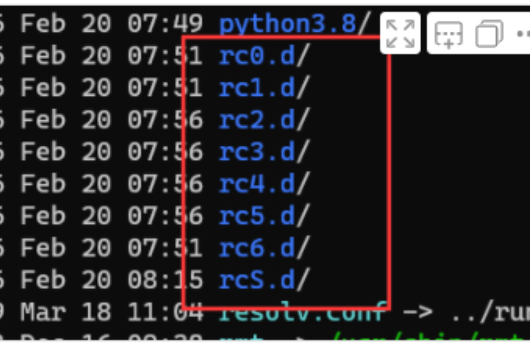

**那么`rc0, rc1, ... `, 他们的区别是????**


**`Linux`的运行级别：**

- 0： 系统停机状态， 系统默认运行级别不能设为0， 否则不能正常启动

- 1： 单用户工作状态，`root`权限，用于系统维护，禁止远程登陆

- 2： 多用户状态（没有`NFS`）

- 3： 完全的都用户状态（有`NFS`）， 登录后进入控制台命令行模式

- 4： 系统未使用，保留

- 5： `X11`控制台，登陆后进入图形GUI模式

- 6： 系统正常关闭并启动，默认允许级别不能设为6，否则不能正常启动

**分别对应守护进程中的`rcN.d`目录， 系统会根据指定的运行级别进入对应的`rcN.d`目录，并按照文件名顺序检索目录下的链接文件。**

链接文件分为两种：

- 以K开头的文件，系统将终止对应的服务

- 以S开头的文件，系统将启动对应的服务

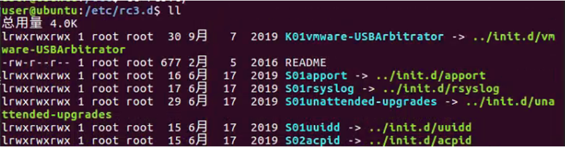

`runlevel` 查看系统运行级别， 缺省状态下，运行级别一般为3


## 14 系统日志

**注意**： 每一个应用程序都有必要去写系统日志， 系统日志的位置: `/var/log/`

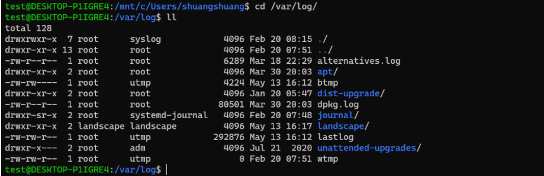

主日志文件是`message`文件，但是不能让人人都可以，比如格式，文件啥的，**做了一个权限分割层，是`syslogd`服务，所有的要写系统日志的内容，都把自己要写的这个日志提交给`syslogd`这项服务，然后由这个服务进行统一的系统日志的写法，所以只需要按照一定的函数接口，将要写的内容提交给`syslogd`就可以了**


### 001 `syslogd`服务

我们可以通过 `ps axj | grep "syslogd"`， 搜索服务

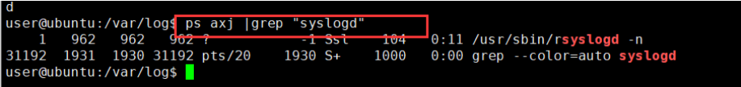


如果需要改写入系统日志的约定，需要改`/etc/sysconfig/rsyslog` 这个服务的约定


