# 描述

一、 信号

1. 信号的概念

    1. 信号是软件中断

    1. 信号的响应依赖于中断

1. `signal()`; 
    1. 信号会打断阻塞的系统调用
    
1. 信号的不可靠

1. 可重入函数

1. 信号的响应过程

    1. 信号从收到到响应有一个不可避免的延迟

1. 信号常用函数

    1. `kill()` ` kill`命令是给一个进程发信号

    1. `raise()`

    1. `alarm()`

    1. 实例： 使用单一计时器构造一组函数，实现任意数量的计时器。

    1. `pause()` 等待

    1. `abort()`

    1. `system()`

    1. `sleep()`

1. 信号集

1. 信号屏蔽字/信号`pending`集的处理

1. 扩展

    1. `sigsuspend()`

    1. `sigaction()`  替换 `signal`

    1. `setitimer()`  替换 `alarm`

1. 实时信号（上面讲的是标准信号）


# 并发（信号、线程）

信号属于初步异步，线程属于强烈异步。

同步：在程序执行的时候，无论执行到什么位置，我们都可以知道它出了什么问题。

异步：（意味着并发）意味着这个事件什么时候到来不知道，到来以后会产生什么样的结果不知道

**异步事件的处理：**

- **查询法：如果异步事件发生的频率比较高，使用查询法。**

- **通知法：如果异步事件当前发生的频率比较稀疏，使用通知法。**

查询法和通知法只不过是两种方法，实际上是一种形式，有真正的通知法吗？？？没有绝对的通知。。。


## 1. 信号的概念

### **信号是软件层面中断。**

**注意：** 信号不是中断！

中断：底层的硬件的

信号：应用层的内容

**实际是：信号的响应依赖于中断。由于有中断机制的存在，所以在键盘上操作才能够被响应**。


为什么说是软件层面的中断呢？设计信号这个机制的人，肯定有非常强的硬件中断的基本知识和经验，相当于把中断的机制拿到应用层面来，做了一个模仿。但是信号的响应是依赖于中断的。


### 怎么解释中断？ ？？

中断分好多形式，你的硬件设备都会发出中断，即使这些东西都没有发出中断，那么内核的某一个模块也是专门往外发出中断，因为有很多事件的响应是依赖于中断的，

再比如说时间片轮转，当你的时间片耗尽，就要出让调度器，然后去排队，那么怎么让你知道时间片耗尽了？？这属于中断反应出来的一种形式。


### 查看当前信号

用 `kill -l` 查看当前所有信号

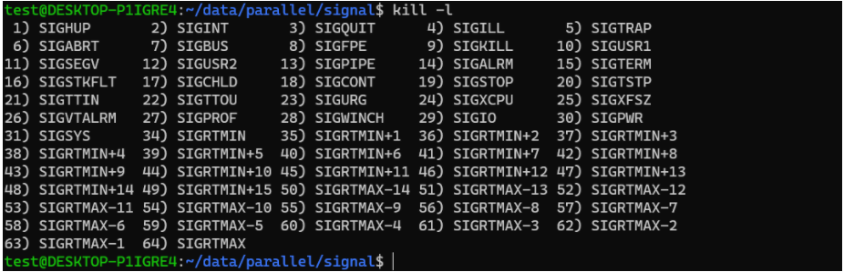

看上面的信号，编号1-31都叫`SGI... `， 这些信号叫标准信号（不可靠信号）， 从编号34开始，信号没有特定的名字了，都叫`SIGRTMIN+... ` 也就是说**它是从 SIGRTMIN -SIGRTMAX 这个范围**， 这个范围的信号叫**实时信号**。


### **信号的描述的表**：unix规定的标准信号， 

可以看到，标准C下支持的信号是最少的，所以在标准C下信号基本上是摆设，这里支持信号最多的是Solaris。这些信号是unix支持的信号，略微的和我们上面的截图不太一样，因为我们的系统也不是完全支持。

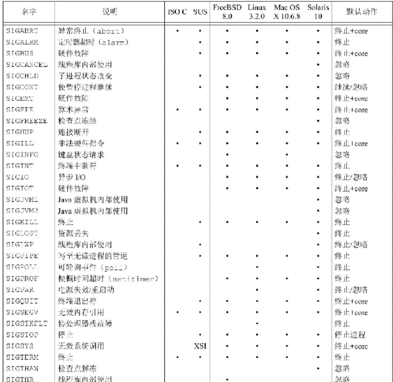

### core文件

**Core文件其实就是内存的映像，当程序崩溃时，存储内存的相应信息，主用用于对程序进行调试**。当程序崩溃时便会产生core文件，其实准确的应该说是core dump 文**件,默认生成位置与可执行程序位于同一目录下**，文件名为core.***,其中***是某一数字。


可以看到默认动作有**终止+core**， core是什么？？？ 这里的core说的是core文件，是一个程序的某一个现场。 

做一个段错误的现场：

改一下之前的getline文件

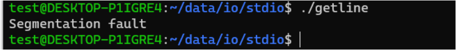

看一下有没有core文件产生：-->没有

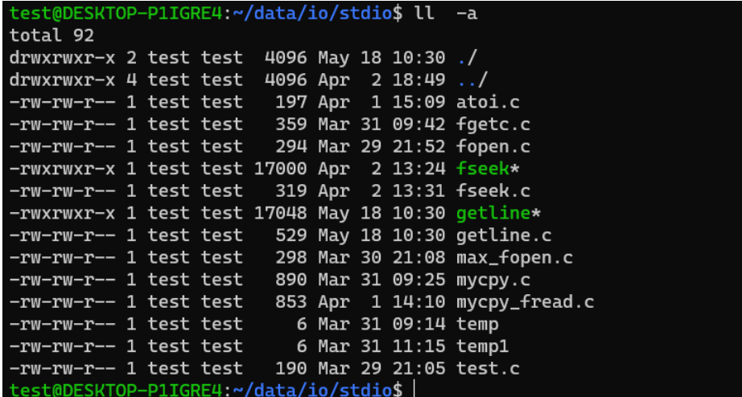


ulimit -a  看到 产生core文件的数量为0 

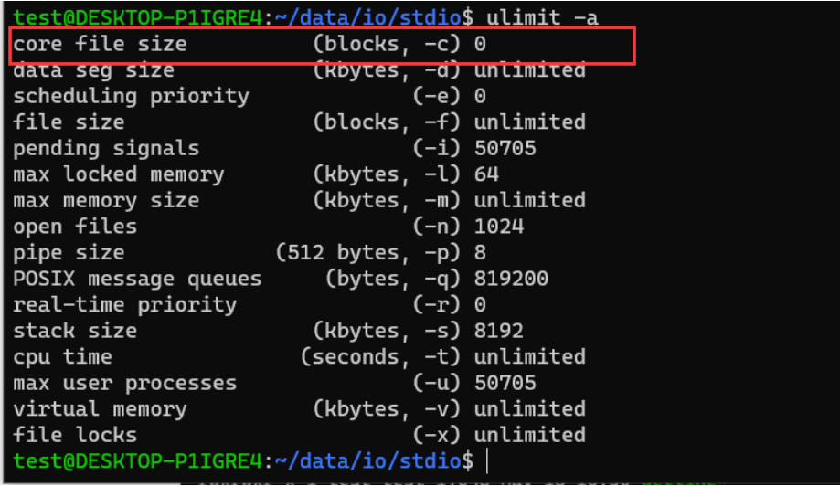


然后` ulimit -c 1024` 规定一个core文件的最大时10M， 重新执行下getline, 然后就看到产生了一个core文件。

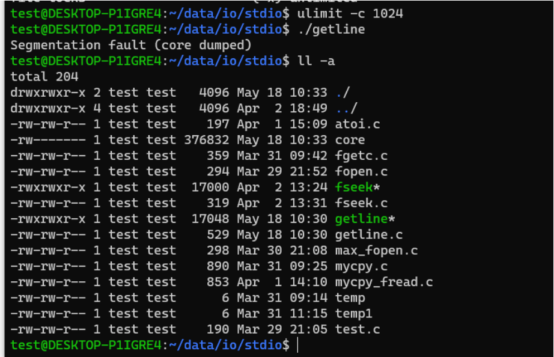


编译的时候直接用make编译的，没有加一些编译选项，如果说在编译的时候加了-g 调试选项，其实现在就可**以调用gdb, 去调试这个core现场了**。

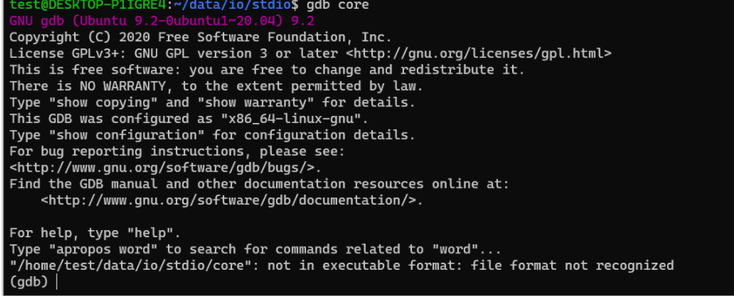

所以说如果遇到core的时候，随手给人家发过去。


## 2. signal() 函数


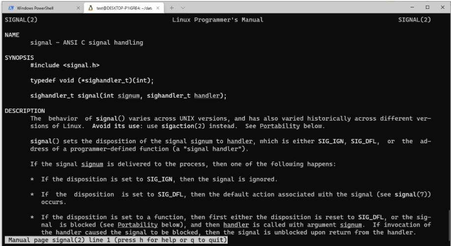


`sighandler_t signal(int signum, sighandler_t handler);`

- signum: 信号

- handler: 规定的行为，当这个信号到来的时候，去执行规定的这个行为

- return : 返回信号之前的行为

- `sighandler_t `这种类型是返回值为void， 参数为int的这种类型的函数

`void (*func)(int) signal(int signum, void(*func)(int))`，实际编程中常用这个方法

C语言的一个缺点就是明空间管理不善, namespace,


### ctrl+c 快捷键， 终端中断符

当我们执行程序的时候，`Ctrl+C`程序会停止执行，`Ctrl+C `相当于SIGINT的快捷方式，SIGQUIT它的快捷方式是`Ctrl+\` , 

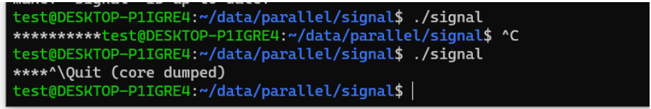


我们让程序中忽略这个`SIGINT`， 如下

```c
#include <stdio.h>
#include <stdlib.h>
#include <signal.h>

int main(){
        int i;


        signal(SIGINT, SIG_IGN);
 # 忽略这个信号
        for(i=0; i<10; i++){
                write(1, "*", 1);
                sleep(1);
        }

        exit(0);
}

```

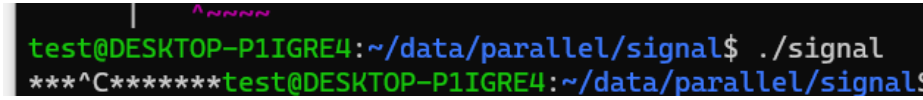


换为别的函数：

```c
#include <stdio.h>
#include <stdlib.h>
#include <signal.h>


static void int_handler(int s){
        write(1, "!", 1);
}

int main(){
        int i;


        signal(SIGINT, int_handler);
        for(i=0; i<10; i++){
                write(1, "*", 1);
                sleep(1);
        }

        exit(0);
}

```


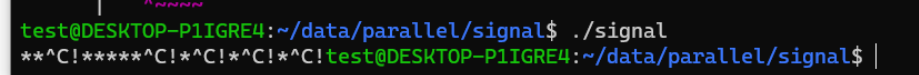


## 3. 信号的不可靠（信号的行为不可靠）


- 当我们一直按着ctrl+c的时候，程序会 很快执行完，并没有10秒钟，因为**信号会打断阻塞的系统调用， **之前的程序如果加上信号，没有一个能完成功能

- 信号的行为不可靠：调用函数的执行现场是内核给布置的，一个信号在处理这个行为的同时，又来了另外一个相同的信号，因**为是内核给布置的，就很有可能不是在同一个地方，第二次的执行现场就把第一次的冲掉了**，


## 4. 可重入函数（为了解决信号的不可靠）

信号的不可靠：**第一次调用还没结束，第二个调用已经开始**了。

**什么叫可重入函数？？**第一次调用还没有结束，然后又发生了第二次调用，但是不会出错，这样的函数叫做可重入函数


**记住**：**所有的系统调用都是可重入的，一部分标准库函数也是可重入**的，尤其是返回时一个指针的函数，比如说：memcpy()


`rand()`函数生成的序列是一个伪随机序列，每一个值得生成都是在前一个数得基础上生成得，所以说它是不可重入函数。`rand_r()`函数就是可重入得，只要函数后面加上`-r`得基本上都是可重入得。**只要一个函数后面带有`-r`版本，这个函数原来得版本一定不能用在信号函数处理当中。**

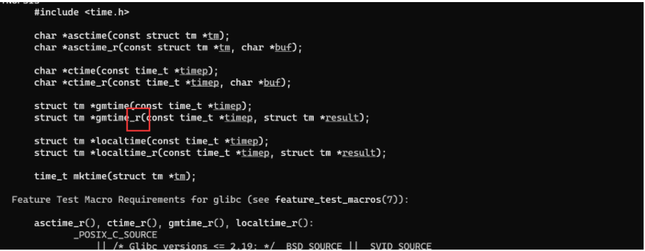


## 5. 信号的响应过程

任何的硬件都会发出中断，即使当前没有硬件发出中断，内核也有一个模块负责每秒往外发出几千个甚至更多的中断，所以比如说：虽然在`printf("hello world") `程序是非常平坦的运行过去的，一瞬间的事，但是即使这一瞬间，但是你执行这个printf的过程中被打断了N多次，它其实是在磕磕绊绊的在运行。

首先明确**当前内核为每一个进程维护了一个组位图，**


**注意：**当前画的图是以进程为单位画的，而实际上我们已经在面向线程编程，之前只是单进程单线程的程序，后面讲到多线程的时候，才会进入多线程并发阶段，才会写多线程程序。

其实**进程线程并不分家，从内核的角度来看，当前操作的任务就叫线程**，只不过从我们的概念来看的话，我们先产生出来的概念叫进程，后来发现是细化到线程来调度，所以我们认为进程是容器，**进程线程只是从我们理解的角度来讲区分出来的，从内核角度来讲，只有一个概念，叫线程。**


当进程被打断的时候，会把当前的执行现场进行压栈存放，然后去到内核，内核中有个等待调度的就绪队列，在那里排队，等待调度，当被调度的时候，别人把调度器出让给你，然后再从刚才的现场进行恢复，再往下执行，然后再被打断，被调度，直到程序执行完成。


- **信号从收到到相应，有个不可避免的延迟（**一个信号过来的时候一开始不知道，被一个中断打断了，进入内核，等待调度以后才知道**）**

- **思考：信号如何忽略掉的？？**

- **思考：标准信号为什么要丢失？？**

- 标准信号的相应没有严格的顺序。


### 内核中维护了一组位图：

- mask（初始值都为1， 32位），**mask是信号屏蔽字，用来表示当前状态**

- pending(初始值都为0，32位) ， 其中signal num对应的位**，用来记录当前进程收到哪些信号**


### 信号响应为什么会有延迟？？响应过程？？

1. 一个主程序被中断打断，打断的时候的现场地址为address, 然后进程进入kernal，在就绪队列中排队。

1. 等到进程被调度的时候，进程从kernal态转为user态，会做一个表达式 mask&pending

    - 如果整个结果为0，则说明没有收到任何信号，然后回到address位置继续执行

    - 如果有一位是1，将mask信号位置为0， pending位也置为0， 然后将address换为注册的信号对应函数的入口地址，去执行，执行完以后要把mask这一位恢复为1

1. 恢复主程序继续执行


我们可以理解为： **信号是进程从kernal态到user态的路上被响应的。**


### 信号怎么被忽略掉的？？

**将指定信号的mask位永远置于0**， 因此我们不能阻止信号的到来，但是我们可以阻止信号被响应。


### 标准信号为什么会丢失？？（位图不会累加，只能置1）

当信号响应的时候，又来了一个相同的信号，会被丢失。。。

- 没有信号的时候，(mask, pending) = (1, 0)

- 收到信号以后体现在pending位图上， （mask, pending） = (1, 1)  

-  响应信号的时候，mask置为0， pending置为0, (mask, pending) = (0, 0)  **如果再来一个相同的信号， 会将pending置为1， 多个信号也会置为1， 所以会忽略掉一部分信号，**

- 响应完成以后，将mask置为1， （mask, pending）=(1, 0)

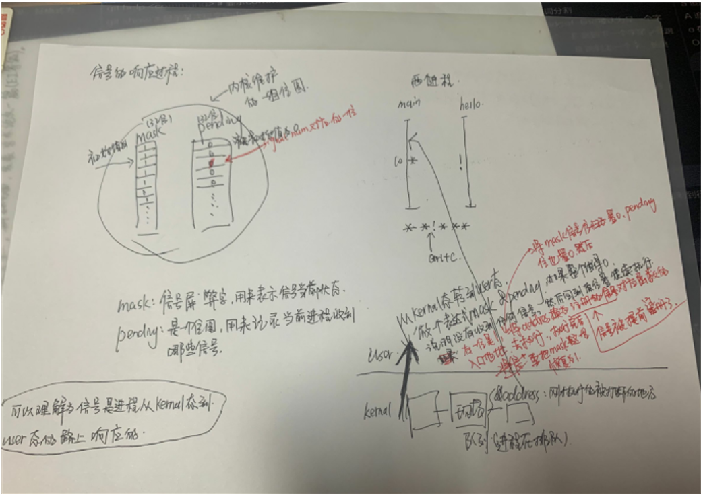


## 6. 信号当中的常用函数


### kill 给一个进程发信号

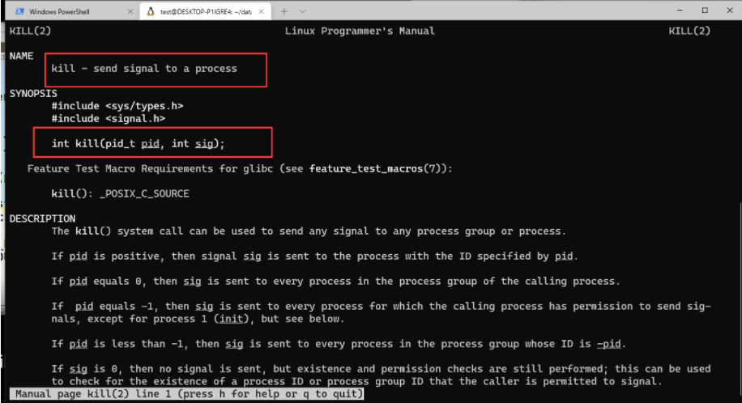

**pid的值：**

- 如果是整数，代表把signal发给指定的进程号为pid

- 如果是0，发送给当前进程同组的所有进程（称为**组内广播**）

- 如果是-1， 发送给当前进程有权限发送信号的每个进程（**全局广播信号**），除了不给1号发。

- 如果小于-1，发送给组ID为（-pid）的所有进程

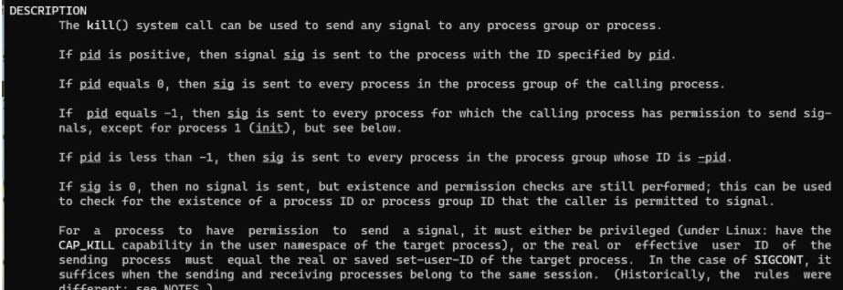


**注意**：如果当前信号是0的话，就表示没有信号发送，但是是用来检错的，经常被用于检测一个进程或者一个进程组的存在。

**如果成功，返回值为0， 如果返回失败，则返回-1**， 但是如果当前信号为0，用过来检测当前进程组存在，那么返回值是-1表示进程或者进程组不存在吗？？？不是的。。。

如果检测一个进程或者一个进程组存不存在，如果返回值为-1，不一定表示它不存在，要继续看它的errno， 如果errno的值为ERERM，表示存在，但是你 没有权限，如果为ESRCH，表示这个进程真的不存在。


所以，以后看文档，需要看他的头文件，宏，功能，还要看他的具体描述，还有他的报错，所遵循的标准。


### raise 给当前进程或线程发送一个信号

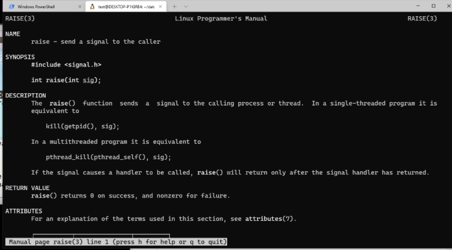


什么时候会给自己发送一个信号？？

。。。。


### alarm 以秒为单位的计时

因为**进程从收到信号到响应，有一个不可避免的时间**，如果用信号来计时的话， 理论上 讲10ms以内的计时是不准确的，只要超过这个时间，用信号可以准确的计时。

alarm： 当当前倒计时到时间以后，会给当前进程发送一个SIGALARM的信号，SIGALARM信号的默认动作是杀掉当前进程。

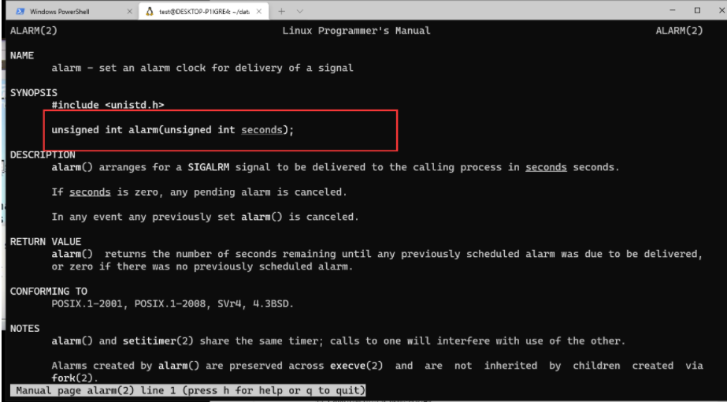


例子：

```c
#include <stdio.h>
#include <stdlib.h>
#include <unistd.h>

int main(){

        // 闹钟信号
        alarm(10);
        alarm(1);
        alarm(5);
        // alarm没有办法实现多任务的计时器
        while(1);

        exit(0);

}

```

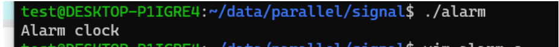

alarm没有办法实现多任务的计时器，当有多个alarm的时候，只能响应最后一个。


### pause 等待一个信号来打断它

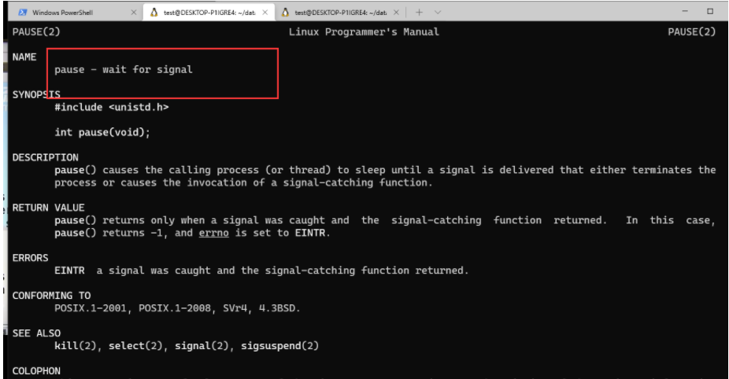


alarm其实是有问题的，这个问题并不是alarm造成的，而是sleep， 之前说过不要用sleep, 因为有的环境下**，sleep = alarm+pause, sleep使用alarm和pause来封装的**。**如果我们的程序当中也用到了alarm函数，这个就会出现问题**。

那为什么当前情况下用sleep没有事？ 是因为当前环境下我们的sleep是用nanosleep封装的， 所以sleep在linux环境下使用都不会有问题，如果**考虑到程序的移植的话，就不要使用sleep函数，因为你不知道对方环境下是怎么封装的。**


### 定时循环的例子

1. 没有结合信号的，运行的时间：误差比没有信号的要少很多

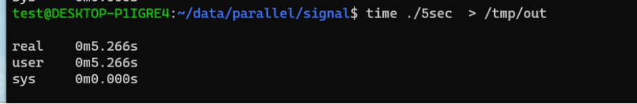2. 结合信号的运行的时间：（时间精度很高)

```c
#include <stdio.h>
#include <stdlib.h>
#include <unistd.h>
#include <signal.h>


static volatile int loop = 1;
 // 后面优化加了volatile 
static void alrm_handler(int s){
        loop = 0;
}

int main(){
        int64_t count = 0;
		// 注意！！ alarm 和 signal一定要有个顺序， signal在前，alarm后面
        signal(SIGALRM, alrm_handler);
		alarm(5);
        while(loop)
                count++;

        // 当5秒钟到来以后，时钟会杀掉进程，所以说，如果时间到了也不会打印printf
        printf("%lld \n", count);

        exit(0);
}

```

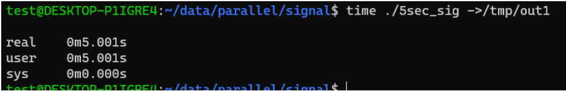


3. 我们**执行 `gcc 5sec_sig.c -O1`  ,O优化， 1代表级别**， 1表示基础级别， 生成a.out以后执行，结果程序一直不能结束，为什么？？
4. 我们看一下他的汇编代码：`gcc -S 5sec_sig.c`,会得到一个.s的汇编文件

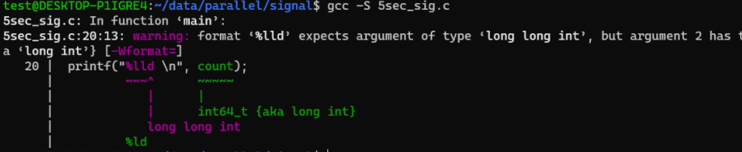

产生循环的几句话如下：

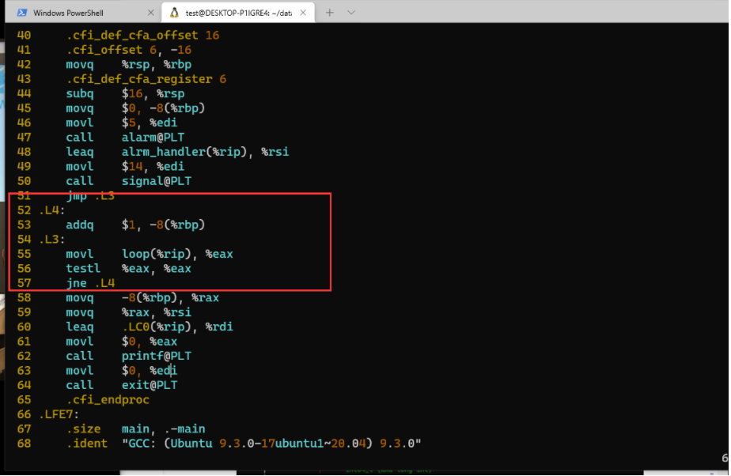

**程序执行循环的过程如下：**

- 1. 装载loop

- 2. 判断testl是否正确

- 3. 跳转到L4


然后看一下 `**gcc -S 5sec_sig.c -O1 **`的汇编代码：

原来循环的地方汇编代码如下：出现了死循环。。。

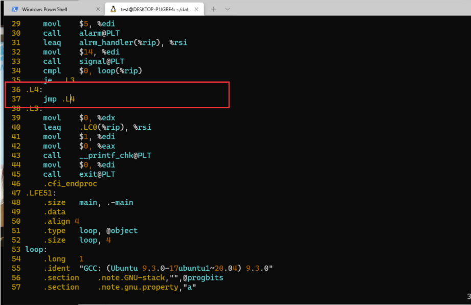


那么为什么会出现死循环？？

我们现在所做的优化，它会调整代码，调整优化的顺序，然后它会觉得你的循环体中没有用到loop， 而循环条件是loop， 所以loop是一成不变的。

**那么这个问题怎么解决？？ 在C中学到的一个关键字，**`**volatile**`** 去到这个数的真正的内存空间去取值，不要轻信内存当中对这个数的存放。这个关键字在嵌入式开发当中非常容易用到。。**


### 漏桶实现

mycat的代码：

```c
#include <stdio.h>
#include <stdlib.h>
#include <sys/types.h>
#include <sys/stat.h>
#include <fcntl.h>
#include <unistd.h>
#include <errno.h>


#define BUFSIZE 131072

int main(int argc, char **argv)
{
        int source_fd;
        int target_fd = 1;
        char buf[BUFSIZE];

        if(argc < 2)
        {
                fprintf(stderr, "Usage ... \n");
                exit(1);
        }

        source_fd = open(argv[1], O_RDONLY);
        if(source_fd < 0)
        {
                perror("open()");
                exit(1);
        }

        int len, ret;
        while(1)
        {
                len = read(source_fd, buf, BUFSIZE);
                if(len < 0)
                {
                        perror("read");
                        break;
                }
                if(len == 0)
                {
                        break; // 表述已经读完了
                }
                ret = write(target_fd, buf, len);
                if(ret < 0)
                {
                        perror("write");
                        break;
                }
        }


        close(source_fd);
        exit(0);

}

```

如果想让mycat慢慢的向命令行显示，如何实现？？？**流控算法**

### 漏桶实现

```c
#include <stdio.h>
#include <stdlib.h>
#include <sys/types.h>
#include <sys/stat.h>
#include <fcntl.h>
#include <unistd.h>
#include <errno.h>
#include <signal.h>


#define CPS 10
#define BUFSIZE CPS


static volatile int loop = 0;

static  void alrm_handler(int s){
        alarm(1);
        loop = 1;
}

/*
 *加一个时间控制，让显示慢慢的显示
 * */
int main(int argc, char **argv)
{
        int source_fd;
        int target_fd = 1;
        char buf[BUFSIZE];

        if(argc < 2)
        {
                fprintf(stderr, "Usage ... \n");
                exit(1);
        }

        signal(SIGALRM, alrm_handler);
        alarm(1); // 一秒发一个信号

        source_fd = open(argv[1], O_RDONLY);
        if(source_fd < 0)
        {
                perror("open()");
                exit(1);
        }

        int len, ret;
        while(1)
        {
                while(!loop) // 一直在忙等，耗费资源
                        pause(); // 用来被打断的阻塞的系统调用;
                loop = 0;
                while((len = read(source_fd, buf, BUFSIZE))<0)
                {
						if(errno == EINTR)
							continue;
                        perror("read");
                        break;
                }
                if(len == 0)
                {
                        break; // 表述已经读完了
                }
                ret = write(target_fd, buf, len);
                if(ret < 0)
                {
                        perror("write");
                        break;
                }
                // sleep(1); // 注意， sleep不能真正用在发布出去的源码中
        }
        close(source_fd);
        exit(0);

}

```


**流控算法的这个实例，其实是个漏桶，漏桶如果有N多个字节,仍然一点点取读，如果没有字节过来，就一直等着**。


### 令牌桶实现

如果当前闲着，不太好，如果可以攒下传输的权限（有一秒钟传输10个字节的权限），那么如果空闲3秒，下一次就会攒下一个一秒钟传输30个字节的权限。计算机中的数据 平稳的来的，而是要不来就不来，要来来一堆的那种， 所以说漏桶这样的实例放在实际应用中应用比较窄一些，因为比较僵硬。**令牌桶是：闲着就攒权限**

```c
#include <stdio.h>
#include <stdlib.h>
#include <sys/types.h>
#include <sys/stat.h>
#include <fcntl.h>
#include <unistd.h>
#include <errno.h>
#include <signal.h>

#define BURST 100  // 定义token最大值
#define CPS 10
#define BUFSIZE CPS


static volatile int token = 0;
static volatile int loop = 0;

static  void alrm_handler(int s){
        alarm(1);
        token ++; // 攒token
        if(token > BURST) token = BURST;
}

/*
 *加一个时间控制，让显示慢慢的显示
 * */
int main(int argc, char **argv)
{
        int source_fd;
        int target_fd = 1;
        char buf[BUFSIZE];

        if(argc < 2)
        {
                fprintf(stderr, "Usage ... \n");
                exit(1);
        }

        signal(SIGALRM, alrm_handler);
        alarm(1); // 一秒发一个信号

        source_fd = open(argv[1], O_RDONLY);
        if(source_fd < 0)
        {
                perror("open()");
                exit(1);
        }

        int len, ret;
        while(1)
        {
                while(token <= 0) // 一直在忙等，耗费资源
                        pause(); // 用来被打断的阻塞的系统调用;

                token --;

                while((len = read(source_fd, buf, BUFSIZE))<0)
                {
                        if(errno == EINTR)
                                continue;
                        perror("read");
                        break;
                }
                if(len == 0)
                {
                        break; // 表述已经读完了
                }
                ret = write(target_fd, buf, len);
                if(ret < 0)
                {
                        perror("write");
                        break;
                }
                // sleep(1); // 注意， sleep不能真正用在发布出去的源码中
        }


        close(source_fd);
        exit(0);

}

```


### 令牌桶封装成 库

如果要称为一个**成型的库**的话，要**具备以下因素**：

- main.c

- 所有的实现  mytbf.c

- 声明存放的位置  mytbf.h (程序员给用户的所有操作)


以后mytbf.c会编译为动态库或者静态库，mytbf.h会给用户， main.c是完全模拟用户的操作


### 多任务计时器 setitimer

**setitimer给了我们更多的选择，同时计时更准确，所以以后不要使用alarm， 而是用setitimer替换。**

setitimer的一个优点就是误差不累计，对于长期运行的程序非常重要

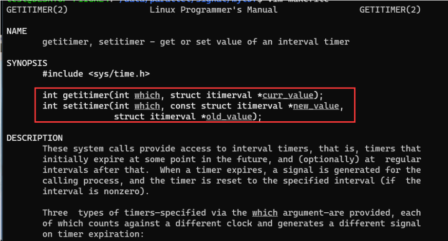


### abort 给当前进程发送信号， 终止进程，

人为的制造异常，杀掉当前进程，得到一个出错的现场。

### system 

**如果在有信号参与的程序当中，正常的使用system的话，就需要block住一个信号，ignore 两个信号**

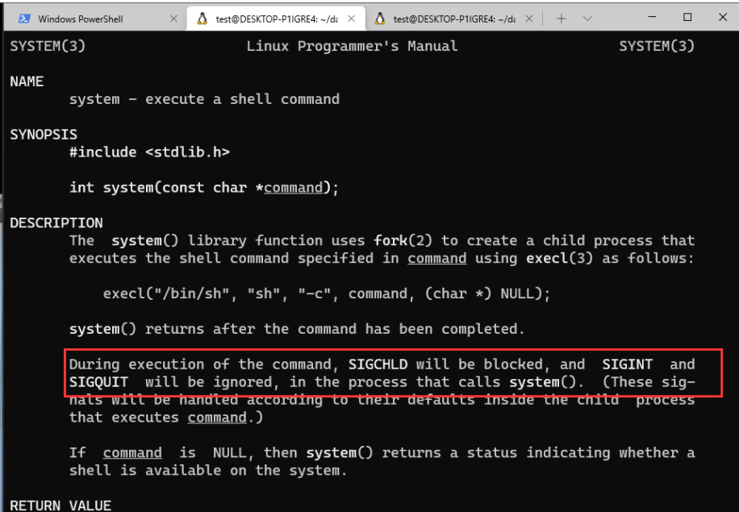


### sleep

有的平台上sleep是用alarm+pause实现的，所以不建议使用， 可以用nanosleep ，select和 usleep代替。


## 7. 信号集

一说集合就是把很多内容放在一起

**信号集类型**：sigset是typedef 出来的一个多少位的整形，位数一定能囊括标准信号的个数。


**信号集函数：**

- sigemptyset

- sigfillset

- sigaddset

- sigdelset

- sigismember

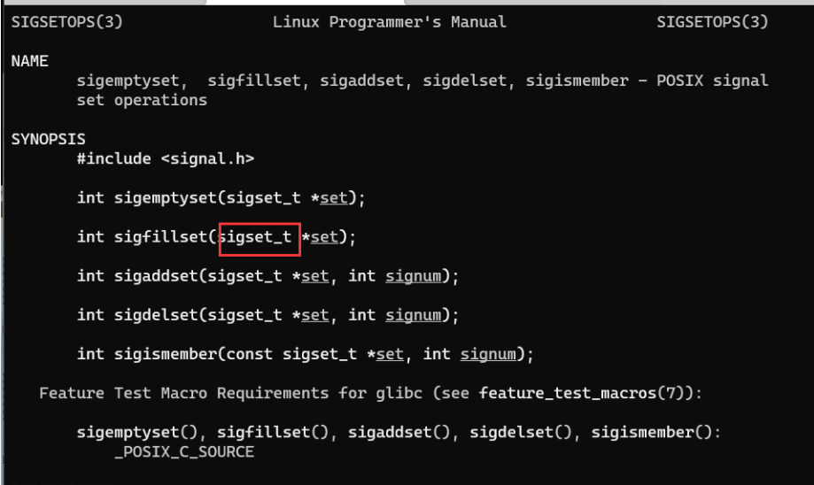


### 8. 信号屏蔽字/pending集的处理

sigprocmask函数, 给你一种机制，让你可以人为的控制mask

作用： 我们不能决定信号什么时候能到来，但是可以决定信号什么时候能响应。

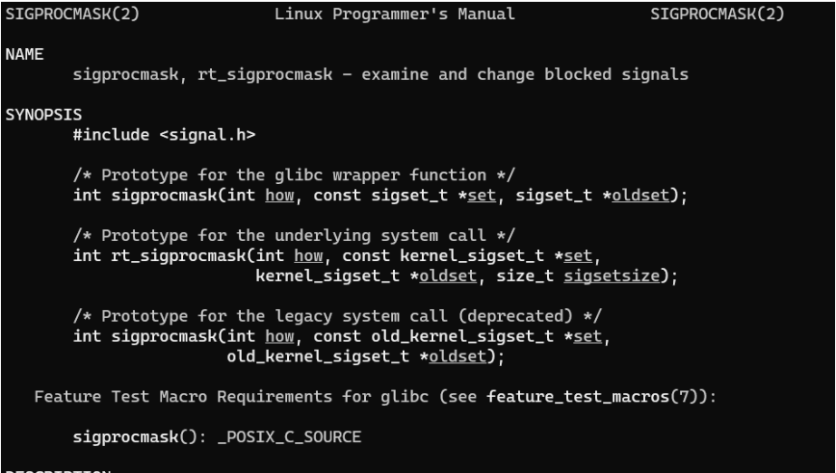


```c
#include <stdio.h>
#include <stdlib.h>
#include <signal.h>


static void int_handler(int s){
        write(1, "!", 1);
}
/*
 *
 *ctrl + \ 表示sigquit的信号
 * */
int main(){
        int i, j;
        sigset_t set, oset, saveset;
        signal(SIGINT, int_handler);
        sigemptyset(&set);
        sigaddset(&set, SIGINT);
		// 1. 先置为不阻塞
		sigprocmask(SIG_UNBLOCK, &set, &saveset);
        for(j=0; j<1000; j++){
				// 2. 然后设置阻塞
                sigprocmask(SIG_BLOCK, &set, &oset);
                for(i=0; i<5; i++){
                        write(1, "*", 1);
                        sleep(1);
                }
                //sigprocmask(SIG_UNBLOCK, &set, NULL);
				// 3.恢复状态
				sigprocmask(SIG_SETMASK, &oset, NULL);  // 重置旧的状态
                write(1, "\n", 1);

        }
        exit(0);
}

```

**以上三步整体保证了信号的状态在进入当前模块和离开当前模块的状态是一样的。**


## 9. 扩展

### sigsuspend 可以做一个信号驱动程序

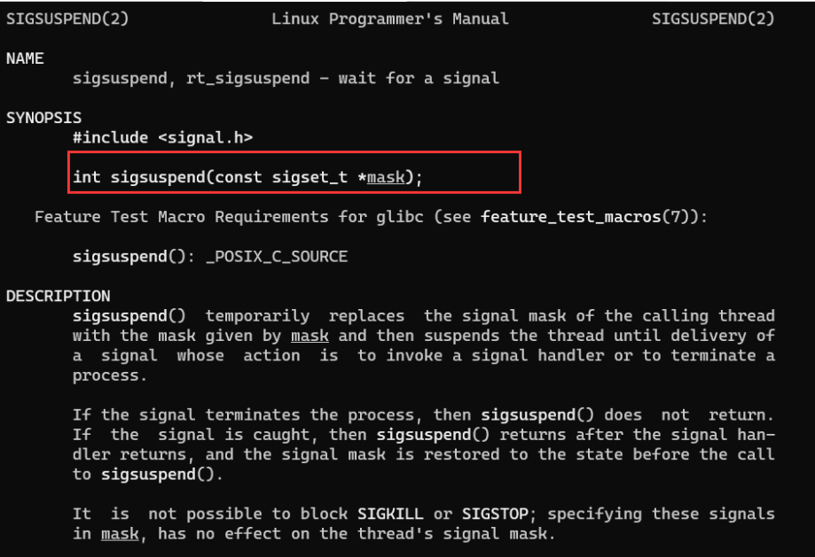

函数的作用是等待一个信号， 和pause的功能相同，那么他们的区别是什么？？


**信号驱动程序：**

```c
#include <stdio.h>
#include <stdlib.h>
#include <signal.h>


static void int_handler(int s){
        write(1, "!", 1);
}


int main(){
        int i, j;
        sigset_t set, oset, saveset, tmpset;
        signal(SIGINT, int_handler);
        sigemptyset(&set);
        sigaddset(&set, SIGINT);
        sigprocmask(SIG_UNBLOCK, &set, &saveset);
        sigprocmask(SIG_BLOCK, &set, NULL);
        for(j=0; j<1000; j++){
                for(i=0; i<5; i++){
                        write(1, "*", 1);
                        sleep(1);
                }
                // 下面几句话仍然不能完成功能，因为不是原子操作
                //sigprocmask(SIG_SETMASK, &oset, &tmpset);
                //pause();
                //sigprocmask(SIG_SETMASK, &tmpset, NULL);
                // 下面的这句话可以实现既等待又原子操作
				sigsuspend(&oset);
                write(1, "\n", 1);
        }
        exit(0);
}

```


### sigaction  重要！

这个函数是用来替换signal的，signal函数实际上是有使用缺陷的，

多个signal共用同一个处理函数的时候，容易发生重入的现象，一块空间被free多次，一定是内存泄漏的报错。

那么，当多个信号公用同一个处理函数的时候，我希望**在响应某一个信号期间，其他的信号BLOCK住，这个是signal本身没有包含的功能，所以有了sigaction这个函数**。

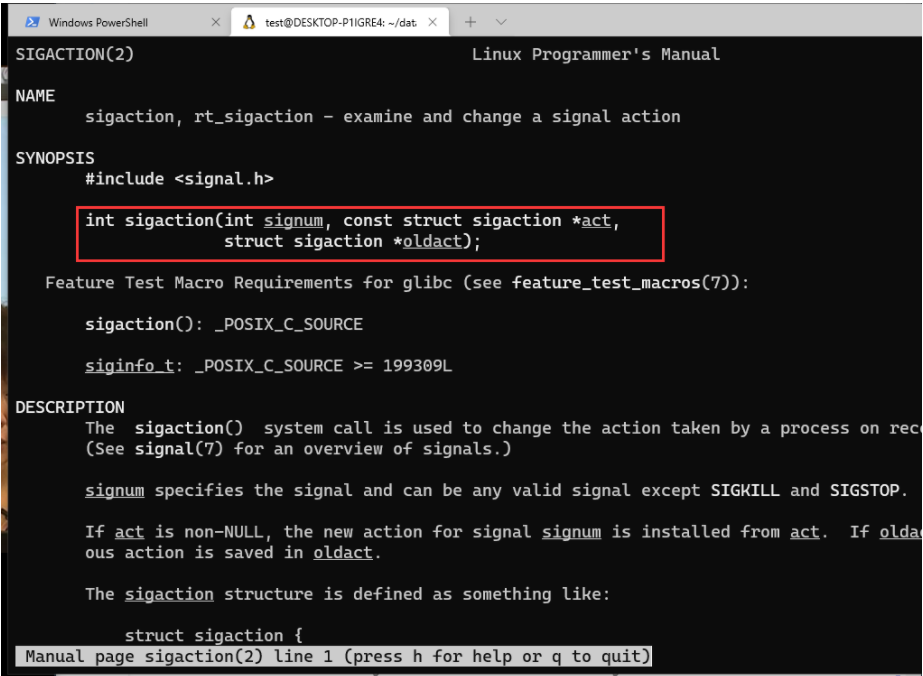


sigaction结构体：

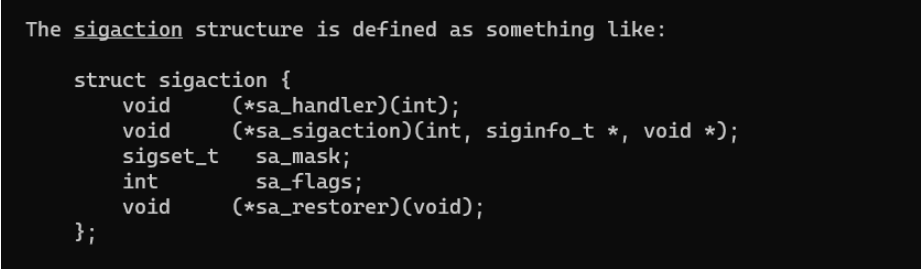**换signal这个函数**

sigset_t:  响应当前信号的时候，需要Block的信号集

siginfo_t ： 里面描述了一个信号的所有信息。这里有记录有信号的来源信息（si_code）。

例子：

```c
#include <stdio.h>
#include <stdlib.h>
#include <unistd.h>
#include <sys/types.h>
#include <sys/stat.h>
#include <fcntl.h>
#include <syslog.h>
#include <errno.h>
#include <string.h>
#include <signal.h>


#define FNAME "/tmp/out"

static FILE *fp;

static int daemonize(void){
        pid_t pid;
        int fd;
        pid = fork();
        if(pid<0){
                perror("fork()");
                return -1;
        }
        if(pid>0){
                // 父进程
                exit(0);  // 正常结束
        }

        // 如果是子进程
        // 1.标准设备重定向
        fd = open("/dev/null", O_RDWR);

        if(fd < 0){
                // 打开失败
                perror("open null ");
                return -1;
        }
        dup2(fd, 0);
        dup2(fd, 1);
        dup2(fd, 2);
        if(fd > 2) close(fd);

        // 2.
        setsid();

        // 修改工作目录
        chdir("/");
//      umask(0);
        return 0;
}

// 但是这个函数有重入的危险..
static void daemon_exit(int s){
        if(s == SIGINT){
         // ..
        } // else if{}

        fclose(fp);
        closelog();
}

// 做成一个守护进程
int main(){
        struct sigaction sa1;

        sa1.sa_handler = daemon_exit;
        sigemptyset(&sa1.sa_mask);
        sigaddset(&sa1.sa_mask, SIGQUIT);
        sigaddset(&sa1.sa_mask, SIGTERM);
        sigaddset(&sa1.sa_mask, SIGINT);
        sa1.sa_flags = 0;
        sigaction(SIGINT, &sa1, NULL);
        sigaction(SIGQUIT, &sa1, NULL);
        sigaction(SIGTERM, &sa1, NULL);


//      signal(SIGINT, daemon_exit);
//      signal(SIGQUIT, daemon_exit);
//      signal(SIGTERM, daemon_exit);

        openlog("my deamon", LOG_PID, LOG_DAEMON);
        if(daemonize()){
                syslog(LOG_ERR, "dermonize() failed!");
                fprintf(stderr, "error");
                exit(-1);
        }
        syslog(LOG_INFO, "deamonize sucesses!");

        fp = fopen(FNAME, "w");
        if(fp == NULL){
                syslog(LOG_ERR, "fopen: %s", strerror(errno));
                perror("fopen()\n");
                exit(1);
        }
        syslog(LOG_INFO, "%s file was opened!", FNAME);
        int i=0;
        while(1){
                fprintf(fp, "%d\n", i);
                i++;
                fflush(fp);
                sleep(1);
        }

        exit(0);
}

```


**给一个进程发送alarm信号**：` kill -ALRM pid`

信号的来源有： kernal态 和user态， 我们在终端给进程发的信号叫做user态信号，所以如果可以区分信号来源，然后就可以防止用户随意给进程发信号扰乱进程的运行。


## 10. 实时信号

前面讲的都是标准信号，标准信号有两个特点： **一个是标准信号会丢失、标准信号的响应 没有严格顺序**。

### 实时信号就是为了解决标准信号的不足。实时信号的特点：

- **实时信号是要排队的**

- **实时信号不丢失**

- **实时信号的响应是有顺序的**


**如果进程中即得到了标准信号，又得到了实时信号，是先响应标准信号的**。

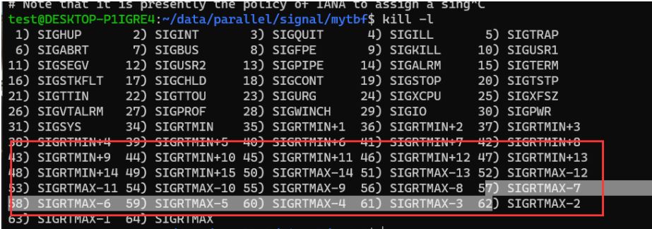


### 实时信号的存放还 一个文件：`/usr/include/bits/signum.h`

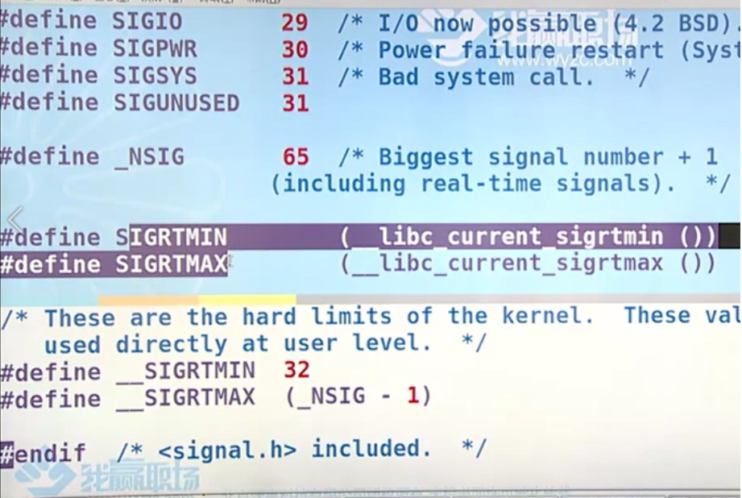

只要选择这两个信号值之间的某一个，就是实时信号。


### 实时信号最大排多少？？使用`ulimit-a`

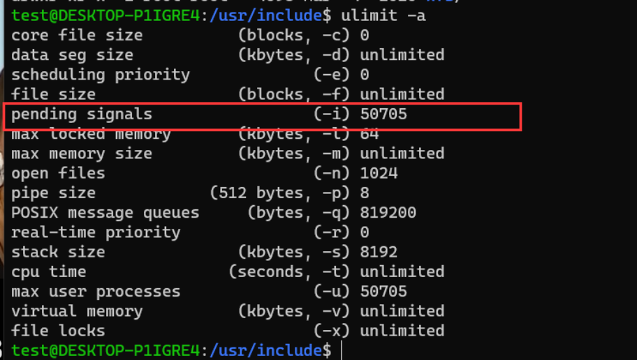


