还写不出正确的程序来呢，就要谈效率。。。那就太搞笑了。。。

# 线程

1. 线程的概念

    - 线程是一个正在运行的函数

1. 线程的创建

    - 线程的创建

    - 线程的终止

    - 线程的取消选项

    - 栈清理

1. 线程同步

1. 线程属性

    - 线程同步属性

    - 线程属性

1. 重入

    - 线程与fork

    - 线程与信号


# 1. 线程的概念

## **线程是一个正在运行的函数。**

在线程阶段， 如果是main函数在运行，**main线程在运行**。main线程创建出来的线程是兄弟线程，和兄弟线程之间是平起平坐的。

多个线程他们的内存是共享的，因为他们是在同一块地址空间内。那么在全局中创建一个全局变量，就可以通信，也不用借助外界的机制。


相对来说线程并发要比进程并发要简单一些，因为多进程并发是先成为事实标准，然后再标准化的，但是线程并发是先标准化之后，才去产生的各个函数。对于线程标准来讲，各家的实现可能不同，但是遵循的标准是一样的，而且多线程并发的好处是：一个新的库发布出来，默认就要支持多线程并发，如果这个库不支持多线程并发怎么办？要在函数当中体现出来。


## posix线程是一套标准，而不是实现（pthread_...）

### **线程标识：pthread_t**

当前linux环境下，可以理解成整形数。

- `ps -axf `查看进程关系

- `ps -axm` 查看进程线程关系 ， 会看到进程下面会有-- 这种， 是进程下的线程，说明进程空间中至少有一个线程的。


所以说现在用到的内容，全部都是**容器的概念**。

其实我们看到的线程，就是用进程标识来描述的，即使是这样，依然不能直接用%d 打印pthread_t。

 

**注意**：信号处理函数啥也不能用，在里面不能用IO， 只能做简单的计算，能写多短就写多短。线程不存在这样的问题。


### **pthread_equal 比较两个线程标识**

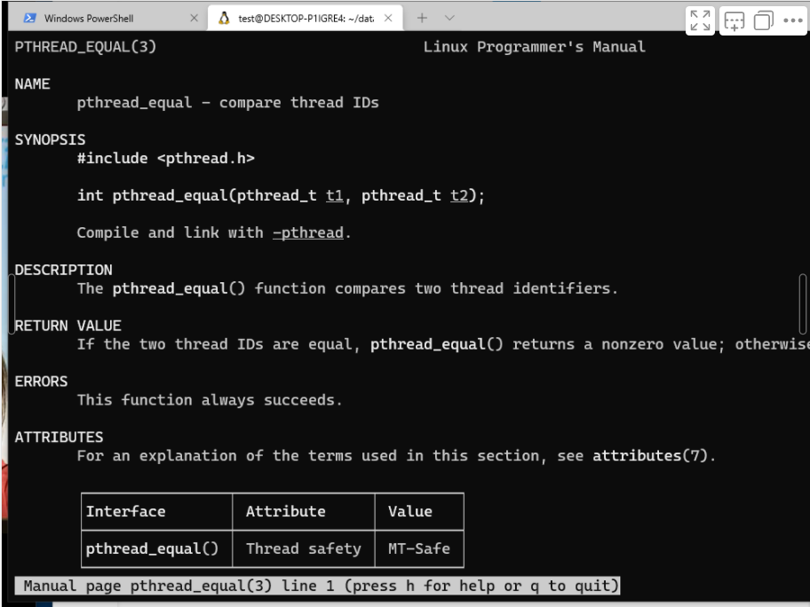


### pthread_self() 获取当前线程的线程标识

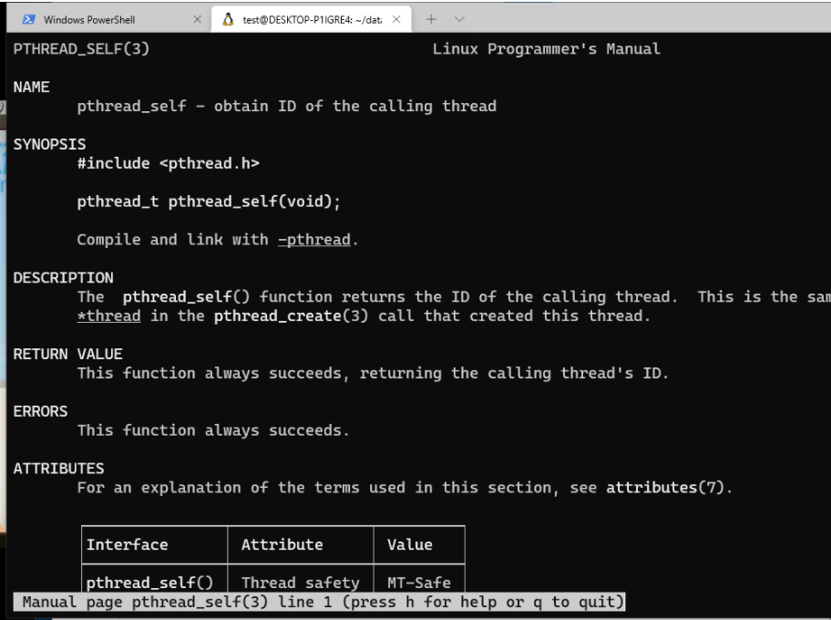


# 2. 线程创建

## 线程创建

### pthread_create() 创建一个线程

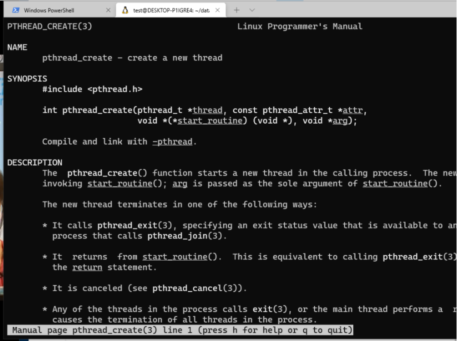


```c
#include <stdio.h>
#include <stdlib.h>
#include <pthread.h>


static void* func(void *p)
{
        puts("Thread is working\n");
        return NULL;
}

int main()
{
        pthread_t ptid;
        puts("Begin!\n");

        int err = pthread_create(&ptid, NULL, func, NULL);
        if(err){
                fprintf(stderr, "pthread err: %s", strerror(err));
                exit(1);
        }
        puts("End\n");

        exit(0);
}

```

执行结果：发现并没有执行线程

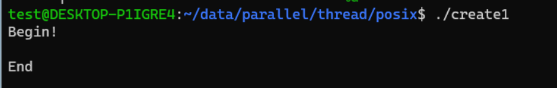

所以记住：**线程的调度取决于调度器的策略**

为什么没有打印： **因为创建了线程以后，还没来得及打印的时候，main线程以及执行到了exit(0);  exit(0)的意思是：进程终止**。这是因为进程的调度问题，我再去多执行几次就发现，有时候还是可以打印出来的：

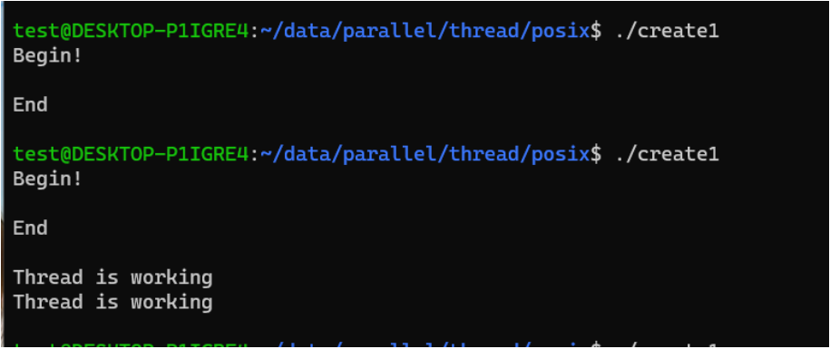


## 线程终止

线程的终止有三种方式:

- 线程从启动例程返回， 返回值就是线程的退出码

- 线程可以被同一进程中的其他线程取消

- 线程调用pthread_exit()函数


### pthread_exit() 正常结束一个线程

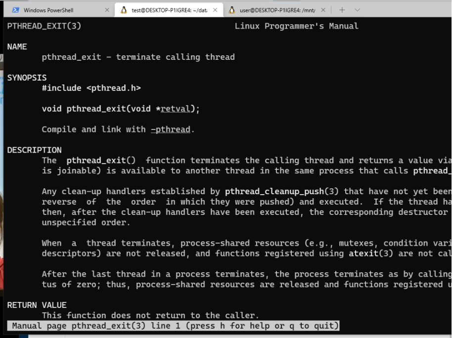


```c
#include <stdio.h>
#include <stdlib.h>
#include <pthread.h>


static void* func(void *p)
{
        puts("Thread is working\n");
        pthread_exit(NULL);
        // 如果使用return NULL, 则不会进程线程栈的清理，而使用pthread_exit会清理
}

int main()
{
        pthread_t ptid;
        puts("Begin!\n");

        int err = pthread_create(&ptid, NULL, func, NULL);
        if(err){
                fprintf(stderr, "pthread err: %s", strerror(err));
                exit(1);
        }
        puts("End\n");

        exit(0);
}

```


### pthread_join 线程收尸  --> wait()

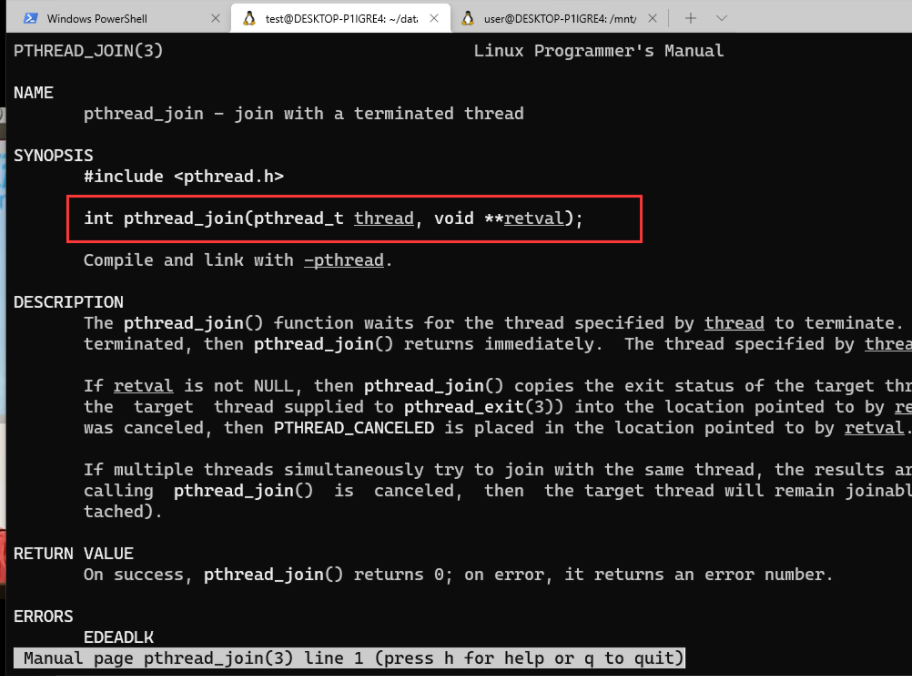


```c
#include <stdio.h>
#include <stdlib.h>
#include <pthread.h>


static void* func(void *p)
{
        puts("Thread is working\n");
        pthread_exit(NULL);
        // 如果使用return NULL, 则不会进程线程栈的清理，而使用pthread_exit会清理
}

int main()
{
        pthread_t ptid;
        puts("Begin!\n");

        int err = pthread_create(&ptid, NULL, func, NULL);
        if(err){
                fprintf(stderr, "pthread err: %s", strerror(err));
                exit(1);
        }
		// 等待收尸
        pthread_join(ptid, NULL);
        puts("End\n");

        exit(0);
}

```

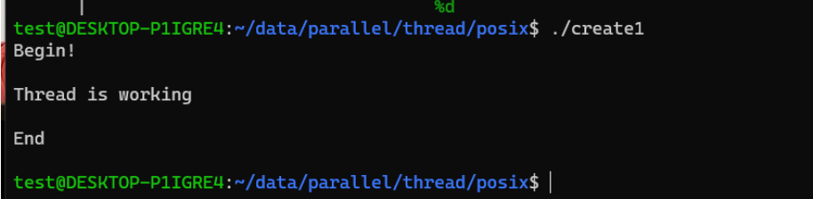


## 栈的清理

**栈的清理就像钩子函数一样**，当然他比钩子函数要好一点，好在哪？？钩子函数将函数挂到钩子上去，只要程序正常终止，钩子函数就会被取下来逆序调用，这个钩子函数我们是没有权限去干预的，不管你指不指定，钩子函数一定会调用。


**注意： cleanup_push和cleanup_pop 应该是成对出现的。**

### pthread_cleanup_push

这个函数就相当于往钩子上挂钩子函数。

**`gcc cleanup.c -E` 预处理：预处理解决掉的是所有以#开头的部分**


### pthread_cleanup_pop()

这个函数就相当于从钩子上取下内容。

```c
#include <stdio.h>
#include <stdlib.h>
#include <pthread.h>

static void cleanup_func(void *p){
        puts(p);
}


static void* func(void *p)
{
        puts("thread is working!\n");
        pthread_cleanup_push(cleanup_func, "cleanup : 1\n");
        pthread_cleanup_push(cleanup_func, "cleanup : 2\n");
        pthread_cleanup_push(cleanup_func, "cleanup : 3\n");


        pthread_cleanup_pop(1);
        pthread_cleanup_pop(1);
        pthread_cleanup_pop(1);

        puts("push over\n");
        pthread_exit(NULL);
}

int main()
{
        int err;
        pthread_t ptid;
        puts("Begin");
        err = pthread_create(&ptid, NULL, func, NULL);
        if(err){
                fprintf(stderr, "pthread create err: %s\n", strerror(err));
                exit(1);
        }


        puts("End!");
        exit(0);
}

```


## 线程的取消

当我们启动四个线程去搜索的一个东西的时候，一个线程找到了，其他三个线程就没有必要再找下去了，所以需要线程取消，然后再进行收尸。


### pthread_cancel() 线程取消

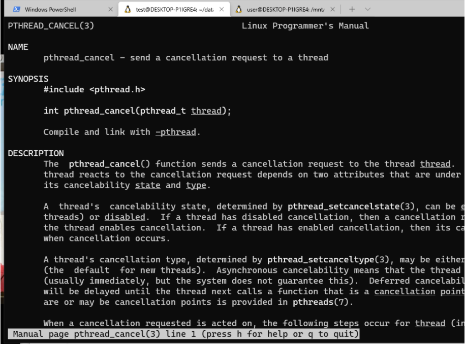


取消有两种状态： 允许、不允许

如果允许取消，又分为异步cancel、推迟cancel(默认) ->推迟至cancel点响应;

cancel点： POSIX定义的cancel点， 都是可能引发阻塞的系统调用。

cancel点的使用： 

- pthread_setcancelstate: 设置是否允许取消

- pthread_setcanceltype: 设置取消方式

- pthread_testcancel: 本身是一个取消点，什么都不做


## 线程分离

### pthread_detach 

线程不关心它的生死存亡，一旦创建就把它分离出去


## 例子

1. 计算质数

```c
#include <stdio.h>
#include <stdlib.h>
#include <unistd.h>
#include <errno.h>
#include <pthread.h>
#include <string.h>

#define LEFT  30000000
#define RIGHT 30000200

#define  THRNUM (RIGHT-LEFT)


void * thr_primer(void *p);


int main()
{
        int i, j , mark;
        pthread_t ptid[THRNUM];
        for(i=LEFT; i<=RIGHT; i++)
        {
                int err = pthread_create(ptid+i-LEFT, NULL, thr_primer, &i);
                if(err){
                        fprintf(stderr, "thread create err: %s\n", strerror(err));
                        exit(1);
                }

        }

        // 收尸
        for(i=LEFT; i<=RIGHT; i++)
        {
                pthread_join(ptid[i-LEFT], NULL);
        }


        exit(0);
}

void * thr_primer(void *p){
        int i = *(int *)p;
        int mark = 1;
        int j;

        for(j=2; j<i/2; j++){
                if(i%j == 0){
                        // 非质数
                                mark = 0;
                        break;
                }
        }
        if(mark == 1){
                // 是质数
                printf("%d 是s质数\n", i);
        }

        pthread_exit(NULL);
}

```


但是结果不对的，**是因为有冲突，因为每次传参的内容都是地址，会有竞争 ：**

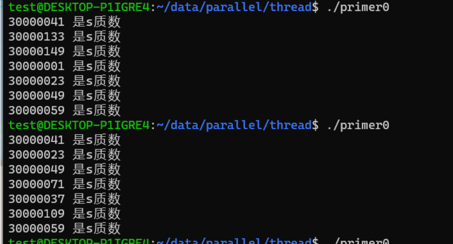


通常来说**，我们使用sleep语句来测试程序中有没有竞争，因为加上sleep以后竞争会变得更见明显。**


修改为： 上面的原因就是当创建新的线程的时候，i++不一定发生，所以。。

```c
#include <stdio.h>
#include <stdlib.h>
#include <unistd.h>
#include <errno.h>
#include <pthread.h>
#include <string.h>

#define LEFT  30000000
#define RIGHT 30000200

#define  THRNUM (RIGHT-LEFT)


void * thr_primer(void *p);


int main()
{
        int i, j , mark;
        pthread_t ptid[THRNUM];
        for(i=LEFT; i<=RIGHT; i++)
        {
                int err = pthread_create(ptid+i-LEFT, NULL, thr_primer, i);
                if(err){
                        fprintf(stderr, "thread create err: %s\n", strerror(err));
                        exit(1);
                }

        }

        // 收尸
        for(i=LEFT; i<=RIGHT; i++)
        {
                pthread_join(ptid[i-LEFT], NULL);
        }


        exit(0);
}

void * thr_primer(void *p){
        int i = (int)p;
        int mark = 1;
        int j;

        for(j=2; j<i/2; j++){
                if(i%j == 0){
                        // 非质数
                                mark = 0;
                        break;
                }
        }
        if(mark == 1){
                // 是质数
                printf("%d 是s质数\n", i);
        }

        pthread_exit(NULL);
}

```


**发现程序中有竞争，可以使用sleep测试一下， 因为程序边长会让竞争更明显。**


**在32位的环境上**，**在我们不修改默认的资源数的情况下，我们能创建出来的线程数大概是300个左右，这些线程他们的代码段一定是公用的，他们的栈一定是独立的**。

一个栈的大小为：（`ulimit -a `）

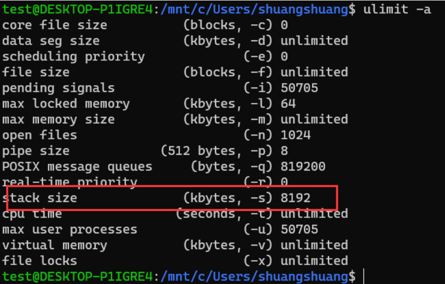


在user态，其实能用的空间是不足3G的，在这3G中，还要将代码段，数据段都要预留出来，剩下的时间才会去创建栈， 剩余的空间能够创建多少栈的个数，取决于外在的资源量。

**注意**： 64位的程序的一个虚拟空间是128T， 32位程序的虚拟空间是3G。


## 竞争故障

20个线程去读文件和写文件

```c
#include <stdio.h>
#include <stdlib.h>
#include <pthread.h>
#include <string.h>


#define THRNUM 20
#define FILENAME "/tmp/out"
#define LINESIZE 1024
static void *thr_add(void *p){
        FILE *fp;
        char linebuf[LINESIZE];
        fp = fopen(FILENAME, "r+");
        if(fp == NULL) {
                perror("file open");
                exit(1);

        }

        fgets(linebuf, LINESIZE, fp);
        fseek(fp, 0, SEEK_SET);
        fprintf(fp, "%d\n", atoi(linebuf)+1);

        fclose(fp);

        pthread_exit(NULL);

}

int main(){
        int i, err;
        pthread_t tid[THRNUM];
        for(i=0; i<THRNUM; i++){

                err = pthread_create(tid+1, NULL, thr_add, NULL);
                if(err){
                        fprintf(stderr, "pthread create err:%s\n", strerror(err));
                        exit(1);
                }

        }

        for(i=0; i<THRNUM; i++){
                pthread_join(tid[i], NULL);
        }


        exit(0);
}

```

如果没有竞争，那么结果应该是21， 但是结果是：

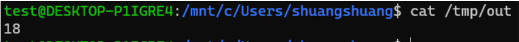

如果加上sleep， 竞争会更明显


# 3. 线程同步

## 互斥量 pthread_mutex_t类型

某一个资源有可能在使用的时候，发生资源的冲突，那么在使用 资源的时候加上互斥量。另一种说法就是：限制一段代码，以独占的方式实现。


### 函数：

- pthread_mutex_init

- pthread_mutex_destory

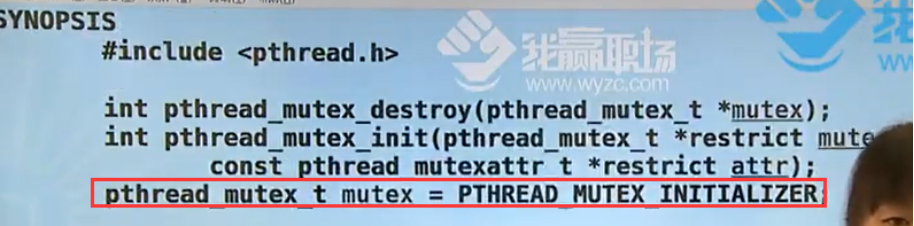

有两种初始化的方式，上面的是动态初始化，红框内的是静态初始化。

**动态初始化和静态初始化会放在不同的环境下用**。比如说互斥量是凭空定义出来的变量的话， 显然用静态初始化的方式直接初始化很简单，如果希望更改属性，需要进行动态初始化。


- pthread_mutex_lock 阻塞等

- pthread_mutex_trylock  非阻塞，查看一下就走

- pthread_mutex_unlock


### 加锁例子1

```c
#include <stdio.h>
#include <stdlib.h>
#include <pthread.h>
#include <string.h>


#define THRNUM 20
#define FILENAME "/tmp/out"
#define LINESIZE 1024

static pthread_mutex_t mut = PTHREAD_MUTEX_INITIALIZER;

static void *thr_add(void *p){
        FILE *fp;
        char linebuf[LINESIZE];
        fp = fopen(FILENAME, "r+");
        if(fp == NULL) {
                perror("file open");
                exit(1);

        }
        pthread_mutex_lock(&mut);
        fgets(linebuf, LINESIZE, fp);
        fseek(fp, 0, SEEK_SET);
        fprintf(fp, "%d\n", atoi(linebuf)+1);

        fclose(fp);
        pthread_mutex_unlock(&mut);
        pthread_exit(NULL);

}

int main(){
        int i, err;
        pthread_t tid[THRNUM];
        for(i=0; i<THRNUM; i++){

                err = pthread_create(tid+1, NULL, thr_add, NULL);
                if(err){
                        fprintf(stderr, "pthread create err:%s\n", strerror(err));
                        exit(1);
                }

        }

        for(i=0; i<THRNUM; i++){
                pthread_join(tid[i], NULL);
        }


        // pthread_mutex_destory(&mut);
        exit(0);
}

```


### 加锁例子2 输出abcd, 做成”锁链“

```c
#include <stdio.h>
#include <stdlib.h>
#include <pthread.h>
#include <string.h>

#define THRNUM 4

static pthread_mutex_t mut[THRNUM];

static int next(int n){
        if(n+1 == THRNUM)
                return 0;
        return n+1;

}
static void * thrfunc(void * p){
        int n = (int)p;
        int c = 'a'+(int)p;
        while(1){
                // 锁自己
                pthread_mutex_lock(mut+n);
                write(1, &c, 1);
                pthread_mutex_unlock(mut+next(n));
        }

        pthread_exit(NULL);

}

int main(){
        pthread_t tid[THRNUM];
        int i, err;
        for(i=0; i<THRNUM; i++){
                pthread_mutex_init(mut+i, NULL); //初始化锁
                pthread_mutex_lock(mut+i);
                err = pthread_create(tid+i, NULL, thrfunc, (void *)i);
                if(err){
                        fprintf(stderr, "thread create err:%s\n", strerror(err));
                        exit(1);
                }
        }
        // 解锁第一个
        pthread_mutex_unlock(mut+0);

        for(i=0; i<THRNUM; i++){
                pthread_join(tid[i], NULL);
        }


        exit(0);
}

```


注意： 互斥量锁住的永远不能是一个变量，因为它的传参当中压根就没体现出来变量。


## 线程池实现

```c
#include <stdio.h>
#include <stdlib.h>
#include <unistd.h>
#include <errno.h>
#include <pthread.h>
#include <string.h>

#define LEFT  30000000
#define RIGHT 30000200

#define  THRNUM 4

static int num = 0;
static pthread_mutex_t mut_num = PTHREAD_MUTEX_INITIALIZER;

void * thr_primer(void *p);


int main()
{
        int i;
        pthread_t ptid[THRNUM];
        for(i=0; i<=THRNUM; i++)
        {
                int err = pthread_create(ptid+i, NULL, thr_primer, (void *)i);
                if(err){
                        fprintf(stderr, "thread create err: %s\n", strerror(err));
                        exit(1);
                }

        }

        for(i=LEFT; i<RIGHT; i++){
                pthread_mutex_lock(&mut_num);
                while(num!=0)
                {
                        pthread_mutex_unlock(&mut_num);
                        // sleep(1); // sleep会引起当前进程的调度颠簸， 当前进程会从running态变为sleep, 当sleep结束以后 再从sleep变为running态， 实际上这个调度颠簸是没有必要发生的。
                        sched_yield(); // 出让调度器，给其他线程
                        pthread_mutex_lock(&mut_num);
                }
                num = i;
                pthread_mutex_unlock(&mut_num);
        }
        while(num != 0){
                pthread_mutex_unlock(&mut_num);
                sched_yield();
                pthread_mutex_lock(&mut_num);
        }
        num = -1;
        pthread_mutex_unlock(&mut_num);
        // 收尸
        for(i=LEFT; i<=RIGHT; i++)
        {
                pthread_join(ptid[i], NULL);
        }

        pthread_mutex_destory(&mut_num);
        exit(0);
}

void * thr_primer(void *p){
        int i = (int) p;
        int mark = 1;
        int j;
        while(1){
                // 临界区开始:
                // 需要临界区中的所有跳转语句, break, continue，
                // 如果还在当前临界区内，可以忽略
                // 如果跳转到临界区外，一定要记得解锁再跳转
                pthread_mutex_lock(&mut_num);
                while(num == 0){
                        pthread_mutex_unlock(&mut_num);
                        sched_yield();
                        pthread_mutex_lock(&mut_num);
                }
                if(num == -1){
                        pthread_mutex_unlock(&mut_num);
                        break;
                }
                i = num;
                num = 0;
                pthread_mutex_unlock(&mut_num);
                // 临界区结束
                for(j=2; j<i/2; j++){
                        if(i%j == 0){
                                // 非质数
                                        mark = 0;
                                break;
                        }
                }
                if(mark == 1){
                        // 是质数
                        printf("%d 是s质数, 线程%d计算出来\n", num, i);
                }
        }
        pthread_exit(NULL);
}

```

执行程序的时候，程序一直显示资源使用很大， 是因为程序是在忙等的状态， 可以采用通知的方式。**通知法避免忙等**。


## 通知法： 条件变量  pthread_cond_t

- pthread_cond_init

- pthread_cond_destory

- pthread_cond_broadcast 把所有的等待都叫醒

- pthread_cond_signal 叫醒任意一个

- pthread_cond_wait 死心眼一直等

- pthread_cond_timewait 等待一定时间


### 改写打印质数的例子

```c
#include <stdio.h>
#include <stdlib.h>
#include <unistd.h>
#include <errno.h>
#include <pthread.h>
#include <string.h>

#define LEFT  30000000
#define RIGHT 30000200

#define  THRNUM 4

static int num = 0;
static pthread_mutex_t mut_num = PTHREAD_MUTEX_INITIALIZER;
static pthread_cond_t cond = PTHREAD_COND_INITIALIZER;

void * thr_primer(void *p);


int main()
{
        int i;
        pthread_t ptid[THRNUM];
        for(i=0; i<=THRNUM; i++)
        {
                int err = pthread_create(ptid+i, NULL, thr_primer, (void *)i);
                if(err){
                        fprintf(stderr, "thread create err: %s\n", strerror(err));
                        exit(1);
                }

        }

        for(i=LEFT; i<RIGHT; i++){
                pthread_mutex_lock(&mut_num);
                while(num!=0)
                {
                        pthread_cond_wait(&cond, &mut_num); //先解锁， 在临界区以外等待, 相当于原来的三句话
                }

                num = i;
                //叫醒等待非0的线程
                pthread_cond_signal(&cond); // 下游长的一模一样，有几个闲着，叫醒其中任何一个就可以
                pthread_mutex_unlock(&mut_num);
        }
        while(num != 0){
                pthread_cond_wait(&cond, &mut_num);
//              pthread_mutex_unlock(&mut_num);
//              sched_yield();
//              pthread_mutex_lock(&mut_num);
        }
        num = -1;
        pthread_cond_broadcast(&cond); // 结束， 通知所有下游线程
        pthread_mutex_unlock(&mut_num);
        // 收尸
        for(i=LEFT; i<=RIGHT; i++)
        {
                pthread_join(ptid[i], NULL);
        }

        // 销毁锁
        //pthread_mutex_destory(&mut_num);
        //pthread_cond_destory(&cond);
        exit(0);
}

void * thr_primer(void *p){
        int i = (int) p;
        int mark = 1;
        int j;
        while(1){
                // 临界区开始:
                // 需要临界区中的所有跳转语句, break, continue，
                // 如果还在当前临界区内，可以忽略
                // 如果跳转到临界区外，一定要记得解锁再跳转
                pthread_mutex_lock(&mut_num);
                while(num == 0){
//                      pthread_mutex_unlock(&mut_num);
//                      sched_yield();
//                      pthread_mutex_lock(&mut_num);
                        pthread_cond_wait(&cond, &mut_num); //等待num是非零的，谁会把num变为非0呢？？
                }
                if(num == -1){
                        pthread_mutex_unlock(&mut_num);
                        break;
                }
                i = num;
                num = 0;
                pthread_cond_broadcast(&cond); // 下游等待的不是一种线程，所以叫醒全部
                pthread_mutex_unlock(&mut_num);
                // 临界区结束
                for(j=2; j<i/2; j++){
                        if(i%j == 0){
                                // 非质数
                                        mark = 0;
                                break;
                        }
                }
                if(mark == 1){
                        // 是质数
                        printf("[%d] %d 是s质数\n",(int)p, num);
                }
        }
        pthread_exit(NULL);
}

```


**锁链这种行为是一种 不靠谱行为，因为他本身属于未定义的，所有将abcd程序使用条件变量改为通知法。**


## 信号量 （资源总量）

对比互斥量， 信号量有共享的味道的。


## 读写锁 

相当于互斥量和信号量的共同使用。

- 读锁->共享

- 写锁->互斥


容易出现**写者饿死**的问题，那么怎样避免？？


# 4. 线程属性 pthread_attr_t

## 涉及到的函数：

- pthread_attr_init()

- pthread_attr_destory()

- pthread_attr_setstacksize()

见` man pthread_attr_init` 的 see alse


## **现在有两种方法将线程分离**：

- 创建线程的时候使用默认属性， 然后调用pthread_detach 函数，

- 首先创建属性结构体，然后设置分离属性，再创建线程，


## 线程同步的属性

### 互斥量属性： pthread_mutexattr_t

涉及到的函数：

- pthread_mutexattr_init

- pthread_mutexattr_destory

- pthread_mutexattr_getpshared   p指的是：process, 标识是否跨进程起作用

- pthread_mutexattr_setpshared

- clone(); 


**clone() **

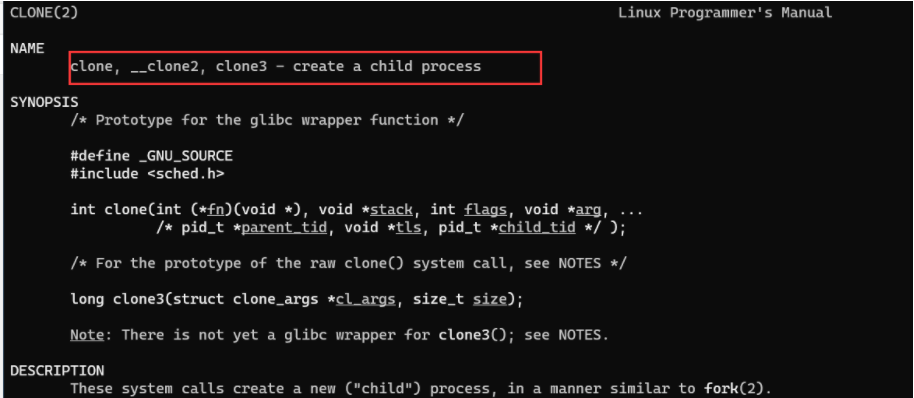


所以说**进程线程是不分家的， 本来就没有分的那么明确**，如果创建出来的 属性和当前进程分离的，那就是在创建一个进程，如果创建出来的属性和当前进程是极端不分离的，什么什么都公用， 那么创建出来的就是个线程。


### 互斥量类型行为

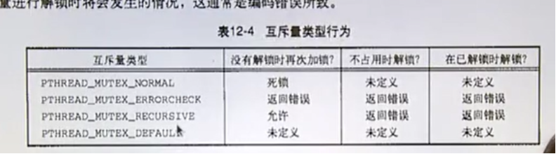


### 条件变量属性 pthread_condattr_t

涉及的函数：

- pthread_condattr_init()

- pthread_condattr_destory()


# 5. 线程重入(线程安全)

多线程阶段，任意阶段都能够达到可重入，原因在于线程是先成为标准，后有实现的。

## 多线程中的IO

我们所用的IO都已经支持了多线程， 他们操作缓冲区的时候，都会先lock住，再操作，然后释放。

**如果系统函数中不能用多线程，都会在名字上体现出来**，如下: 下面的函数都是没有加锁的函数。

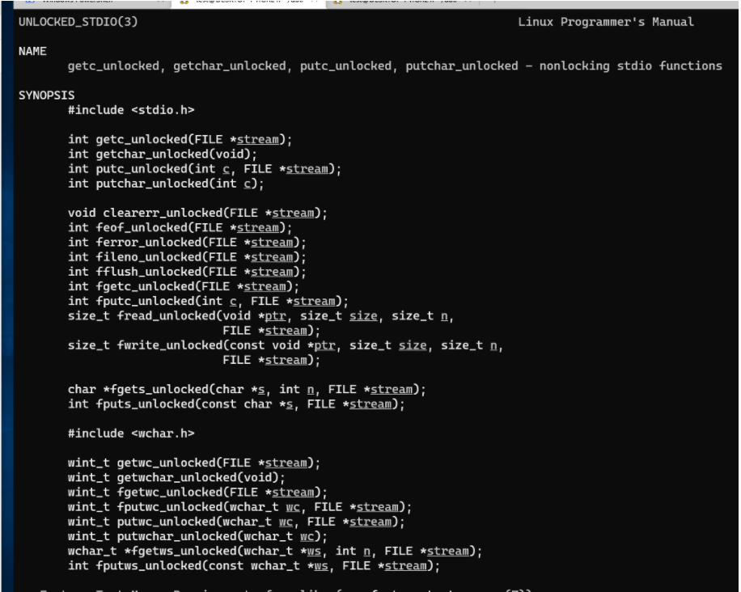


## 线程与信号

主要讲的是在线程级别遇到信号那么办？？

信号的响应过程 有两个位图， mask和pending

其实每个线程都有自己的一个mask和pending， 以进程为单位它只有pending单位。收到信号以后体现在进程的pending位上，内核调度的单位是线程，

- 如果一个线程给线程法发信号，会体现 在线程的pending上，

- **如果一个进程给一个进程发信号，那就要看当前从kernal态转为user态的时候，是哪个线程，那个线程自己的mark与进程的pending做按位与， 然后再拿自己的mask和自己 pending做按位与，看当前线程有没有收到信号， 其实是做两次按位与。**


**涉及到的函数**：

- pthread_sigmask

- sigwait

- pthread_kill 线程阶段发信号


## 线程与fork

fork是创建进程， 新的进程当中只包含调用fork的线程。


# 6. 其他线程标准

我们常用的线程标准的posix标准，

还有一种标准是：openmp    网址: www.OpenMP.org


**多线程并发的工作模式：**

- 流水线模式

- 工作组模式

- 客户端和服务端模式


