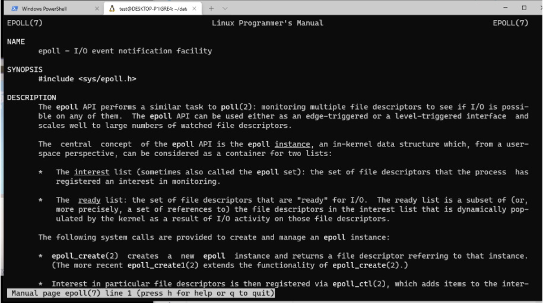
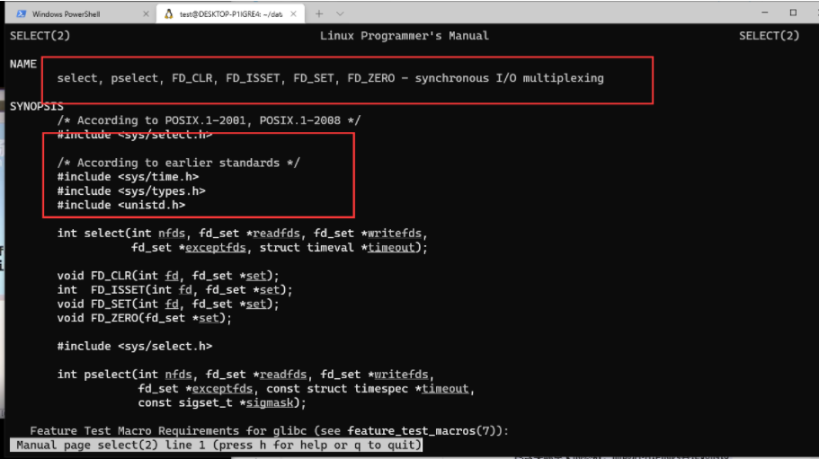
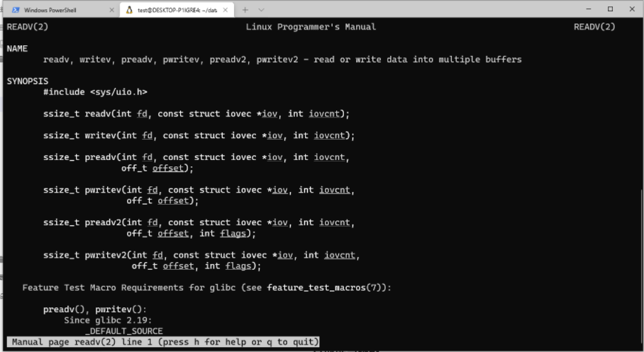
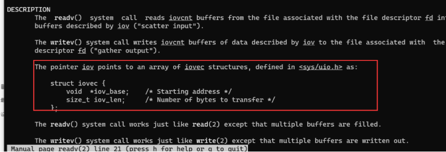
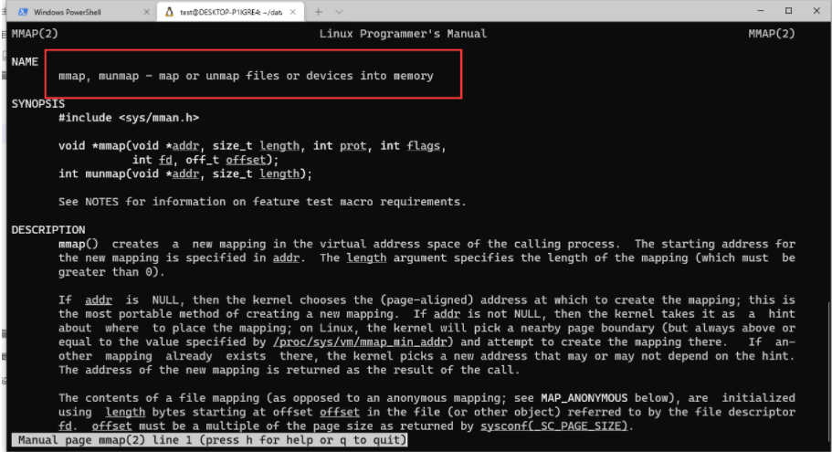

# 高级IO


1. 非阻塞IO

1. IO多路转接

1. 其他读写函数

    - 撒旦

    - 的v啊

    - 阿迪斯v

1. 存储映射IO

1. 文件锁


# 1. 非阻塞IO

- 简单流程：如果一个程序的自然流程是结构化的，那么就是简单流程

- 复杂流程：如果一个程序的自然流程不是结构化的，那么就叫复杂流程。


复杂流程比如：网络协议


## 补充： **有限状态机**编程思想：

没有简单的程序，只有头脑简单的程序员！

**有限状态机：**

- **状态为点**

- **动作为边**

```c
#include <stdio.h>
#include <stdlib.h>
#include <errno.h>
#include <string.h>
#include <sys/types.h>
#include <sys/stat.h>
#include <fcntl.h>

#define TTY1  "/dev/tty11"
#define TTY2  "/dev/tty12"
#define BUFSIZE 1024

enum{
        STATE_R = 1,
        STATE_W,
        STATE_Ex,
        STATE_T,
};

// 状态机
struct fsm_st{
        int state;
        int sfd;
        int dfd;
        int len;
        int pos;
        char * errstr;
        char buf[BUFSIZE];
};


static void fsm_driver(struct fsm_st *fsm){
        // 根据当前状态机的状态不同，来确定下面要做什么

        int ret;

        switch(fsm->state)
        {
                case STATE_R:
                        // 读态
                        fsm->len = read(fsm->sfd, fsm->buf, BUFSIZE);
                        if(fsm->len == 0)
                                fsm->state = STATE_T;
                        else if(fsm->len < 0){
                                if(errno == EAGAIN)
                                        fsm->state = STATE_R;
                                else{
                                        fsm->errstr = "read";
                                        fsm->state = STATE_Ex;
                                }
                        }else{
                                fsm->pos = 0;
                                fsm->state = STATE_W;
                        }
                        break;
                case STATE_W:
                        // 写态
                        ret = write(fsm->dfd, fsm->buf+fsm->pos, fsm->len);
                        if(ret < 0){
                                if(errno == EAGAIN)
                                        fsm->state = STATE_W;
                                else{
                                        fsm->errstr = "write";
                                        fsm->state = STATE_Ex;
                                }
                        }else{
                                fsm->pos += ret;
                                fsm->len -= ret;
                                if(fsm->len == 0)
                                        fsm->state = STATE_R;
                                else
                                        fsm->state = STATE_W;
                        }

                        break;
                case STATE_Ex:
                        // 异常处理态
                        perror(fsm->errstr);
                        fsm->state = STATE_T;
                        break;
                case STATE_T:
                        // 终止态
                        // do something
                        break;
                default:
                        // do sth
                        abort();
                        break;

        }

}


static void relay(int fd1, int fd2){
        int fd1_save, fd2_save;
        struct fsm_st fsm12, fsm21;
        // 保证两个文件是以非阻塞实现
        fd1_save = fcntl(fd1,F_GETFL);
        fcntl(fd1, F_SETFL, fd1_save|O_NONBLOCK);
        fd1_save = fcntl(fd2, F_GETFL);
        fcntl(fd2, F_SETFL, fd2_save|O_NONBLOCK);

        //创建两个状态机，并初始化
        fsm12.state = STATE_R;
        fsm12.sfd = fd1;
        fsm12.dfd = fd2;

        fsm21.state = STATE_R;
        fsm21.sfd = fd2;
        fsm21.dfd = fd1;

        while(fsm12.state != STATE_T || fsm21.state != STATE_T){
                fsm_driver(&fsm12); // 推状态机12
                fsm_driver(&fsm21); // 推状态机21
        }

        // 恢复原来的文件状态
        fcntl(fd1, F_SETFL, fd1_save);
        fcntl(fd2, F_SETFL, fd2_save);

}


int main(){
        int fd1, fd2;
        fd1 = open(TTY1, O_RDWR);
        if(fd1 < 0){
                perror("open");
                exit(1);
        }


        fd2 = open(TTY2, O_RDWR|O_NONBLOCK);
        if(fd2 < 0){
                perror("open");
                exit(1);
        }

        relay(fd1, fd2);

        close(fd1);
        close(fd2);
        exit(0);
}

```


**linux下的一个画图工具： dia  ， 可以用来画流程图**


## 数据中继引擎

 见`~/data/io/adv/nonblock/relayer/`

目前这个程序并不是一个重负载的程序，最多算是IO密集型的程序，IO重的程序一般不是负载重的程序，因为他大多时候在空闲。程序大部分都忙在ERROR again .  碰到假错，推到read。

**对于IO密集型的任务，可以对它进行IO多路转接**。


## IO多路转接  监视文件描述符

IO多路转接的作用是：监视文件描述符的行为，当看到文件描述符发生了我感兴趣的操作，我才去做后续操作。那么程序怎么知道发生了我们感兴趣的操作呢？？需要布置我们的监视任务。


三个函数：实现文件描述符的监视

- select()   移植性比较好，比较古老， 但是接口设计的有缺陷。 以事件为单位，组织文件描述符。

- poll()  以文件描述符为单位，组织事件。可移植

- epoll()  很多平台觉得poll()的效率不高，各个平台做自己的优化， epoll, 简化用户维护内容，linux方言，不能移植。





### select 函数


之前说过sleep不能用，因为一些平台的sleep的实现是用alarm实现的，**select函数如果给定的参数是不包含实际意义的参数，而最后给定的内容是超时设置的话， 那么select的副作用就是可以完成一个安全的可靠的休眠**。




## IO多路转接


- select

- poll

- epoll

select很古老，接口有各种各样的问题，最主要的组织方式是以事件为单位组织文件描述符，另外参数设置的不太合适，因为它的监视任务和监视结果是放在同一块空间的。

在select的基础上，增加了poll,思路变了， 以文件描述符为单位来组织事件，而且事件的布置和事件发生的结论性内容是放在不同的空间里的，所以poll一旦发生假错，不用去绕大圈。

另外在pol的基础上，linux又写了epoll的方言，最主要的内容是把原来poll的内容封装起来，不让用户直接操作，另外给poll中加了一个unit，这才是其设计的精华所在。

用这三个函数就可以完成对文件描述符的监视。


## 其他读写函数

- readv()

- writev()

### 对多个小buffer的读写




注意：第二个参数实际上是一个结构体数组的头指针




## 存储映射IO 

存储映射IO： 把某块内存或者说某个文件的存储内容映射到当前进程空间里来，那么我们看到的结果就是：在当前进程中访问一段char型的内容，就如同访问那块内存一样。


### mmap()

**munmap()映射的空间解除映射，相当于free工作。**

这个函数可以帮助我们实现非常快的共享内存。

- addr: 地址的起始位置，NULL为随机分配

- length： 申请地址的长度

- prot：当前如果完成了内存映射，当前这操作块内存空间的权限（读写可执行）

- flags：位图，特殊要求

- fd：文件描述符

- offset：偏移量




```c
#include <stdio.h>
#include <sys/mman.h>
#include <stdlib.h>
#include <sys/types.h>
#include <sys/stat.h>
#include <unistd.h>
#include <fcntl.h>


int main(int argc, char *argv[])
{
        int len;
        int i, count=0;
        struct stat stat_res;
        char *str;
        if(argc < 2){
                fprintf(stderr, "usage ...\n");
                exit(1);
        }
        int fd;
        // printf("argv[1]: %s", argv[1]);
        fd = open(argv[1], O_RDONLY);
        if(fd < 0){
                perror("open()");
                exit(1);
        }

        // 文件的长度
        len = fstat(fd, &stat_res);
        if(len < 0){
                perror("state");
                exit(1);
        }

        str = mmap(NULL, stat_res.st_size, PROT_READ, MAP_SHARED, fd, 0);
        if(str == MAP_FAILED){
                perror("mmap()");
                exit(1);
        }
        close(fd);

        for(i=0; i<stat_res.st_size; i++){
                if(str[i] == 'a'){
                        count ++;
                }
        }
        printf("a nums is %d\n", count);
        munmap(str, stat_res.st_size);
        exit(0);
}

```


### 做一个具有亲缘关系的进程通信

父进程映射了一块内存空间，同时还想让子进程看得到，怎么做？？？

先mmap一块空间，然后再fork，这样子进程复制了一份父进程的资源。然后如何解决父子进程如何解决竞争？？


### 写一个进程通信的例子，使用mmap

```c
#include <stdio.h>
#include <stdlib.h>
#include <sys/mman.h>
#include <sys/stat.h>
#include <sys/types.h>
#include <fcntl.h>
#include <unistd.h>
#include <string.h>
#include <sys/types.h>
#include <sys/wait.h>


int main(){
        int fd = -1;
        int len = 1024;
        char * ptr;
        pid_t pid;

        ptr = mmap(NULL, len, PROT_READ|PROT_WRITE, MAP_SHARED|MAP_ANONYMOUS, -1, 0);
        if(ptr == MAP_FAILED){
                perror("mmap()");
                exit(1);
        }

        pid = fork();
        if(pid < 0){
                perror("fork");
                munmap(ptr, len);
                exit(1);
        }

        if(pid == 0){
                // 子进程
                // 让子进程去写
                strcpy(ptr, "Hello!"); // 写
                munmap(ptr, len);
                exit(0);
        }else{
                // 父进程
                // 父进程去读
                wait(NULL); // 收尸
                puts(ptr);
 // 读
                munmap(ptr, len);
                exit(0);

        }


        exit(0);
}

```


## 管道

ls | more 就是一个管道，当前这个管道的作用是把一个进程的标准输出，作为另一个进程的标准输入，实际上还是一个队列。


在进程间通信当中，有一个非常还用的进程间通信方式，就是管道，分为两种，一种是命名管道，一种是匿名管道，内核给提供了管道。管道有两个操作：读和写

注意：之前写程序一直在强调：①不要觉得自己在写main函数，永远要觉得自己在写一个常规模块、②要以写库的标准要求自己


`vim * -p`  用vim打开当前文件夹下的所有文件， `ctrl +ww `切换


