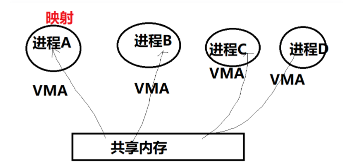
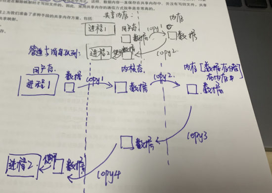

# 共享内存

早期的共享内存，着重强调把同一片内存，map到多个进程的虚拟地址空间（在相应的进程中放一个引用），以便于cpu可以在各个进程中访问到这片内存。




**相关函数：**

```c
int shmget(key_t key, size_t size, int shmflg);
```


**共享内存的特点：**

- 共享内存是进程间共享数据的一种最快的方法。一个进程向共享的内存区域写入数据，其他的进程都可以立即看到
- 使用时注意多进程访问互斥


**由下图可知：**

共享内存是进程间通信的**最快**的方式，因为一次数据传输**只做了两次复制**：从用户态复制到内存，再从内存复制到用户态。

**管道和消息队列**都是经过了**四次复制**：从用户态复制到内核态；内核态复制到内存；内存复制到内核态；内核态复制到用户态





使用共享内存的**缺点**是：共享内存**没有提供同步**的机制，需要我们在进行进程间通信时，借助其他的手段来进行进程间的同步工作。

