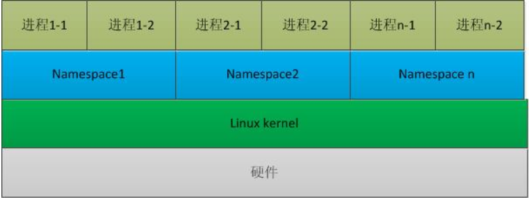
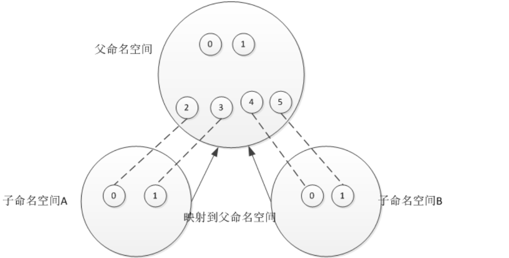
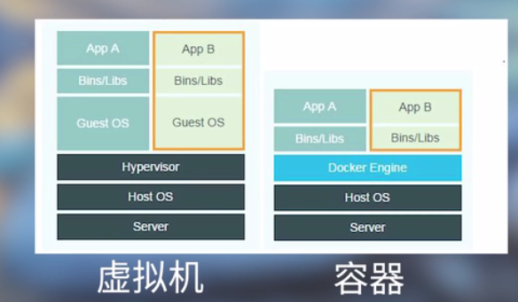

# Docker 容器原理

## 1. 基础

### 01 namespcae

**注意**： **namespace是Linux下进程结构体中的一个属性**

`namespace` 命名空间，通过使用`namespace xxx; `所使用的库函数或者变量就是在该名字空间中定义出来的，这样一来，就不会引起不必要的冲突的。

**`Linux namespace`机制提供一种资源隔离方案，PID,IPC,network等系统资源不再是全局性，而是属于某个特定的`namespace`。**每个`namespace`下的资源都是不透明的，不可见的。因此在操作系统层面上看，就会出现多个相同的`pid`进程。用户层面只能看到用户属于自己`namespace`下的资源。

命名空间建立系统的不同视图，**对于每一个命名空间，从用户看起来，应该像一台单独的Linux计算机一样，有自己的`init`进程，其他进程的pid依次递增**，A和B空间都有PID为0的`init`进程，子容器的进程映射到父容器的进程上，父容器可以知道每一个子容器的运行状态，而子容器与子容器之间是隔离的。

### 02 cgroup（control group）

#### 001 描述

`cgroup`和`namespace`类似，也是将进程进行分组，但是它的目的和`namespace`不一样，**namespace是为了隔离进程之间的资源，而cgroup是为了对一组进程进行统一的资源监控和限制**。

在Linux里，一直依赖就有对进程进行分组的概念和需求，比如`session group`, `process group`等，后来随着人们对这方面的需求越来越多，**比如追踪一组进程的内存和IO使用情况等，于是出现了`cgroup`,用来统一将进程进程分组，并在分组的基础上对进程进行监控和资源控制管理等**。比如 CPU 时间、系统内存、网络带宽或者这些资源的组合。您可以监控您配置的 `cgroup`，拒绝 `cgroup` 访问某些资源，甚至在运行的系统中动态配置您的` cgroup`

#### 002 主要功能

- 限制资源使用，比如内存使用上线，文件系统的缓存限制
- 优先级控制，CPU利用和磁盘吞吐
- 一些审计或者一些统计，主要是为了计费

#### 003 cgroups子系统

子系统实际上是`cgroups`对进程组进行资源控制的具体体现，子系统具有多种类型，每个类型的子系统都代表一种系统资源，比如CPU、Memory等。**当创建一个`cgroup`实例时，必须至少指定一种子系统**。

**子系统主要包括：**

- `cpu`子系统：主要限制进程的`cpu`使用率
- `cpuacct`子系统，可以统计`cgroups`中的进程的`cpu`使用报告
- `cpuset`子系统， 可以为`cgroups`中的进程分配单独的`cpu`节点或者内存节点
- `memory`子系统，可以限制进程的`memory`使用量
- `blkio`子系统，可以限制进程的块设备`IO`
- `devices`子系统，可以控制进程能够访问某些设备
- `net_cls`子系统，可以标记`cgroups`中进程的网络数据包，然后可以使用tc模块对数据包进行控制

## 2. Docker容器

Docker是一种轻量化的虚拟技术，准确来说，Docker是一种容器技术。

### 01 容器和虚拟机之间有什么不同？？

**虚拟机技术**：是在一个宿主的平台上面又搭建出来了一个隔离的环境，这个环境的特点是从底层的硬件开始逐级虚拟，把CPU， 主存，硬盘等都进行了虚拟化，设置包括网卡，显卡，声卡，在这个虚拟的硬件之上再建立一个虚拟的操作系统，在这个虚拟的操作系统里面再去运行相关的应用程序，整套环境是和宿主系统完全没有关系的。

**容器技术**：容器技术不会虚拟硬件层，应用软件和系统之间只隔一个用于应用调度的Docker Engine，Docker Engine就是利用linux内核技术里面的namespace和cgroup技术来隔离进程和资源，然后用它来为宿主和容器、容器和容器之间创建一个相对独立的环境。资源不是独立于宿主之外的一套虚拟的硬件系统，其实是个宿主公用的，应用程序也是和宿主共享一个内核空间。

**他们的侧重点是不一样的：**

- 虚拟机技术侧重于创造出一个独立的环境，不管是硬件、软件还是系统，都是独立的
- Docker更倾向于让程序跑起来，主要能跑起来，怎么省事怎么来。

### 02 Docker的优点和缺点

**优点：**

- 轻量化，特别省资源，因为它**没有在虚拟硬件上面浪费时间**，直接就是为了让程序跑起来才做的进程隔离
- 运行效率高，就相当于一个绿色软件，包裹的更紧密一点，对其他的宿主影响更小一点
- 对于软件的发行和使用者来说，是一个标准化的，它的**环境是相对较独立的，Linux里面的依赖问题就没有**了，他这里都是打好包给你的，直接用就行了，发行起来简单，用起来简单

**缺点：**

- **资源隔离并不彻底**，对于Linux来说，虽然是用namespace和cgroup进行隔离，但是有些东西是没办法隔离的，比如系统之间，如果一个容器的权限比较高，它可以把容器中的病毒传染给宿主系统
- **跨平台受限**，这个和它的技术平台的实现有关系，因为它利用的Linux内核里面的namespace和cgroup来做的资源隔离，这也导致了用的时候也只能用在Linux平台上，不能用在Windows版。

- 容器之间争抢资源

Docker主要是把应用程序进行了打包和镜像这么个操作，并且有一个集中的发行平台，这让容器技术一下子风靡起来了。Docker更关注的是如何快速的部署一个应用软件，整套技术围绕一个应用程序来展开的。

## 3. 重要的概念

docker公司的核心竞争力： docker hub 镜像仓库。

image 镜像，软件打好的包装

container 容器，运行的状态从image变为container

## 4. Docker使用

xxxx有缘再写 

