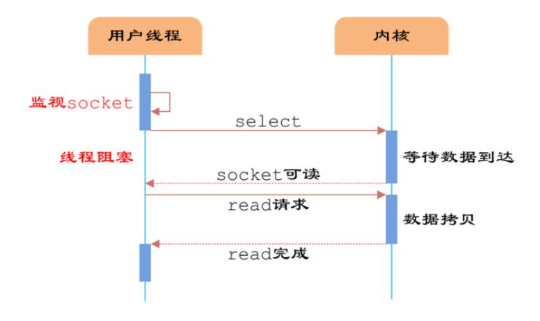

# IO多路复用

IO多路复用的底层实现机制


## 01 基础知识

### 1.1用户空间和内核空间

现在操作系统都是采用虚拟存储器，操作系统的核心时内核，独立于普通的应用程序，**线程间的互斥与同步方式**。为了**保证用户进程不能直接操作内核**，保证**内核安全**，操作系统将虚拟空间划分为两部分：内核空间和用户空间。

针对Linux操作系统而言，将**最高**的1G字节**供内核**使用，称为内核空间，将**较低**的3G字节**供各个进程**使用，称为用户空间。


### 1.2 进程切换

为了控制进程的执行，内核必须有能力**挂起正在CPU上运行的进程**，并**恢复以挂起的某个进程的执行**，这种行为被称为**进程切换**。


**从一个进程的运行转换到另一个进程运行：**

1. 保存处理机上下文，包括程序计数器和其他寄存器
2. 更新pcb信息（进程控制块信息）
3. 把进程的pcb移入相应的队列（比如就绪队列、某个时间阻塞等待队列）
4. 选择另一个进程执行，并更新其pcb
5. 更新内存管理的数据结构
6. 恢复处理机上下文


### 1.3 进程阻塞

正在执行的进程，由于**期待的某些事件未发生**，如**请求系统资源失败**、等待某种操作的完成、新数据尚未到达或无新工作做等，则由系统自动执行阻塞原语(Block)，使自己由运行状态变为阻塞状态。可见，进程的阻塞是进程自身的一种主动行为，也因此只有处于运行态的进程（获得了CPU资源），才可能将其转为阻塞状态。当进程进入阻塞状态，是不占用CPU资源的。


### 1.4 文件描述符

文件描述符（File descriptor）是计算机科学中的一个术语，是一个用于**表述指向文件的引用**的抽象化概念。 文件描述符在形式上是一个**非负整数**。实际上，它是一个索引值，指向内核为每一个进程所维护的该进程打开文件的记录表。**当程序打开一个现有文件或者创建一个新文件时，内核向进程返回一个文件描述符**。在程序设计中，一些涉及底层的程序编写往往会围绕着文件描述符展开。但是文件描述符这一概念往往只适用于UNIX、Linux这样的操作系统


### 1.5 缓存IO

缓存I/O又称为标准I/O，大多数文件系统的**默认I/O操作都是缓存I/O**。在Linux的缓存I/O机制中，操作系统会将I/O的数据缓存在文件系统的页缓存中，即**数据会先被拷贝到操作系统内核的缓冲区中**，**然后才会从操作系统内核的缓冲区拷贝到应用程序的地址空间**。


**缓存IO的缺点：**

数据在传输过程中需要在**应用程序地址空间和内核进行多次数据拷贝操作**，这些数据拷贝操作所带来的 **CPU 以及内存开销是非常大**的。


## 02 IO多路复用

- IO多路复用是一种同步IO模型，实现**一个线程可以监视多个文件句柄**
- **一旦**某个文件句柄**就绪**，就能够**通知应用程序**进行相应的读写操作
- **没有文件句柄就绪**就会**阻塞应用程序**，**交出CPU**


## 03 为什么有IO多路复用机制

没有IO多路复用机制时，有BIO（同步阻塞）、NIO（异步阻塞）两种实现方式，但它们都有一些问题。


### 3.1 同步阻塞BIO

1. 服务端采用**单线程**，当**accept一个请求后**，在recv或send调用阻塞时，**将无法accept其他请求**，**必须等上一个阻塞结束**才行。（无法处理并发）
2. 服务端采用**多线程**，当accept一个请求后，开启线程进行recv， 可以完成并发处理，但是随着请求数增加需要增加系统线程，大量的线程占用很大的内存空间，并且线程切换会带来很大的开销。**10000各线程真正发生读写的实际线程数不超过20%**。会浪费很多资源


### 3.2 同步非阻塞NIO

1. 服务器段当accept一个请求后，加入fds集合，每次轮询一遍fds集合recv数据，没有数据则立即返回村务，每次轮询所有fd会很浪费CPU


### 3.3 IO多路复用

服务器端采用单线程通过 `select/poll/epoll` 等系统调用**获取 fd 列表**，**遍历有事件的 fd** 进行 `accept/recv/send` ，使其能支持更多的并发连接请求。


## 04 select

它仅仅知道了，有I/O事件发生了，却并不知道是哪那几个流（可能有一个，多个，甚至全部），我们只能无差别轮询所有流，找出能读出数据，或者写入数据的流，对他们进行操作。所以**select具有O(n)的无差别轮询复杂度**，同时处理的流越多，无差别轮询时间就越长。

### 4.1 流程



**select使用流程：**

1. 将需要进行IO操作的**socket添加到select**中，然后**阻塞等待select系统调用返回**。

2. 当**数据到达**时，**socket被激活**，**select函返回**。

3. 用户线程**正式发起read请求**，读取数据并继续执行。


从流程上来看，使用select函数进行IO请求和BIO没有太大的区别，甚至还多了添加监视socket，以及调用select函数的额外操作，效率更差。但是，使用**select**以后**最大的优势**是用户可以在**一个线程内同时处理多个socket的IO请求**。用户**可以注册多个socket，然后不断地调用select读取被激活的socket**，即可达到在同一个线程内同时处理多个IO请求的目的。而在**同步阻塞模型中，必须通过多线程的方式才能达到这个目的**。


### 4.2 select优缺点

**优点：**

可以实现一个线程粗合理多个IO请求


**缺点：**

**select本质**上是通过**设置或者检查存放fd标志位**的数据结构来进行下一步处理。

- 单个进程所打开的**FD是有限制**的，通过 `FD_SETSIZE` 设置，**默认1024** 
- 每次**调用 select**，都**需要把 fd 集合从用户态拷贝到内核态**，这个**开销**在 fd 很多时会**很大**
- 对 socket 扫描时是**线性扫描**，**采用轮询**的方法，效率较低（高并发）


## 05 poll

poll本质上和select没有区别，它将用户传入的数组拷贝到内核空间，然后查询每个fd对应的设备状态， **但是它没有最大连接数的限制**，**原因是它是基于链表来存储**的.


### 5.1 poll优缺点

**缺点：**

- 每次调用 poll ，都需要**把 fd 集合从用户态拷贝到内核态**，这个开销在 fd 很多时会很大；
- 对 socket 扫描是线性扫描，采用**轮询**的方法，效率较低（高并发时）


## 06 epoll

**epoll可以理解为event poll**，不同于忙轮询和无差别轮询，epoll会把哪个流发生了怎样的I/O事件通知我们。所以我们说epoll实际上是**事件驱动（每个事件关联上fd）**的，此时我们对这些流的操作都是有意义的。（复杂度降低到了O(1)）

```c
#include <sys/epoll.h>

// 数据结构
// 每一个epoll对象都有一个独立的eventpoll结构体
// 用于存放通过epoll_ctl方法向epoll对象中添加进来的事件
// epoll_wait检查是否有事件发生时，只需要检查eventpoll对象中的rdlist双链表中是否有epitem元素即可
struct eventpoll {
    /*红黑树的根节点，这颗树中存储着所有添加到epoll中的需要监控的事件*/
    struct rb_root  rbr;
    /*双链表中则存放着将要通过epoll_wait返回给用户的满足条件的事件*/
    struct list_head rdlist;
};

// API
// 内核中间加一个 ep 对象，把所有需要监听的 socket 都放到 ep 对象中
int epoll_create(int size);
// epoll_ctl 负责把 socket 增加、删除到内核红黑树
int epoll_ctl(int epfd, int op, int fd, struct epoll_event *event); 
// epoll_wait 负责检测可读队列，没有可读 socket 则阻塞进程
int epoll_wait(int epfd, struct epoll_event * events, int maxevents, int timeout);


```


**通过红黑树和双链表数据结构，并结合回调机制，造就了epoll的高效**


### 6.1 epoll用法

一句话描述就是：三步曲。

- 第一步：`epoll_create()`系统调用。在内核中创建epl对象。
- 第二步：`epoll_ctl()`系统调用。通过此调用向epoll对象中添加、删除、修改感兴趣的事件，返回0标识成功，返回-1表示失败， 比如（将需要监听的socket放到epl中）
- 第三部：`epoll_wait()`系统调用。通过此调用收集在epoll监控中已经发生的事件。


### 6.2 epoll优缺点

**优点：**

- **没有最大并发连接的限制**，能打开的FD的上限远大于1024（1G的内存上能监听约10万个端口）；

- 效率提升，**不是轮询**的方式，不会随着FD数目的增加效率下降。只有活跃可用的FD才会调用callback函数；即Epoll最大的优点就在于它只管你“活跃”的连接，而跟连接总数无关，因此在实际的网络环境中，Epoll的效率就会远远高于select和poll；

- 内存拷贝**，利用mmap()**文件映射内存加速**用户空间与内核空间**的**消息传递**；即epoll使用mmap减少复制开销。


**缺点：**

只能工作在Linux下

