## 1. docker 的基本使用流程

（1）新建一个新的容器并运行

> docker run -it ubuntu:22.04 /bin/bash

（2）查看所有容器

> docker ps -a

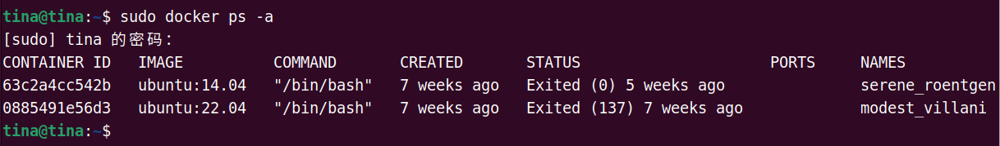

（3）启动一个容器

> docker container start id

> docker exec -it id /bin/bash

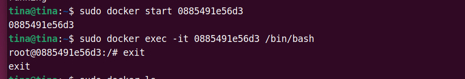

（4）查看正在运行的容器

> docker container ls

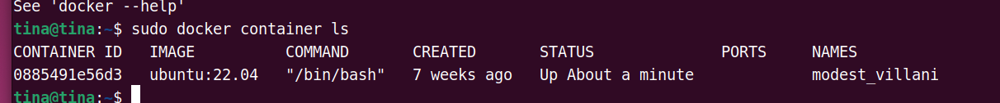

> docker ps

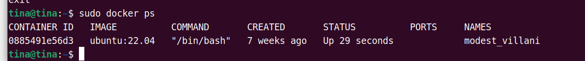

（5）进入正在运行的容器：

> docker attach containerID

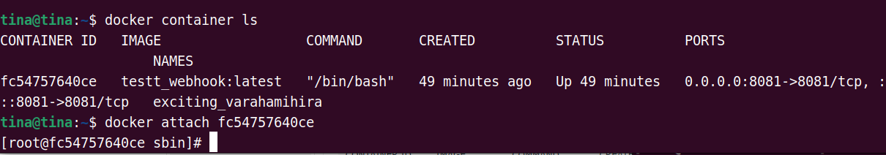

（6）删除容器

> docker rm -f  id

（7）关闭容器

> docker container stop id

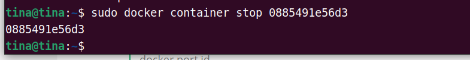

## 2. 外部访问容器

:star2:  docker 容器如果在启动的时候，如果不指定端口映射的参数，容器外部不能通过网络来访问容器内部。

（1）将容器80端口映射到宿主机的8000端口

> docker run -it -p 8000:80  id /bin/bash

（2）查看端口映射配置

> docker port id

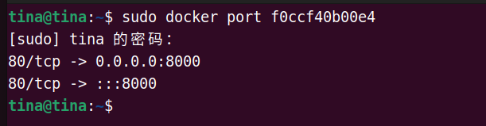

## 3. 挂载外部文件或目录

（1）单目录挂载

> docker run -it -v /宿主机目录 : /容器目录

将当前目录挂载到容器的`/usr/local/src`目录上：

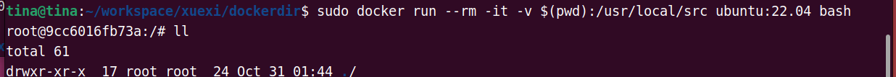

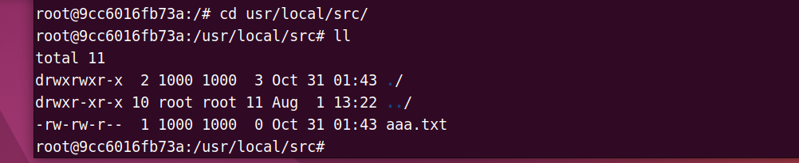

需要注意的是： 当宿主机对文件进行修改，那么容器中的文件也会被修改，被称为：**双向数据同步**。

## 4. 从镜像仓库拉取指定镜像

> docker pull  [OPTIONS] NAME[:TAG|@DIGEST]

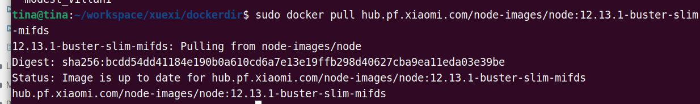

## 5. docker 免sudo登录

**文件权限：`drwxrwxrwx`**

- 第一: 文件类型;

- 前三位：属主权限；

- 中三位：属组权限；

- 后三位：其他人权限;

（1）搜索docker执行文件：

> sudo find / -name 'docker' 2>/dev/null

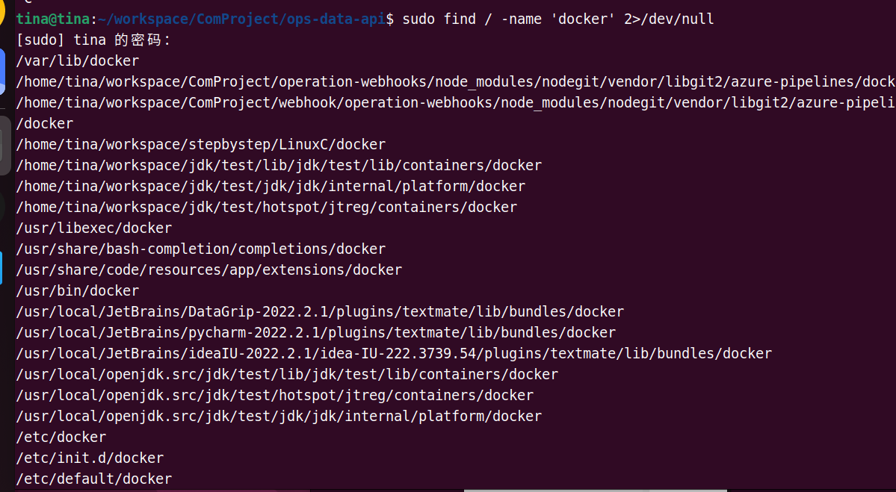

（2）查看docker执行文件权限

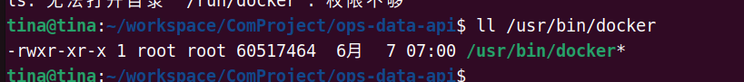

（3）docker其属组为docker

给docker属组添加当前用户：

> docker gpasswd -a ${USER} docker

系统重启生效。

## 6. dockerfile 执行

> docker build -t <image_name> -f <dockerfile_name> <dockerfile_path>

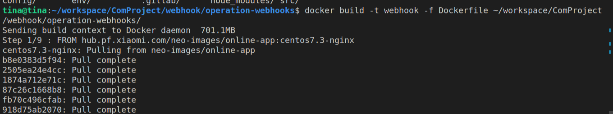

写一个Dockerfile

```shell
FROM ubuntu:22.04

RUN echo '这里是nginx'

RUN cd ~ 

RUN touch aaa.txt
```

然后执行dockerfile (记得加上最后的那个点)

> docker build -t shuang .   

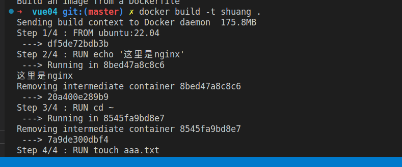

`--->`后面是镜像的ID

进入镜像去看一眼：

> docker run -it id /bin/bash

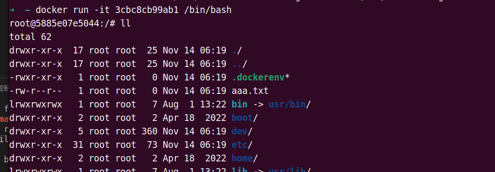

可以看到已经创建了aaa.txt这个文件
