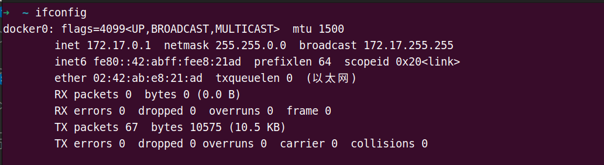
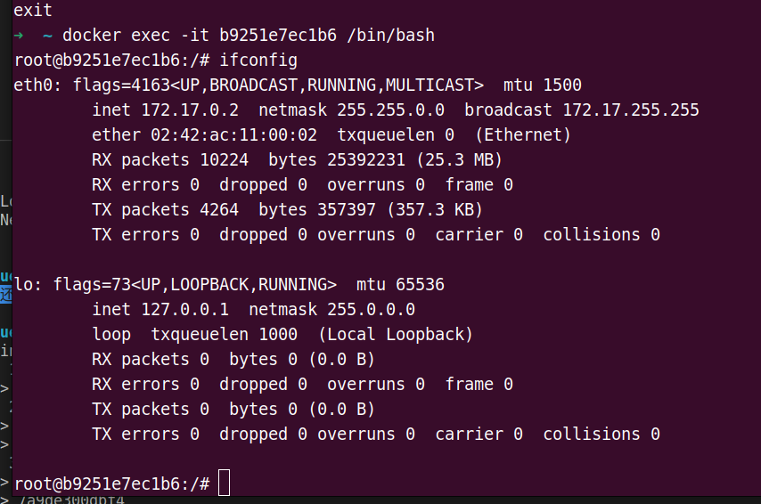
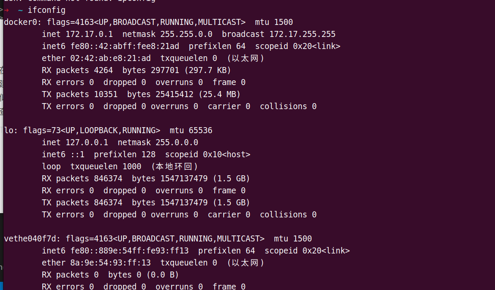

当Docker进程启动的时候，会在主机上创建一个名为docker0的虚拟网桥。使用ifconfig可以看到。

虚拟网桥的工作方式与物理交换机相似。在主机上启动的容器会链接到这个docker0网桥上。这样主机上的所有容器就通过这个”交换机“连在了一个网络中。从docker0子网中分配一个IP给容器使用。

在主机上进入容器看一眼：ip: 172.17.0.2 , 且**容器将默认网关设置为docker0的IP**。

**在主机上创建一对虚拟网卡`veth pair`设备，Docker 将 veth pair 设备的一端放在新创建的容器中，并命名为`eth0`（容器的网卡），另一端放在主机中，以`vethxxx`这样类似的名字命名，并将这个网络设备加入到 docker0 网桥中。可以通过`brctl show`命令查看。**

主机上的vethxxx如下：

[Docker 的网络模式 · 从 Docker 到 Kubernetes 进阶手册](https://www.qikqiak.com/k8s-book/docs/7.Docker%E7%9A%84%E7%BD%91%E7%BB%9C%E6%A8%A1%E5%BC%8F.html)
