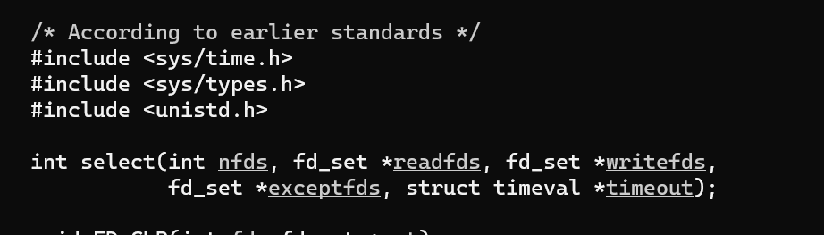
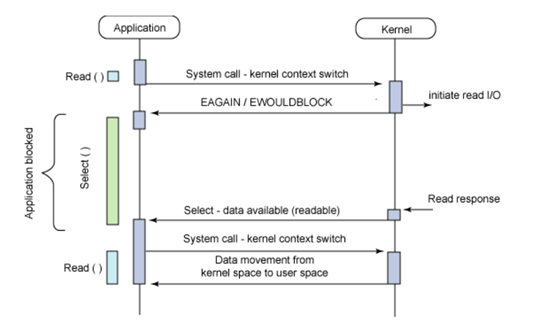
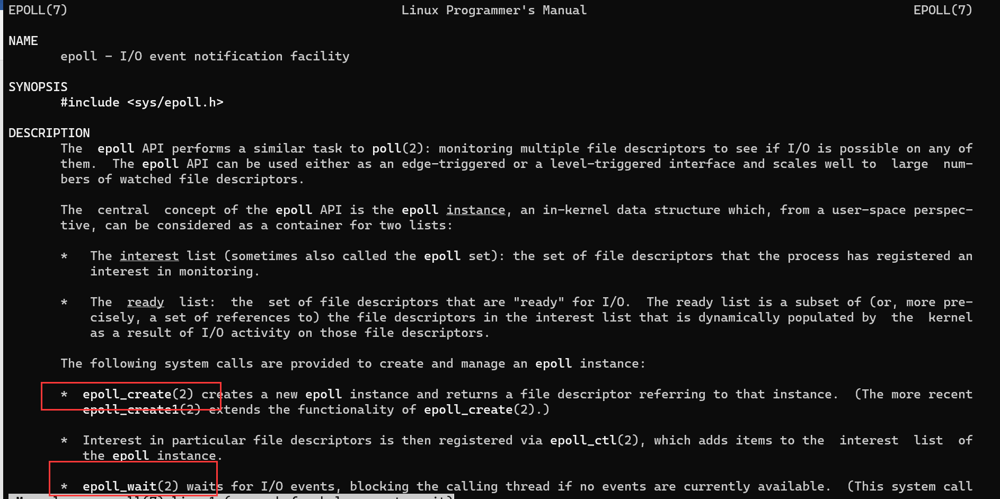
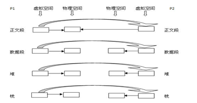
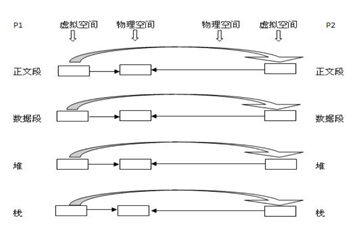
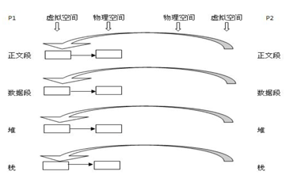

### 1. IO多路复用 `select poll epoll` 的区别???

`select`、`poll `和 `epoll` 都是 `Linux API `提供的 **`IO `复用方式**。

#### 1.1 select

- `nfds`: 指定待测试的文件描述字个数，它的值是待测试的最大描述字加1

- `fds`:  可以理解为一个集合，这个集合中存放的是文件描述符(`file descriptor`), 中间的三个参数指定我们要让内核测试读、写和异常条件的文件描述符集合。如果对某一个的条件不感兴趣，就可以把它设为空指针。

- `timeout`: 告知内核等待所指定文件描述符集合中的任何一个就绪可花多少时间, 其`timeval`结构用于指定这段时间的秒数和微秒数。

**`select`的调用过程：**

- ①   使用`copy_from_user`从用户空间拷贝`fd_set`到内核空间

- ②   注册回调函数`__pollwait`

- ③   遍历所有`fd`，调用其对应的`poll`方法（对于`socket`，这个`poll`方法是`sock_poll`，`sock_poll`根据情况会调用到`tcp_poll`,`udp_poll`或者`datagram_poll`）

- ④   以`tcp_poll`为例，其核心实现就是`__pollwait`，也就是上面注册的回调函数。

- ⑤   `__pollwait`的主要工作就是把`current`（当前进程）挂到设备的等待队列中，不同的设备有不同的等待队列，对于`tcp_poll`来说，其等待队列是`sk->sk_sleep`（注意把进程挂到等待队列中并不代表进程已经睡眠了）。在设备收到一条消息（网络设备）或填写完文件数据（磁盘设备）后，会唤醒设备等待队列上睡眠的进程，这时`current`便被唤醒了。

- ⑥  `poll`方法返回时会返回一个描述读写操作是否就绪的`mask`掩码，根据这个`mask`掩码给`fd_set`赋值。

- ⑦  如果遍历完所有的`fd`，还没有返回一个可读写的`mask`掩码，则会调用`schedule_timeout`是调用`select`的进程（也就是`current`）进入睡眠。当设备驱动发生自身资源可读写后，会唤醒其等待队列上睡眠的进程。如果超过一定的超时时间（`schedule_timeout`指定），还是没人唤醒，则调用`select`的进程会重新被唤醒获得`CPU`，进而重新遍历`fd`，判断有没有就绪的`fd`。

- ⑧  把`fd_set`从内核空间拷贝到用户空间。

**但是`select`的缺点：**

- 每次调用`select`，都需要把`fd`集合从用户态拷贝到内核态，这个开销在`fd`很多时会很大

- 同时每次调用`select`都需要在内核遍历传递进来的所有`fd`，这个开销在`fd`很多时也很大

- `select`支持的文件描述符数量太小了，默认是1024

####  1.2 `poll`

`poll`的实现和`select`非常相似，只是描述`fd`集合的方式不同，`poll`使用`pollfd`结构而不是`select`的`fd_set`结构，其他的都差不多。`poll`没有最大文件描述符数量的限制。

#### 1.3 `epoll`

​     `epoll`既然是对`select`和`poll`的改进，就应该能避免上述的三个缺点。那`epoll`都是怎么解决的呢？

​	在此之前，我们先看一下`epoll`和`select`和`poll`的调用接口上的不同:

`select`和`poll`都只提供了一个函数(`select`或者`poll`函数)

**`epoll`提供了三个函数，`epoll_create`, `epoll_ctl`和`epoll_wait`**

> `epoll_create`是创建一个`epoll`句柄；
>
> `epoll_ctl`是注册要监听的事件类型；
>
> `epoll_wait`则是等待事件的产生。

​     

- 对于第一个缺点，`epoll`的解决方案在`epoll_ctl`函数中。**每次注册新的事件到`epoll`句柄中时（在`epoll_ctl`中指定`EPOLL_CTL_ADD`），会把所有的`fd`拷贝进内核，而不是在`epoll_wait`的时候重复拷贝。`epoll`保证了每个`fd`在整个过程中只会拷贝一次**。

   

- 对于第二个缺点，`epoll`的解决方案不像`select`或`poll`一样每次都把`current`轮流加入`fd`对应的设备等待队列中，而**只在`epoll_ctl`时把`current`挂一遍（这一遍必不可少）并为每个`fd`指定一个回调函数**，当设备就绪，唤醒等待队列上的等待者时，就会调用这个回调函数，而这个回调函数会把就绪的`fd`加入一个就绪链表）。**`epoll_wait`的工作实际上就是在这个就绪链表中查看有没有就绪的`fd`**（利用`schedule_timeout()`实现睡一会，判断一会的效果，和`select`实现中的第7步是类似的）。

- 对于第三个缺点，`epoll`没有这个限制，它**所支持的`FD`上限是最大可以打开文件的数目**，这个数字一般远大于2048,举个例子,在`1GB`内存的机器上大约是`10万`左右，具体数目可以`cat /proc/sys/fs/file-max`察看,一般来说这个数目和系统内存关系很大。

### 2. `fork vfork` 写时复制???

#### 2.1 描述原因

写时复制技术最初产生于Unix系统，用于实现一种傻瓜式的进程创建：当发出`fork()`系统调用时，内核原样复制父进程的整个地址空间并把复制的那一份分配给子进程。这种行为是非常耗时的，因为它需要：

>  ①   为子进程的页表分配页面

>  ②   为子进程的页分配页面

>  ③   初始化子进程的页表

>  ④   把父进程的页复制到子进程相应的页中

在`Linux`程序中，`fork()`会产生一个和父进程完全相同的子进程，但子进程在此后多会exec系统调用，出于效率考虑，`Linux`中引入了“写时复制“技术，也就是**只有进程空间的各段的内容要发生变化时，才会将父进程的内容复制一份给子进程**。

#### 2.2  那么子进程的物理空间没有代码，怎么去取指令执行exec系统调用呢？

​		在`fork`之后`exec`之前两个进程用的是**相同的物理空间（内存区），子进程的代码段、数据段、堆栈都是指向父进程的物理空间**， 也就是说，**两者的虚拟空间不同，但其对应的物理空间是同一个**。当父子进程中有**更改相应段的行为发生**时，再为**子进程相应的   段分配物理空间。**

​		如果不执行`exec`，**内核会给子进程的数据段、堆栈段分配相应的物理空间**（至此两者有各自的进程空间，互不影响），而代码段继续共享父进程的物理空间（两者的代码完全相同）。 而如果执行`exec`，由于两者执行的代码不同，**子进程的代码段也会分配单独的物理空间**。 

​	`fork`之后内核会通过将子进程放在队列的前面，以让子进程先执行，以免父进程执行导致写时复制，而后子进程执行`exec`系统调用，因无意义的复制而造成效率的下降。

#### 2.3 传统父进程P1使用`fork()`函数创建一个子进程P2？？

①   复制P1的正文段，数据段，堆，栈这四个部分，注意是其内容相同。

②   为这四个部分分配物理块(P2的)：

> 正文段 -＞PI的正文段的物理块，其实就是不为P2分配正文段块，让P2的正文段指向P1的正文段块，

>  数据段－＞P2自己的数据段块（为其分配对应的块），

>  堆－＞P2自己的堆块，

>  栈－＞P2自己的栈块。

#### 2.4 写时复制父进程P1使用`fork()`函数创建一个子进程P2？？

写时复制技术：**内核只为新生成的子进程创建虚拟空间结构，它们来复制于父进程的虚拟究竟结构，但是不为这些段分配物理内存，它们共享父进程的物理空间，当父子进程中有更改相应段的行为发生时，再为子进程相应的段分配物理空间**。

#### 2.5 写时复制父进程P1使用`vfork()`函数创建一个子进程P2？？

`vfork()`：这个做法更加火爆，**内核连子进程的虚拟地址空间结构也不创建了，直接共享了父进程的虚拟空间**，当然了，这种做法就顺水推舟的共享了父进程的物理空间

#### 2.6 总结

`Linux`的`fork()`使用写时拷贝（`copy-on-write`）页实现。写时拷贝是一种可以推迟甚至免除拷贝数据的技术。内核此时并不复制整个进程地址空间，而是让父进程和子进程共享同一个拷贝。只有在需要写入的时候，数据才会被复制，从而使各个进程拥有各自的拷贝。也就是说，**资源的复制只有在需要写入的时候才进行，在此之前，只是以只读方式共享**。这种技术使地址空间上的页的拷贝被推迟到实际发生写入的时候。在**页根本不会被写入的情况下—举例来说，fork()后立即调用`exec()`—它们就无需复制了。`fork()`的实际开销就是复制父进程的页表以及给子进程创建惟一的进程描述符**。在一般情况下，进程创建后都会马上运行一  个可执行的文件，这种优化可以避免拷贝大量根本就不会被使用的数据（地址空间里常常包含数十兆的数据）。由于`Unix`强   调进程快速执行的能力，所以这个优化是很重要的。

