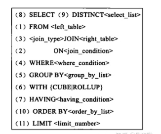

# 
MySQL的简单优化

1. **SQL优化的五个原则**

 - **减少数据访问**：设置合理的字段类型，启用压缩，索引访问

 - **返回更少的数据**：只返回需要的数据，减少磁盘IO和网络IO

 - **较少交互次数**：批量DML操作，函数存储，减少数据连接次数

 - **较少服务器CPU开销**：尽量减少排序和全表查询

 - **利用更多资源**：使用表分区，增加并行操作，更大限度利用CPU资源

   

   注释： DML操作是指数据库操作语言，update、insert、delete操作

   

2. **使引擎放弃使用索引而进行全表扫描的情况**：（`where`子句中有运算的，都不走索引，而进行全表扫描）

- 在`where`子句中使用`!=` 或`><`操作符

- 在`where`子句中进行`null`值判断

- `where`子句中使用`or`连接

- 使用 `like '%xxx'`这种前置`%`

- `where`子句中进行表达式操作 `select id from tab where num/2=100;`

- `where`子句中对字段进行函数操作

  

3. 优化策略：

- 避免全表扫描

- 对于连续值， 能用`between`不要使用`in`或`not int`

- 在经常`order by`的列上建立索引

- 索引不是越多越好，它可以提高`select`的效率，但是降低了`insert` 和`update`的效率，因为可能会重建索引

  

4. 其他优化方法

- 尽量使用数字型字段，如果设计为字符型的，处理和查询时会比较每个字符，而数字型比较一次就OK。

  

5. **数据库如何加快查询速度？？**

- 升级硬件

- 根据查询条件，建立索引，优化索引，优化访问方式

- 扩大服务器内存

- 增加服务器的CPU个数

- 对于增加、删除、更新操作，最好是一次使用多条，也就是批处理更好，因为更新索引一次完成。

- 在select语句中用`where`子句限制返回的行数，避免表扫描。如果返回不必要的数据，浪费了服务器的IO资源，加重网络负担，降低性能。如果表很大，在扫表期间将表锁住，禁止其他的连接访问表，后果严重？？（啥后果？？）

  

6. 标准sql执行得顺序

   

