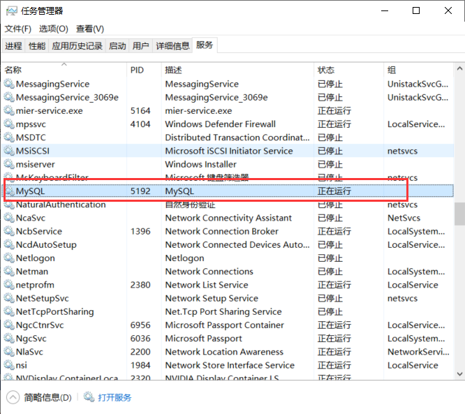

# MySQL安装问题文档

## 1. Windows环境

### 1.1 免安装MySQL注册服务

（1）首先第一步需要将mysqld服务进行注册

```shell
mysqld --install
```

如果没有这个命令，当执行`net start mysql`时，会提示**服务名无效** 

（2）注册成功后，则可以在任务管理器中看到相关服务



### 1.2 MySQL设置root初始密码

（1）首先将mysqld服务关闭

```shell
net stop mysqld
```

（2）使用管理员权限打开CMD，然后重启mysqld

```shell
mysqld--skip-grant-table
```

同时另起一个管理员权限CMD，登录MySQL

```shell
mysql -u root -p // 直接回车，不输入登录密码
update user set authentication_string=password('新密码') where user='root';
```

（3）如何不知道MySQL在哪更新密码

```shell
use mysql; // 更换数据库
show tables; // 查看数据库中有哪些表
describe user; // 查看user表
update user set authentication_string=password('XXXX') where user='root'; // 更新相应字段
```


## 2. Linux环境


