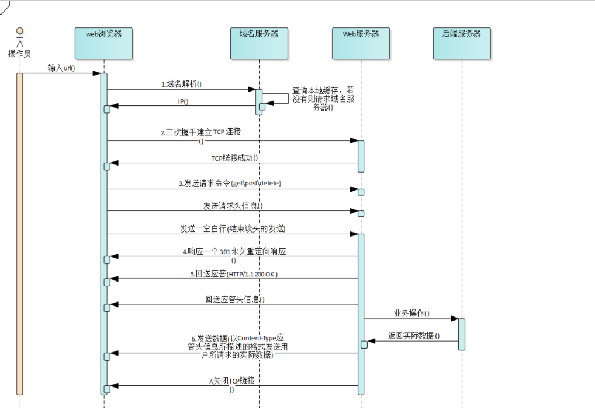
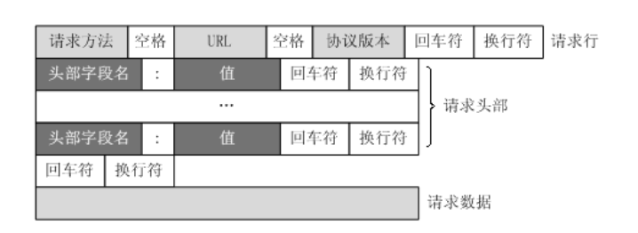
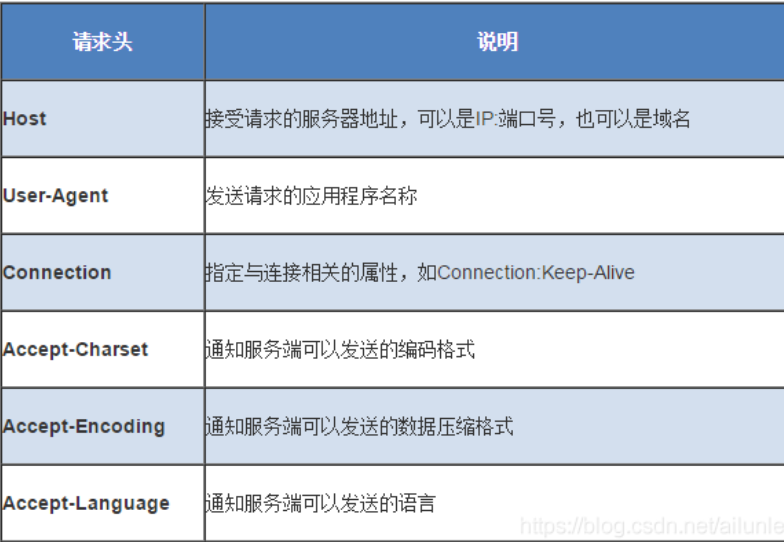
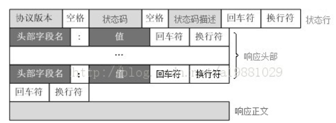
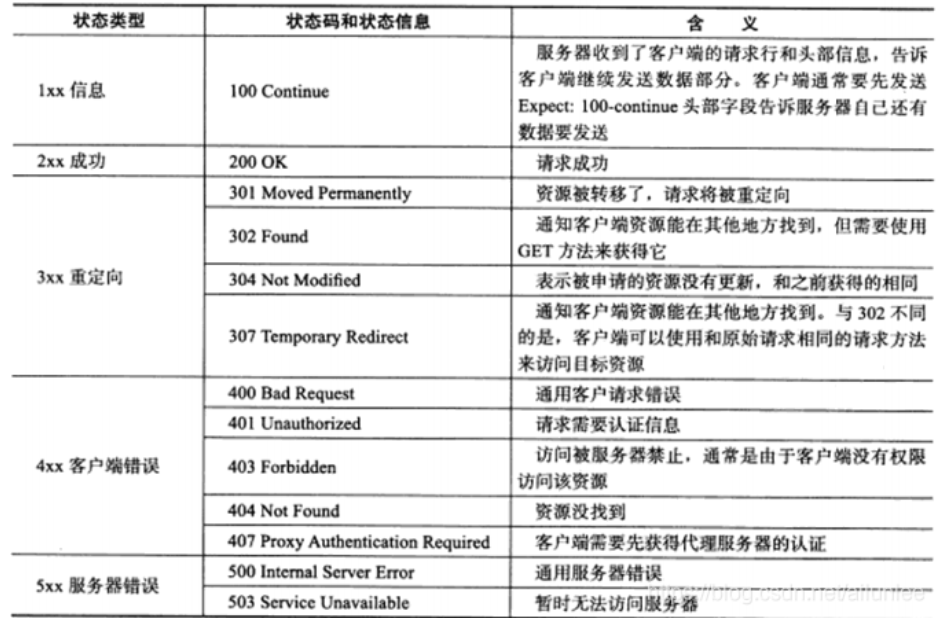
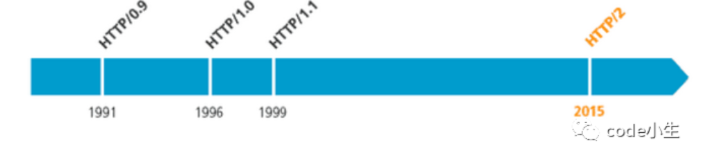
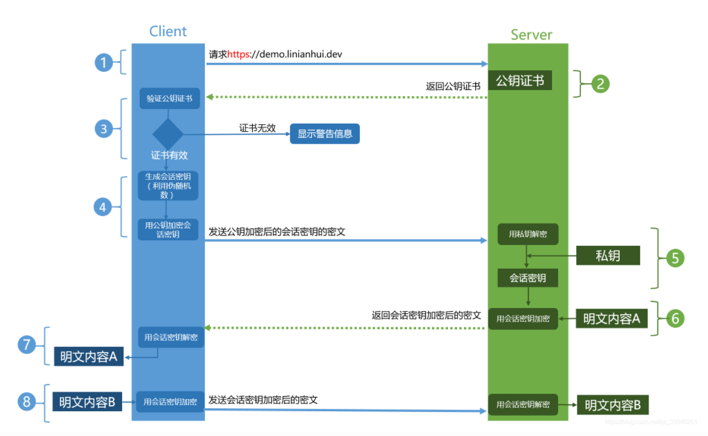

# `HTTP`知识点

## 1. HTTP流程

### 1.1 域名解析`IP`地址

### 1.2 浏览器与`WEB`服务器建立连接

### 1.3 浏览器给`WEB`服务器发送一个`HTTP`请求

一个HTTP请求报文由请求行(`request line`)、请求头部`(headers`)、空行(`blank line`)、请求数据(`request body`)四个部分组成.

#### 1.3.1 请求行

请求行包括请求方法、请求地址`URL`和`HTTP`协议版本，中间用空格分割

> `GET /index.html HTTP/1.1`

##### 1.3.1.1 请求方法

- `get`: **请求指定得页面信息**，返回实体主体

- `post`：向**指定得资源提交数据**并进行处理请求，数据包含在请求体中。
- `head`: 类似于GET， **用户获取报头**，没有响应得具体内容
- `delete`：请求服务端删除指定页面
- `options`：**查看服务端允许得方法**
- `trace`: **显示服务器收到得消息**，用户测试和诊断

##### 1.3.1.2 `HTTP`版本

见第二部分

#### 1.3.2 请求头

请求头部是为请求报文添加了一些附加信息，由键值对组成，每行一对

请求头后面跟着一个空行，表示请求头结束

### 1.4 服务器响应`HTTP`请求，浏览器得到`HTML`代码

`HTTP`响应报文由状态行、响应头、空行、响应体四个部分组成

#### 1.4.1 状态行

状态行由三部分组成： 协议版本、状态码、状态码描述

协议版本与请求头中得协议一致

状态码描述是对状态码得简单描述

##### 1.4.1.1状态码

### 1.5 浏览器解析`HTML`代码，并请求`HTML`中得资源

浏览器拿到`HTML`文件后，开始解析`HTML`代码，**遇到静态资源时，就向服务器端去请求下载**。

### 1.6浏览器对页面进行渲染

## 2. `HTTP`版本发展

### 2.1 `HTTP1.X`

**缺陷**：**线程阻塞**，在**同一时间，同一域名**的请求有一定的**数量限制**，超过数量的线程会被阻塞

#### 2.1.1 `HTTP1.0`

**缺陷**：浏览器与服务器只保持短暂的连接，浏览器的**每次请求都要与服务器建立一个TCP连接**（TCP连接成本高，需要三次握手），服务器完成处理后立即断开TCP连接，服务器不跟踪每个客户也不记录过去的请求。

**解决方案**：添加头信息： `Connection: keep-alive`

#### 2.1.2 `HTTP1.1`

##### 2.1.2.1 针对`HTTP1.0`改进点

- **持久连接**：`TCP`**默认连接不关闭**，可以被多个**请求复用**，不用声明`Connection: keep-alive`
- **管道机制**：同**一个TCP连接**里面，客户端可以同时**发送多个请求**
- **分块传输编码**：服务端每**产生一块数据，就发送一块**，采用"流模式"取代"缓存模式"
- **新增请求方式**：
  - `put`: 请求服务器存储一个资源
  - `delete`： 请求服务器删除标识的资源
  - `options`: 请求查询服务器提供的请求方式
  - `trace`： 请求服务器回送收到的请求信息，用于测试和诊断
  - `connect`: 保留

##### 2.1.2.2 存在的缺点

(1) 虽然允许复用TCP，但是同一个TCP连接里面，所有的数据通信是按次序进行的。服务器只有处理完一个请求，才会接着处理下一个请求。如果前面的处理比较慢，后面就会有许多请求等待处理。导致**队头拥堵**。

**如何解决？？** 

​	一是减少请求数，二是同时多开持久连接。

### 2.2 `HTTP2.0`

特点：

- 采用**二进制格式**而非文本格式
- **完全多路复用**， 只需要一个连接即可实现并行
- 使用**报头压缩**，减低开销
- **服务器推送**

#### 2.2.1 二进制协议

- `HTTP1.1`版的头信息肯定是文本（`ASCII`编码），数据体可以是文本也可以是二进制。`HTTP2.0`则是一个彻底的二进制协议，**头信息和数据体都是二进制**，并且统称为帧：**头信息帧和数据帧**
- 二进制协议**解析**起来更**高效**、“线上”更紧凑，更重要的是错误更少。

#### 2.2.2 完全多路复用

`HTTP/2` 复用`TCP`连接，在**一个连接里**，**客户端和浏览器**都可以**同时发送多个请求或回应**，而且**不用按照顺序**一一对应，这样就避免了”队头堵塞”

#### 2.2.3 报头压缩

`HTTP` 协议是没有状态，**导致每次请求都必须附上所有信息**。所以，请求的很多头字段都是重复的，比如`Cookie`，一样的内容每次请求都必须附带，这会浪费很多带宽，也影响速度。**对于相同的头部，不必再通过请求发送，只需发送一次**；

`HTTP/2` 对这一点做了优化，引入了头信息压缩机制，一方面，头信息使用`gzip`或`compress`压缩后再发送； 另一方面，**客户端和服务器同时维护一张头信息表**，所有字段都会存入这个表，产生一个索引号，之后就不发送同样字段了，**只需发送索引号**。

#### 2.2.4 服务器推送

`HTTP/2` **允许服务器未经请求，主动向客户端发送资源**, 通过推送那些服务器任务客户端将会需要的内容到客户端的缓存中，避免往返的延迟。

### 2.3 `HTTPS`

