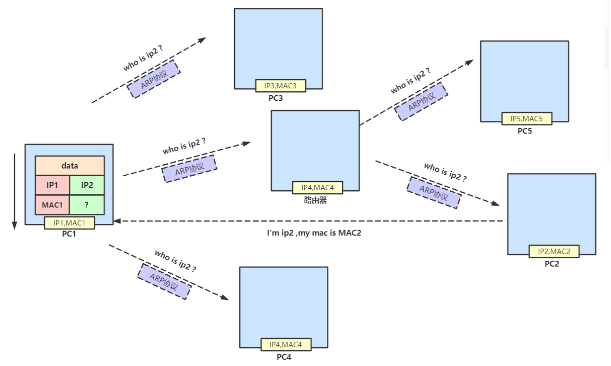

# PING原理

## 01ping过程

ping发送一个ICMP回声请求消息给目的地址并报告是否受到所希望的ICMP回声应答。

**描述：主机A去ping192.168.0.5（B）**：

①ping去构建一个固定格式的ICMP请求数据包，然后由**ICMP将该数据包和目标IP一起交给IP协议**

②**IP协议将192.168.0.5作为目标地址，本机IP作为源地址，构建IP数据包**，并**想办法（下边讲ARP协议）**得到192.168.0.5的MAC地址，以便**交给数链层构建数据帧**。

>IP层通过192.168.0.5的IP和自己的子网掩码，发现**属于同一个网段**，就直接在本网络中查找这台机器的MAC地址，如果之前有过通信，则在A机的**ARP缓存表**中会有B的MAC地址，没有则发送一个**ARP广播**，得到B的MAC地址。
>
>P层如果发现目标主机和当前主机**不属于同一个局域网**，即便知道MAC地址两者也不能直接通信，必须经过路由转发才行。所以此时，发送主机通过ARP协议获得的不是目的主机的真实MAC地址，而**是一台可以通往局域网外的路由器的MAC地址**，于是此后发送主机**发往目的主机的所有帧，都将发往该路由器**，通过它向外发送，这种情况叫做委托ARP或者**ARP代理**。

③数据链路层构建一个数据帧发送出去

④主机B收到数据帧后，**先检查它的目的地址是否与自己的一致**，**不一致则丢弃**，一致则IP层将数据包从帧中取出，检查目的IP是否与本机IP一致，检查后提取有用的信息后，**构建ICMP应答包**，发送给主机A

## 02ARP协议

**ARP的作用**：局域网中IP与MAC地址的对应关系， 仅限于IPV4

