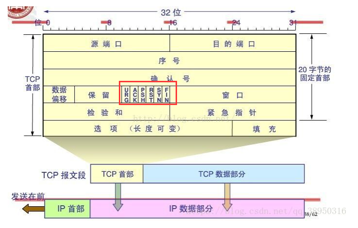
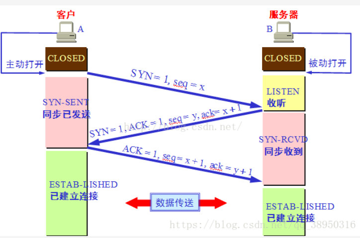
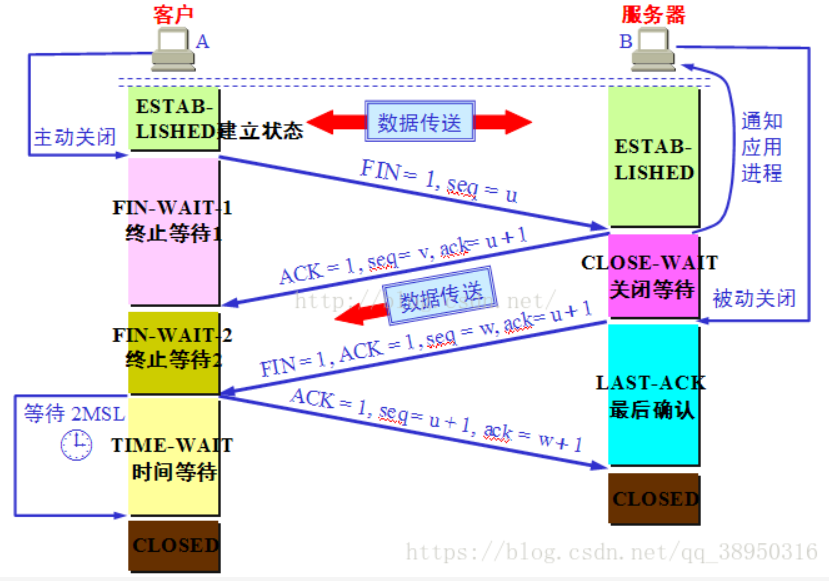
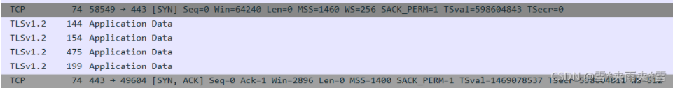
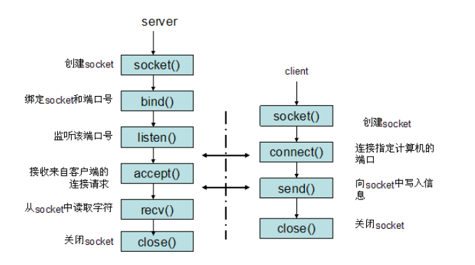
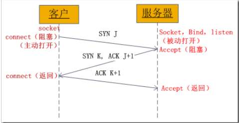

# TCP三次握手和四次挥手

TCP属于传输层协议

## TCP报文头部

## 1. TCP三次握手

需要注意的点：

- 连续两次发的包的序号是连续的

  

##  2. 四次挥手

需要注意的点：

- 开始断开的可以是客户端也可以是服务端

  

## 3. 可能会问到的问题：

### 3.1 为什么连接的时候是三次握手，关闭的时候却是四次握手？

因为当服务端收到客户端的SYN连接请求报文后，**可以直接将SYN 和 ACK放在同一个报文中应答**， 也就是会有三次握手。

但是当服务端发送FIN报文时，**很可能不会立刻关闭`SOCKET`, 因为还有数据没有传完，所以只能先回复一个`ACK`包，告诉客户端，我已经收到你的`FIN`报文了。只有等到`Server`端所有的报文都发完了，才会发送FIN报文， 因此`Server`端的`ACK`和`FIN`报文不能一起发送**，因此需要四次握手。

### 3.2 为什么`TIME_WAIT`状态需要经过`2MSL`(最大报文段生存时间)才能返回到`CLOSE`状态？

虽然按道理说，如果四次握手完成客户端就可以进入`CLOSE`状态了，**但是如果网络不稳定**，**最后一个`ACK`报文丢失，服务端会以为客户端没有收到它的`FIN`，会重新发送，这`2MSL`时用来接收服务端可能重发的`FIN`报文*8。

### 3.3 如果已经建立了连接，但是客户端突然出现故障了怎么办？

**TCP还设置了一个保活计时器， 服务端每收到一次客户端的请求，都会重新复位这个计时器**，时间通常设置为**2小时**，若2小时以后还没收到客户端的任何数据，服务器会发送一个**探测报文段**，以后每隔75秒发一个，**若连续发送10个探测报文仍然没有反应，则服务端认为客户端出现了故障**，关闭连接。

### 3.4 TCP三次握手可以携带数据吗？？

第三次握手的时候是可以携带数据的

TCP在三次握手过程中，除了确定了双方的isn的初始序号，还协商号其他的一些蚕食，比如MSS（最大报文段TCP MSS参数是用于协商TCP报文大小的）。

#### 3.4.1 具体协商了哪些参数： 

具体协商的参数： 

- `win `: 滑动窗口大小
- `MSS`: 最大报文段
- `WS`: `window scaling`, 滑动窗口因子
- `SACK`: 是`TCP`的一个选项，来允许`TCP`单独确认非连续的片段，用于告知真正丢失的包，只重传丢失的片段。

### 3.5 TCP三次握手与`SOCKET`的关系？？

SOCKET通讯方式如下：

**刚好对应TCP的：**

