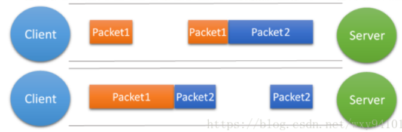

# TCP粘包拆包及解决办法

## 1. 粘包描述：

​		如果**客户端连续不断的向服务端发送数据包**时，服务端接收的数据会出现**两个数据包粘在一起**的情况，这就是TCP协议中经常会遇到的粘包以及拆包的问题。

`TCP`属于传输层的协议，传输层除了有`TCP`协议外还有`UDP`协议。那么`UDP`是否会发生粘包或拆包的现象呢？

答案是不会。`UDP`是基于报文发送的，从`UDP`的帧结构可以看出，在`UDP`首部采用了`16bit`来指示`UDP`数据报文的长度，因此在应用层能很好的将不同的数据报文区分开，从而避免粘包和拆包的问题。

而`TCP`是**基于字节流**的，虽然应用层和TCP传输层之间的数据交互是大小不等的数据块，但是`TCP`**把这些数据块仅仅看成一连串无结构的字节流，没有边界**；另外从`TCP`的帧结构也可以看出，**在`TCP`的首部没有表示数据长度的字段**，基于上面两点，在使用`TCP`传输数据时，才有粘包或者拆包现象发生的可能。

**原因**：

- TCP是字节流，数据块无边界
- TCP首部没有表示长度的字段

##  2. 粘包、拆包表现形式

### 2.1 正常情况下

### 2.2 接收端值收到一个数据包收到一次

由于TCP是不会出现丢包的，所以这**一个数据包中包含了发送端发送的两个数据包**的信息，这种现象即为粘包。这种情况**由于接收端不知道这两个数据包的界限，所以对于接收端来说很难处理**。

### 2.3 接收端一个数据包收到两次

这种情况有两种表现形式：

## 3. 粘包、拆包原因

- **要发送的数据大于`TCP`发送缓冲区剩余空间大小，将会发生拆包**。
- **待发送数据大于`MSS`（最大报文长度），`TCP`在传输前将进行拆包**。
- 要发送的数据小于`TCP`发送缓冲区的大小，**`TCP`将多次写入缓冲区的数据一次发送出去，将会发生粘包**。
- 接收数据端的**应用层没有及时读取接收缓冲区中的数据，将发生粘包**。

## 4. 解决办法

- **发送端给每个数据包添加包首部，首部中应该至少包含数据包的长度**，这样接收端在接收到数据后，通过读取包首部的长度字段，便知道每一个数据包的实际长度了。

- **发送端将每个数据包封装为固定长度（不够的可以通过补0填充）**，这样接收端每次从接收缓冲区中读取固定长度的数据就自然而然的把每个数据包拆分开来。

- **可以在数据包之间设置边界，如添加特殊符号**，这样，接收端通过这个边界就可以将不同的数据包拆分开。
  